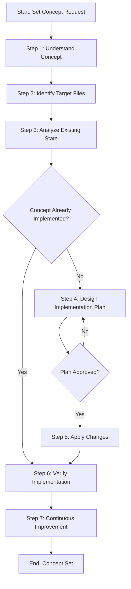

# Process: Set Dedicated Folder Structure Concept

**Template**: set-concept  
**Status**: Running  
**Created**: 2026-01-24

## Description

Implement or update a concept systematically across multiple non-code files. This template guides you through understanding the concept, analyzing the current state, designing an implementation plan, applying changes, and verifying complete implementation.

## Purpose & Usage

Use this template when you need to:
- Implement a new pattern, structure, or standard across documentation files
- Update an existing concept across multiple files consistently
- Apply best practices or conventions to non-code files (markdown, processes, configurations)
- Ensure consistent implementation of architectural decisions or guidelines

## Parameters

| Parameter | Value |
|-----------|-------|
| **conceptName** | Dedicated Folder Structure |
| **conceptDescription** | Each step and process template should have a dedicated folder containing its MD and JSON files, rather than having them loose in the category folder. This improves organization by grouping related files together. |
| **targetFiles** | .processes/steps/ and .processes/templates/ |
| **existingState** | Steps and templates have their MD and JSON files stored directly in category folders (e.g., .processes/steps/planning/understand-context.md and .processes/steps/planning/understand-context.json) |
| **requestedState** | Each step and template should have its own dedicated folder (e.g., .processes/steps/planning/understand-context/understand-context.md and .processes/steps/planning/understand-context/understand-context.json) |

## Process Flow

## Steps

- [ ] **Step 1: Understand concept**
  - **Step**: `@framework-step:planning/understand-context`
  - **Description**: Fully understand the context, sources, and requirements for the concept to implement
  - **Output**: Context documentation

- [ ] **Step 2: Identify target files**
  - **Step**: `@framework-step:investigation/identify-files`
  - **Description**: Identify which files and directories need to be processed
  - **Output**: List of target files in identified-files.json

- [ ] **Step 3: Analyze existing state**
  - **Step**: `@framework-step:investigation/review-verify-document`
  - **Description**: Review identified files to understand current state and gaps
  - **Output**: Findings report

- [ ] **Step 4: Design implementation plan** ⚠️ *Approval Required*
  - **Step**: `@framework-step:planning/design-implementation-plan`
  - **Description**: Design comprehensive implementation plan with change proposals
  - **Output**: Implementation plan with change proposals

- [ ] **Step 5: Apply changes**
  - **Step**: `@framework-step:common/apply-changes`
  - **Description**: Apply all user-approved changes to relevant files
  - **Output**: Modified and newly created files

- [ ] **Step 6: Verify implementation**
  - **Step**: `@framework-step:investigation/review-verify-document`
  - **Description**: Verify all changes were applied correctly
  - **Output**: Verification report

- [ ] **Step 7: Continuous Improvement** ⚠️ *Approval Required*
  - **Step**: `@framework-step:learning/continuous-improvement`
  - **Description**: Analyze process execution and implement improvements
  - **Output**: Improvements implemented

