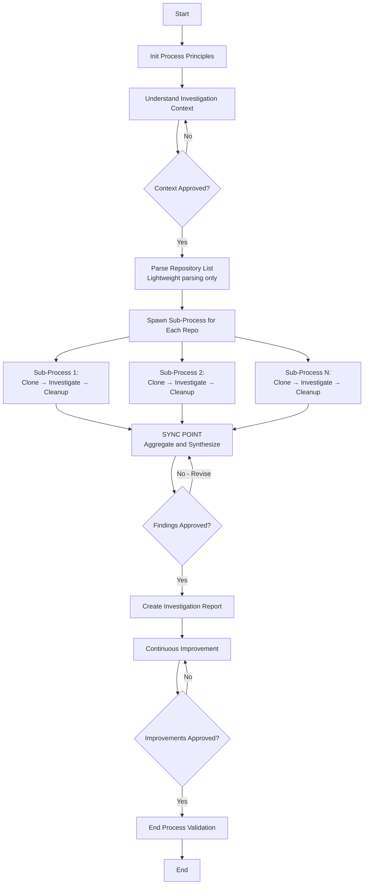

# Multi-Repo Codebase Investigation Template - Design Document

**Template Name**: `multi-repo-codebase-investigation`
**Category**: `investigation`
**Created**: 2026-02-14
**Status**: Awaiting Approval
**Version**: 3.0 (On-demand cloning with cleanup)

---

## Purpose Statement

Systematic investigation of multiple repositories to answer research questions. Allows users to investigate patterns, implementations, and gather information across multiple codebases in a structured way. **Handles remote repositories with on-demand cloning and automatic cleanup.**

## Use Cases

This template should be used when:

1. **Investigating feature implementations across microservices**
   - Example: "How is authentication handled in each of our services?"

2. **Comparing patterns in different codebases**
   - Example: "What error handling patterns are used across our repositories?"

3. **Gathering metrics from multiple projects**
   - Example: "What testing frameworks are used and how extensively?"

4. **Understanding architectural decisions across repos**
   - Example: "How is configuration managed in each repository?"

5. **Analyzing security practices across repositories**
   - Example: "What security measures are implemented in each codebase?"

---

## Parameters

### Required Parameters

| Parameter | Type | Description | Example |
|-----------|------|-------------|---------|
| **researchQuestion** | string | The specific question or investigation goal to answer across repositories | "How is authentication implemented across our microservices?" |
| **repositories** | string | List of repository URLs or local paths to investigate (comma-separated) | "https://github.com/org/service-auth, https://github.com/org/service-api, c:/local/service-web" |

### Optional Parameters

| Parameter | Type | Default | Description | Example |
|-----------|------|---------|-------------|---------|
| **investigationScope** | string | - | Specific areas or patterns to focus on | "authentication and authorization patterns" |
| **filePatterns** | string | - | File patterns to search within each repository | "**/*.cs, **/*.ts, **/config/*.json" |
| **excludePatterns** | string | - | Patterns to exclude from investigation | "**/node_modules/**, **/bin/**, **/obj/**" |
| **outputFormat** | string | "markdown" | Desired output format for findings | "comparative-table" |

---

## Step Breakdown (8 Steps Total)

### Step 0: Init Process Principles ✅ Reused
- **Step Ref**: `@framework-step:common/init-process-principles`
- **Output**: Principles loaded and confirmed
- **Approval Required**: No
- **Rationale**: Standard framework step - mandatory for all processes

---

### Step 1: Understand Investigation Context ✅ Reused
- **Step Ref**: `@framework-step:planning/understand-context`
- **Output**: Context documentation with research question, repositories, scope
- **Approval Required**: **Yes**
- **Rationale**: Existing step handles parameter gathering and clarification - fits perfectly for establishing investigation context

---

### Step 2: Parse Repository List 🆕 New
- **Step Ref**: `@framework-step:multi-repo/parse-repository-list`
- **Output**: Repository list parsed into structured format
- **Approval Required**: No
- **Rationale**: **NEW STEP NEEDED** - Lightweight step to parse comma-separated repository list. No cloning happens here.

**What This Step Does**:
- Parse the `repositories` parameter (comma-separated URLs/paths)
- For each entry:
  - Trim whitespace
  - Determine if remote (URL) or local (path)
  - Extract repository name from URL or path
- Create `repositories-list.json` with:
  ```json
  [
    {
      "name": "service-auth",
      "source": "https://github.com/org/service-auth",
      "type": "remote",
      "subProcessId": null,
      "subProcessPath": null,
      "status": "pending"
    },
    {
      "name": "service-web",
      "source": "c:/local/service-web",
      "type": "local",
      "subProcessId": null,
      "subProcessPath": null,
      "status": "pending"
    }
  ]
  ```
- **NO cloning** - just parsing and cataloging
- **Includes tracking fields** - Step 3 will populate these when spawning subprocesses

---

### Step 3: Investigate Repositories (Subprocess Loop) 🔄 Subprocess Orchestration
- **Step Ref**: `@framework-step:common/spawn-sub-process`
- **Output**: Completed sub-processes for each repository with findings
- **Approval Required**: No
- **Sub-Process Template**: `investigate-single-repo`
- **Sync Point**: Step 4 (parent waits at next step)

**What This Step Does**:
- Read `repositories-list.json`
- For each repository with `status: "pending"`:
  - Spawn sub-process using `investigate-single-repo` template
  - Pass parameters:
    - `repositorySource`: URL or local path
    - `repositoryName`: repository name
    - `repositoryType`: "remote" or "local"
    - `researchQuestion`: the research question
    - `investigationScope`: scope from parent (optional)
    - `filePatterns`: file patterns from parent (optional)
    - `excludePatterns`: exclude patterns from parent (optional)
  - Set sync point to "step-4" (parent continues, waits at Step 4)
  - **Update `repositories-list.json`** with subprocess info:
    - `subProcessId`: UUID of spawned subprocess
    - `subProcessPath`: Path to subprocess directory
    - `status`: "running"
- **Tracking in file** - All subprocess tracking in `repositories-list.json`, not parent memory
- **Does NOT wait here** - continues to Step 4 which is the sync point

**Sub-Process Responsibility**: Each subprocess handles its own cloning (if needed) and cleanup

---

### Step 4: Aggregate and Synthesize Findings 🆕 New (SYNC POINT)
- **Step Ref**: `@framework-step:multi-repo/aggregate-and-synthesize-findings`
- **Output**: Comparative analysis, patterns across repos, differences, recommendations
- **Approval Required**: **Yes**
- **Rationale**: **NEW STEP NEEDED** - Must wait for all sub-processes, collect findings, perform cross-repository comparison. No existing step handles multi-repo aggregation and synthesis.

**What This Step Does**:
- **SYNC POINT**: Wait for all spawned sub-processes from Step 3 to complete
- Read `repositories-list.json` to get subprocess paths and statuses
- For each subprocess (identified by `subProcessPath`):
  - Verify completion status
  - Read findings from subprocess memory/output
  - Extract relevance status and findings data
  - **Update `repositories-list.json`** with final status:
    - `status`: "completed" or "failed"
- Aggregate all findings:
  - Repos that were relevant vs not relevant
  - Per-repository findings summary
- Compare findings across repositories:
  - Identify common patterns and approaches
  - Highlight differences and unique implementations
  - Detect anomalies or outliers
  - Generate cross-cutting insights
- Create `comparative-analysis.md`
- Present for user approval

---

### Step 5: Create Investigation Report ✅ Reused (May Need Adaptation)
- **Step Ref**: `@framework-step:investigation/create-research-report`
- **Output**: Comprehensive investigation report in specified format
- **Approval Required**: No
- **Rationale**: Can likely reuse/adapt existing report creation step with multi-repo context

**What This Step Does**:
- Structure report based on `outputFormat` parameter
- Include sections:
  - Executive Summary
  - Research Question
  - Repositories Investigated (total, relevant, not relevant)
  - Per-Repository Findings
  - Comparative Analysis (from Step 4)
  - Common Patterns
  - Unique Approaches
  - Recommendations
  - Conclusion
- Create `investigation-report.{md|json|html}`

---

### Step 6: Continuous Improvement ✅ Reused
- **Step Ref**: `@framework-step:learning/continuous-improvement`
- **Output**: Improvements implemented
- **Approval Required**: **Yes**
- **Rationale**: Standard framework step for all templates

---

### Step 7: End Process Validation ✅ Reused
- **Step Ref**: `@framework-step:common/end-process-validation`
- **Output**: Compliance report
- **Approval Required**: No
- **Rationale**: Standard framework step for all templates

---

## Process Flow with Sub-Processes



### Sub-Process Details

Each `investigate-single-repo` sub-process is **fully self-contained**:
- **Input**: Repository source (URL/path), research question, scope
- **Process**:
  1. Clone repo if URL (to temp location)
  2. Check relevance
  3. Extract findings if relevant
  4. **Cleanup**: Delete cloned repo if it was cloned
- **Output**: Findings + cleanup confirmation
- **Parent Sync**: All sub-processes complete before Step 4 executes

---

## Sub-Process Template: investigate-single-repo

A new template is required for investigating a single repository. This will be spawned N times (once per repo).

**Template Name**: `investigate-single-repo`
**Category**: `investigation`

### Parameters

| Parameter | Type | Required | Description |
|-----------|------|----------|-------------|
| repositorySource | string | Yes | Repository URL or local path |
| repositoryName | string | Yes | Repository name |
| repositoryType | string | Yes | "remote" or "local" |
| researchQuestion | string | Yes | Research question from parent |
| investigationScope | string | No | Investigation scope from parent |
| filePatterns | string | No | File patterns to search |
| excludePatterns | string | No | Patterns to exclude |

### Steps (6 Steps)

**Step 0: Init Process Principles** ✅ Reused
- Standard initialization

---

**Step 1: Prepare Repository** 🆕 New
- **Purpose**: Clone if remote, validate if local
- **Actions**:
  - If `repositoryType` == "remote":
    - Create temp directory: `./.temp-investigation-{processId}/{repositoryName}`
    - Execute: `git clone {repositorySource} {tempDir}`
    - Set `workingPath` = temp directory
    - Set `wasCloned` = true
  - If `repositoryType` == "local":
    - Validate path exists
    - Set `workingPath` = repositorySource
    - Set `wasCloned` = false
- **Output**: Repository ready at `workingPath`, cleanup flag set

---

**Step 2: Check Repository Relevance** ✅ Can Reuse (May Need New)
- **Purpose**: Quick scan to determine if repo is relevant to research question
- **Actions**:
  - Search for keywords from research question
  - Check file types and structure
  - Determine relevance score
- **Output**: Relevance determination (relevant/not-relevant + reason)

---

**Step 3: Extract Findings** 🆕 New (Conditional)
- **Condition**: Only if repository is relevant
- **Purpose**: Deep investigation to extract patterns, implementations, examples
- **Actions**:
  - Search files using filePatterns
  - Extract code snippets, configurations, patterns
  - Document findings specific to research question
- **Output**: Detailed findings document

---

**Step 4: Create Sub-Process Summary** 🆕 New
- **Purpose**: Document findings or reason for non-relevance
- **Output**:
  - `summary.json` - Structured data for parent
  - `repo-findings.md` - Detailed findings (if relevant)

---

**Step 5: Cleanup Repository** 🆕 New
- **Purpose**: Remove cloned repository to free disk space
- **Actions**:
  - If `wasCloned` == true:
    - Delete temp directory recursively
    - Verify deletion
    - Log: "Cleaned up cloned repository"
  - If `wasCloned` == false:
    - Skip cleanup (local path retained)
    - Log: "Local repository retained"
- **Output**: Cleanup confirmation

---

**Step 6: Notify Parent Complete** ✅ Reused
- **Purpose**: Signal completion to parent
- Standard subprocess completion step

---

## Updated Architecture

### Parent Process Responsibilities

| Step | Responsibility | Heavy? |
|------|----------------|--------|
| 0 | Init principles | No |
| 1 | Understand context | No |
| 2 | **Parse repo list** | ❌ Lightweight |
| 3 | Spawn subprocesses | ❌ Lightweight |
| 4 | Aggregate findings (sync) | ✅ Moderate |
| 5 | Create report | ✅ Moderate |
| 6 | Continuous improvement | No |
| 7 | End validation | No |

### Subprocess Responsibilities

| Step | Responsibility | Heavy? |
|------|----------------|--------|
| 0 | Init principles | No |
| 1 | **Prepare repo (clone if needed)** | ✅ Heavy |
| 2 | Check relevance | ❌ Light |
| 3 | Extract findings | ✅ Heavy |
| 4 | Create summary | ❌ Light |
| 5 | **Cleanup (delete if cloned)** | ❌ Light |
| 6 | Notify parent | No |

---

## New Steps Required

### Parent Template: 2 New Steps

| Step Name | Category | Purpose |
|-----------|----------|---------|
| parse-repository-list | multi-repo | Parse comma-separated repo list into structured JSON |
| aggregate-and-synthesize-findings | multi-repo | Sync point: wait for sub-processes, collect findings, comparative analysis |

### Subprocess Template: 4 New Steps

| Step Name | Category | Purpose |
|-----------|----------|---------|
| prepare-repository | investigation | Clone repo if remote, validate if local, set cleanup flag |
| check-repository-relevance | investigation | Determine if repo is relevant to research question |
| extract-findings | investigation | Deep investigation for patterns and implementations |
| create-subprocess-summary | investigation | Document findings for parent aggregation |
| cleanup-repository | investigation | Delete cloned repo if it was cloned |

### Reused Steps

**Parent**: 5 reused (62.5%)
- init-process-principles, understand-context, spawn-sub-process, create-research-report (may need adaptation), continuous-improvement, end-process-validation

**Subprocess**: 2 reused (33%)
- init-process-principles, notify-parent-complete

---

## Design Decisions

### 1. On-Demand Cloning ⭐ KEY OPTIMIZATION
- **Decision**: Clone repos on-demand in subprocess, not in advance
- **Rationale**:
  - **Minimal disk usage**: Only one repo cloned at a time (per parallel subprocess)
  - **Faster start**: No upfront cloning delay
  - **Failure isolation**: Clone failure doesn't block other repos
- **Impact**: Subprocess handles its own lifecycle

### 2. Automatic Cleanup ⭐ KEY FEATURE
- **Decision**: Delete cloned repos after investigation
- **Rationale**:
  - **Disk space**: Investigating 50 repos doesn't leave 50 clones
  - **Security**: Temporary clones don't linger
  - **Conditional**: Only deletes if cloned (preserves local paths)
- **Implementation**: Cleanup step checks `wasCloned` flag

### 3. Lightweight Parent Steps
- **Decision**: Parent does minimal work (parse, spawn, aggregate)
- **Rationale**: All heavy lifting (clone, investigate) in subprocess
- **Benefit**: Clean separation of concerns

### 4. Subprocess Self-Containment
- **Decision**: Subprocess handles full lifecycle (clone → investigate → cleanup)
- **Rationale**: Easier to reason about, better isolation
- **Benefit**: Subprocess can be tested independently

### 5. No cloneDirectory Parameter
- **Decision**: Removed from parent parameters
- **Rationale**: Subprocess creates temp directories automatically
- **Impact**: Simpler parameter set

---

## Expected Outputs

### Parent Process Artifacts

1. **repositories-list.json** - Parsed list of repositories with type (remote/local)
2. **comparative-analysis.md** - Cross-repository pattern comparison
3. **investigation-report.{md|json|html}** - Final comprehensive report

### Sub-Process Artifacts (per repository)

Each sub-process creates:
- **relevance-check.md** - Relevance determination
- **repo-findings.md** - Findings (if relevant)
- **summary.json** - Structured output for parent

Then deletes cloned repo (if applicable)

### Memory Tracking

Parent memory tracks:
- Research question and scope
- Repository count (total, relevant, not relevant)
- Sub-process status and references
- Aggregated patterns
- Report location

---

## Architecture Benefits

✅ **On-Demand Cloning** - Clone only when needed, one at a time
✅ **Automatic Cleanup** - No lingering clones consuming disk space
✅ **Subprocess Isolation** - Each repo investigated independently
✅ **Minimal Parent Overhead** - Parent just orchestrates
✅ **Failure Resilience** - One repo's clone failure doesn't block others
✅ **Scalable** - Works with 2 repos or 200 repos
✅ **Secure** - Temporary clones automatically removed

---

## Approval Decision

This **updated design** (v3.0) is ready for your review. Changes based on your feedback:
- ✅ **Lightweight parent Step 2** - Just parses the list, no cloning
- ✅ **Subprocess handles cloning** - Clone on-demand per repo
- ✅ **Automatic cleanup** - Subprocess deletes cloned repos after investigation
- ✅ **Preserves local paths** - Only deletes if it was cloned

Please select one:

- ✅ **Approve Design** - Proceed to Step 2 (create template file)
- ✏️ **Request Changes** - Specify modifications needed
- ➕ **Add Step** - Suggest an additional step
- 🔧 **Modify Parameters** - Change required/optional parameters
- ❌ **Reject and Restart** - Start planning process over

---

**Design v3.0 Complete** | Step 1 of 7 | Awaiting User Approval
