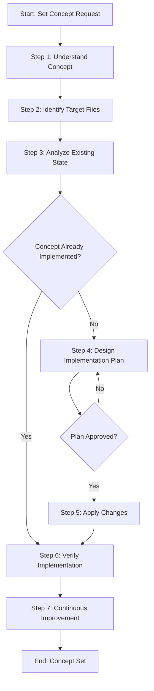

# Process: Set Universal PendingInteraction Concept

**Template**: set-concept  
**Status**: Running

## Description

Implement or update a concept systematically across multiple non-code files. This template guides you through understanding the concept, analyzing the current state, designing an implementation plan, applying changes, and verifying complete implementation.

## Purpose & Usage

Use this template when you need to:
- Implement a new pattern, structure, or standard across documentation files
- Update an existing concept across multiple files consistently
- Apply best practices or conventions to non-code files (markdown, processes, configurations)
- Ensure consistent implementation of architectural decisions or guidelines

**Not suitable for**: Code changes, single-file modifications, or verification-only tasks.

## Parameters

| Parameter | Value |
|-----------|-------|
| `conceptName` | Universal PendingInteraction |
| `conceptDescription` | The pendingInteraction field in process.json must be used for ALL user interactions during process execution, not only for approval checkpoints. This includes Q&A sessions, parameter collection, decision points, corrections, and any other point where the agent needs user input. Whenever the agent needs to interact with the user for any reason, it must set appropriate options in pendingInteraction so the UI can render them for easy user selection. |
| `targetFiles` | .processes/types/process-instance.ts, .processes/steps/_components/operating-principles.md, .processes/prompts/process-continue.md, .processes/prompts/process-new.md, .processes/steps/_components/mandatory-approval-checkpoint.md |
| `existingState` | pendingInteraction is currently described in Principle 8 as being for 'approval, choices, decisions' only. The concept is not applied to Q&A sessions, parameter collection, or general interaction points. |
| `requestedState` | pendingInteraction is used for ALL interactions: approvals, Q&A sessions, parameter collection, corrections, any user input. All guidance files consistently instruct agents to set pendingInteraction whenever they need any form of user input. |

## Process Flow

## Steps

- [x] Step 0: Init Process Principles
  - **Step**: `@framework-step:common/init-process-principles`
  - **Description**: Load and confirm operating principles
  - **Output**: Principles loaded and confirmed

- [ ] Step 1: Understand concept
  - **Step**: `@framework-step:planning/understand-context`
  - **Description**: Understand the Universal PendingInteraction concept
  - **Output**: Context documentation
  - **Approval Required**: Yes

- [ ] Step 2: Identify target files
  - **Step**: `@framework-step:investigation/identify-files`
  - **Description**: Identify all files that need updating
  - **Output**: List of target files in identified-files.json

- [ ] Step 3: Analyze existing state
  - **Step**: `@framework-step:investigation/review-verify-document`
  - **Description**: Analyze current pendingInteraction usage
  - **Output**: Findings report

- [ ] Step 4: Design implementation plan
  - **Step**: `@framework-step:planning/design-implementation-plan`
  - **Description**: Design changes for universal pendingInteraction
  - **Output**: Implementation plan with change proposals
  - **Approval Required**: Yes

- [ ] Step 5: Apply changes
  - **Step**: `@framework-step:common/apply-changes`
  - **Description**: Apply the approved changes
  - **Output**: Modified and newly created files

- [ ] Step 6: Verify implementation
  - **Step**: `@framework-step:investigation/review-verify-document`
  - **Description**: Verify all files correctly implement the concept
  - **Output**: Verification report

- [ ] Step 7: Continuous Improvement
  - **Step**: `@framework-step:learning/continuous-improvement`
  - **Description**: Identify improvements from process execution
  - **Output**: Improvements implemented

- [ ] Step 8: End Process Validation
  - **Step**: `@framework-step:common/end-process-validation`
  - **Description**: Final validation of process compliance
  - **Output**: Compliance report
