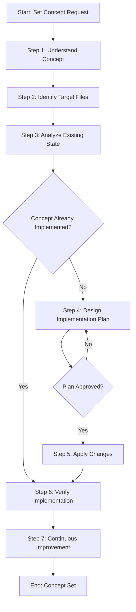

# Process: Set User Interaction Options Concept

**Template**: set-concept  
**Status**: Running

## Description

Implement the "User Interaction Options" concept systematically across the agentic-processes framework. This will ensure that whenever a step needs user interaction, it provides multiple choice options for easy selection, which can be rendered by UI applications.

## Purpose & Usage

This process will:
- Define a schema for interaction options in the ProcessStep type
- Update process.json structure to support step-level interaction options
- Ensure UI applications can render these options as buttons/choices

## Parameters

| Parameter | Value |
|-----------|-------|
| `conceptName` | User Interaction Options |
| `conceptDescription` | Always when a step needs user interaction, it will provide multiple choice options for easy selection. These options will be defined in the process.json schema (ProcessStep type) so the UI application can render them for users to choose from instead of free-form input. |
| `targetFiles` | .processes/types/process-instance.ts, process.json files, and related step templates |
| `existingState` | Steps can have approvalRequired flag but no structured way to define selectable options for user interactions |
| `requestedState` | Steps can define an array of interaction options with id, label, and optional description that UI apps can render as buttons/choices |

## Process Flow

## Steps Summary

| Step | Name | Status | Approval Required |
|------|------|--------|-------------------|
| 0 | Init Process Principles | In Progress | No |
| 1 | Understand concept | Pending | Yes |
| 2 | Identify target files | Pending | No |
| 3 | Analyze existing state | Pending | No |
| 4 | Design implementation plan | Pending | Yes |
| 5 | Apply changes | Pending | No |
| 6 | Verify implementation | Pending | No |
| 7 | Continuous Improvement | Pending | Yes (per improvement) |
| 8 | End Process Validation | Pending | No |

## Current Status

**Active Step**: Init Process Principles  
**Action**: Starting process initialization
