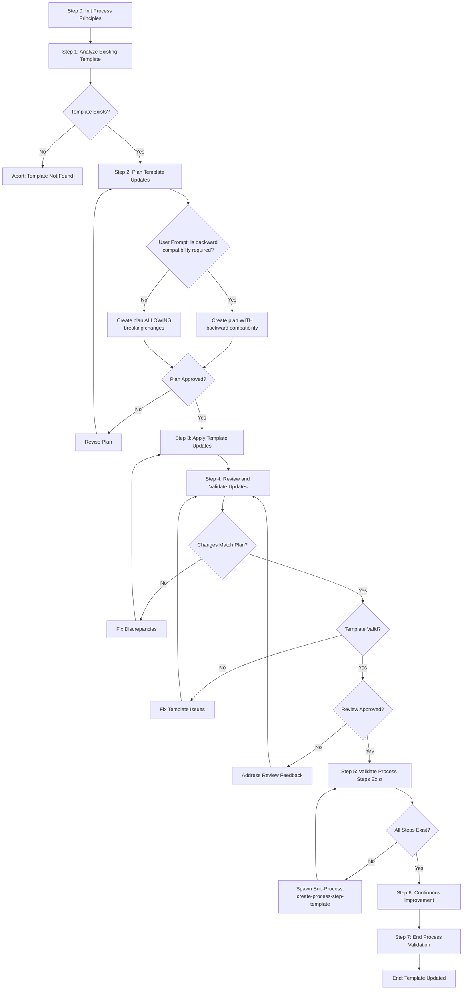

# Design: update-process-template

**Status**: Awaiting Approval  
**Created**: 2026-02-04

---

## Overview

A structured workflow for safely modifying existing process templates. Backward compatibility is **not automatic** - the process asks the user if it's required during execution.

---

## Requirements

### Template Information

| Field | Value |
|-------|-------|
| **Name** | update-process-template |
| **Category** | infrastructure |
| **Purpose** | Workflow for modifying and updating existing process templates |

### Parameters

| Name | Required | Type | Description |
|------|----------|------|-------------|
| `templateName` | Yes | string | Name of the template to update |
| `updateDescription` | Yes | string | Description of what changes are needed |
| `changeScope` | No | string | Scope of changes: "minor" or "major" |
| `preserveActiveProcesses` | No | boolean | Warn if active processes use this template |

### Backward Compatibility

**Important**: Backward compatibility is NOT a parameter. Instead, the process **prompts the user** during Step 2 (Plan Template Updates):

> "Is backward compatibility required for this update?"

- If **yes**: The update plan maintains backward compatibility
- If **no**: The update plan allows breaking changes

---

## Use Cases

1. Updating existing templates when requirements change
2. Adding new steps to templates
3. Modifying template parameters
4. Improving template structure
5. Fixing issues in templates
6. Updating step references

---

## Process Steps

| # | Step Name | Step Reference | Status | Approval |
|---|-----------|----------------|--------|----------|
| 0 | Init Process Principles | `@framework-step:common/init-process-principles` | Reuse | No |
| 1 | Analyze Existing Template | `@framework-step:template/analyze-existing-template` | **NEW** | No |
| 2 | Plan Template Updates | `@framework-step:template/plan-template-updates` | **NEW** | **Yes** |
| 3 | Apply Template Updates | `@framework-step:template/apply-template-updates` | **NEW** | No |
| 4 | Review and Validate Updates | `@framework-step:template/review-and-validate-updates` | **NEW** | **Yes** |
| 5 | Validate Process Steps Exist | `@framework-step:template/validate-process-steps-exist` | Reuse | No |
| 6 | Continuous Improvement | `@framework-step:learning/continuous-improvement` | Reuse | No |
| 7 | End Process Validation | `@framework-step:common/end-process-validation` | Reuse | No |

### Step Details

#### Step 0: Init Process Principles
- **Reference**: `@framework-step:common/init-process-principles`
- **Status**: Reuse existing step
- **Description**: Load and confirm understanding of agent operating principles

#### Step 1: Analyze Existing Template *(NEW)*
- **Reference**: `@framework-step:template/analyze-existing-template`
- **Status**: New step to create
- **Description**: 
  - Load template JSON and MD files
  - Parse current structure (steps, parameters, metadata)
  - Identify all step references (`@framework-step:` patterns)
  - Check for any existing issues or inconsistencies
  - Document current state in memory for comparison

#### Step 2: Plan Template Updates *(NEW)* - Approval Required
- **Reference**: `@framework-step:template/plan-template-updates`
- **Status**: New step to create
- **Approval**: **YES**
- **Description**:
  - Review user's update description
  - **Prompt user**: "Is backward compatibility required for this update?"
  - Design specific changes based on user's answer
  - Check if active processes use this template (if `preserveActiveProcesses` is true)
  - Create detailed change proposals
  - **Create `update-plan.md`** file with the complete plan for user review
- **Output**: `update-plan.md` containing:
  - Summary of proposed changes
  - Backward compatibility decision
  - Impact analysis
  - Step-by-step change details
  - Files to be modified

#### Step 3: Apply Template Updates *(NEW)*
- **Reference**: `@framework-step:template/apply-template-updates`
- **Status**: New step to create
- **Description**:
  - Read approved `update-plan.md` from process directory
  - Apply changes to template JSON file
  - Apply changes to template MD file
  - Update mermaid diagram if flow changed
  - Verify changes applied correctly

#### Step 4: Review and Validate Updates *(NEW)* - Approval Required
- **Reference**: `@framework-step:template/review-and-validate-updates`
- **Status**: New step to create
- **Approval**: **YES**
- **Description**:
  - **Review against plan**: Compare implemented changes with `update-plan.md` from Step 2
  - Verify each planned change was correctly applied
  - Check for unplanned changes or missing changes
  - **Validate template structure**:
    - Template JSON structure against schema
    - All required fields present (name, category, metadata, parameters, steps)
    - Parameter definitions complete (type, description, required flag)
    - Step references format (`@framework-step:category/step-name`)
    - Mermaid diagram syntax in MD file
    - JSON and MD files are in sync
  - **Create `review-report.md`** file with results for user review
- **Output**: `review-report.md` containing:
  - Plan compliance summary
  - Checklist: planned changes vs implemented changes
  - Unplanned changes detected (if any)
  - Missing changes (if any)
  - Template validation results
  - Recommendations

#### Step 5: Validate Process Steps Exist
- **Reference**: `@framework-step:template/validate-process-steps-exist`
- **Status**: Reuse existing step
- **Description**: Verify all referenced steps exist, spawn sub-processes if needed

#### Step 6: Continuous Improvement
- **Reference**: `@framework-step:learning/continuous-improvement`
- **Status**: Reuse existing step
- **Description**: Review process for potential improvements

#### Step 7: End Process Validation
- **Reference**: `@framework-step:common/end-process-validation`
- **Status**: Reuse existing step
- **Description**: Final validation and compliance check

---

## Process Flow Diagram

---

## New Steps Summary

| Step | Category | Key Responsibilities |
|------|----------|---------------------|
| analyze-existing-template | template | Load, parse, and document current template state |
| plan-template-updates | template | Prompt for compatibility, design changes, create `update-plan.md` for approval |
| apply-template-updates | template | Apply approved changes to template files |
| review-and-validate-updates | template | Compare changes to plan, validate template, create `review-report.md` for approval |

---

## Statistics

- **Total Steps**: 8 (including Step 0)
- **Reused Steps**: 4
- **New Steps**: 4
- **Approval Checkpoints**: 2 (Step 2, Step 4)
