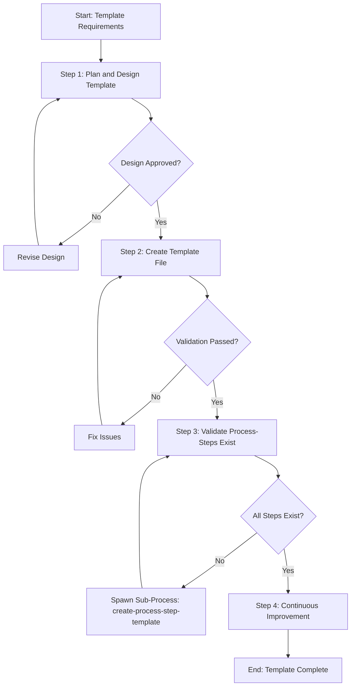

# Process: Create update-process-template Template

**Template**: create-process-template  
**Status**: Running

## Description

Create a new process template for the Agentic Process System. This template guides you through designing, creating, validating, and documenting a new template that can be used to instantiate processes.

## Purpose & Usage

Use this template when you need to:
- Create a new reusable process template for the framework
- Define a systematic workflow for a specific type of task
- Establish a standardized approach that others can follow

**Not suitable for**: Creating process steps (use `create-process-step-template`), modifying existing templates, or one-time processes.

## Parameters

| Parameter | Value |
|-----------|-------|
| `templateName` | update-process-template |
| `templatePurpose` | Workflow for modifying and updating existing process templates while maintaining backward compatibility and ensuring all references are valid |
| `useCases` | Updating existing templates when requirements change, adding new steps to templates, modifying template parameters, improving template structure, fixing issues in templates |

## Process Flow

## Steps

- [x] Step 0: Init Process Principles
  - **Step**: `@framework-step:common/init-process-principles`
  - **Description**: Load and confirm understanding of agent operating principles
  - **Output**: Principles loaded and confirmed

- [ ] Step 1: Plan and design template
  - **Step**: `@framework-step:template/plan-and-design-template`
  - **Description**: Create requirements document and design artifacts for the template
  - **Output**: Requirements document, design artifacts, mermaid diagram
  - **Approval Required**: Yes

- [ ] Step 2: Create template file
  - **Step**: `@framework-step:template/create-template-file`
  - **Description**: Create the template JSON and MD files
  - **Output**: Complete template file with validation reports

- [ ] Step 3: Validate process-steps exist
  - **Step**: `@framework-step:template/validate-process-steps-exist`
  - **Description**: Verify all referenced steps exist, spawn sub-processes if needed
  - **Output**: Validation report

- [ ] Step 4: Continuous Improvement
  - **Step**: `@framework-step:learning/continuous-improvement`
  - **Description**: Review process for potential improvements
  - **Output**: Improvements implemented

- [ ] Step 5: End Process Validation
  - **Step**: `@framework-step:common/end-process-validation`
  - **Description**: Final validation and compliance check
  - **Output**: Compliance report
