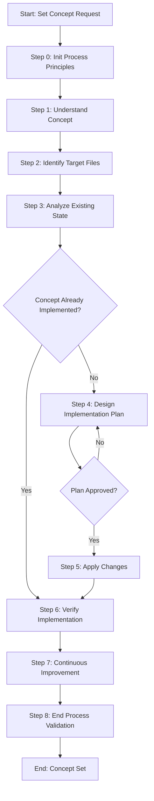

# Process: Set Process Completion and Directory Migration Concept

**Template**: set-concept  
**Status**: Running  
**Created**: 2026-01-29

## Description

Implement or update a concept systematically across multiple non-code files. This template guides you through understanding the concept, analyzing the current state, designing an implementation plan, applying changes, and verifying complete implementation.

## Purpose & Usage

Implementing the "Process Completion and Directory Migration" pattern to ensure completed processes are moved from `.user-processes/active` to `.user-processes/completed` when they finish.

## Parameters

| Parameter | Value |
|-----------|-------|
| `conceptName` | Process Completion and Directory Migration |
| `conceptDescription` | Ensure completed processes are moved from .user-processes/active to .user-processes/completed when they finish. The end-process-validation step (or a new dedicated step) should handle this migration automatically after successful validation. |
| `targetFiles` | .processes/steps/common/end-process-validation/, .processes/prompts/process-continue.md, related process completion files |
| `existingState` | Completed processes remain in .user-processes/active directory; no migration logic exists in any step |
| `requestedState` | Completed processes automatically migrate to .user-processes/completed when end-process-validation succeeds |
| `verificationCriteria` | end-process-validation step includes directory migration logic; processes move to completed directory after successful validation |

## Process Flow

## Steps

| Step | Name | Status | Approval Required |
|------|------|--------|-------------------|
| 0 | Init Process Principles | ⬜ Pending | No |
| 1 | Understand concept | ⬜ Pending | **Yes** |
| 2 | Identify target files | ⬜ Pending | No |
| 3 | Analyze existing state | ⬜ Pending | No |
| 4 | Design implementation plan | ⬜ Pending | **Yes** |
| 5 | Apply changes | ⬜ Pending | No |
| 6 | Verify implementation | ⬜ Pending | No |
| 7 | Continuous Improvement | ⬜ Pending | No |
| 8 | End Process Validation | ⬜ Pending | No |

## Current State

**Phase**: Initialization  
**Current Step**: 0 - Init Process Principles
