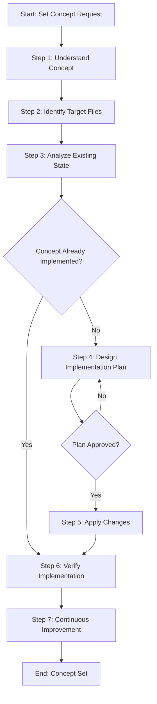

# Process: Set Strongly Typed JSON Schema Concept

**Template**: set-concept  
**Status**: Completed  
**Created**: 2026-01-29

## Description

Implement or update a concept systematically across multiple non-code files. This template guides you through understanding the concept, analyzing the current state, designing an implementation plan, applying changes, and verifying complete implementation.

## Purpose & Usage

Implement a strongly typed schema definition for all step and template JSON files, ensuring consistent structure, required fields, and type definitions across the entire framework. This includes defining TypeScript-style interfaces/types for steps, templates, and process instances.

## Parameters

| Parameter | Value |
|-----------|-------|
| **conceptName** | Strongly Typed JSON Schema |
| **conceptDescription** | Implement a strongly typed schema definition for all step and template JSON files, ensuring consistent structure, required fields, and type definitions across the entire framework |
| **targetFiles** | All JSON files in .processes/steps/ and .processes/templates/ |
| **existingState** | Current JSON files have ad-hoc structures with varying fields and no formal schema definition |
| **requestedState** | All JSON files conform to defined TypeScript-style schemas with consistent structure, required/optional field annotations, and proper typing |
| **verificationCriteria** | All files validate against schema, consistent field names across all files, proper type definitions documented |

## Process Flow

## Steps

- [x] **Step 0**: Init Process Principles ✓
  - **Step**: `@framework-step:common/init-process-principles`
  - **Description**: Load and confirm operating principles
  - **Output**: Principles loaded and confirmed

- [x] **Step 1**: Understand concept ⚠️ **APPROVED** ✓
  - **Step**: `@framework-step:planning/understand-context`
  - **Description**: Fully understand the context, sources, and requirements
  - **Output**: Context documentation

- [x] **Step 2**: Identify target files ✓
  - **Step**: `@framework-step:investigation/identify-files`
  - **Description**: Identify all files that need schema updates
  - **Output**: List of target files in identified-files.json

- [x] **Step 3**: Analyze existing state ✓
  - **Step**: `@framework-step:investigation/review-verify-document`
  - **Description**: Review current JSON structures and document findings
  - **Output**: Findings report

- [x] **Step 4**: Design implementation plan ⚠️ **APPROVED** ✓
  - **Step**: `@framework-step:planning/design-implementation-plan`
  - **Description**: Create schema definitions and change proposals
  - **Output**: Implementation plan with change proposals

- [x] **Step 5**: Apply changes ✓
  - **Step**: `@framework-step:common/apply-changes`
  - **Description**: Apply approved schema changes to all files
  - **Output**: Modified and newly created files

- [x] **Step 6**: Verify implementation ✓
  - **Step**: `@framework-step:investigation/review-verify-document`
  - **Description**: Verify all files conform to new schema
  - **Output**: Verification report

- [x] **Step 7**: Continuous Improvement ✓
  - **Step**: `@framework-step:learning/continuous-improvement`
  - **Description**: Document learnings and improvements
  - **Output**: Improvements implemented

- [x] **Step 8**: End Process Validation ✓
  - **Step**: `@framework-step:common/end-process-validation`
  - **Description**: Final validation and compliance check
  - **Output**: Compliance report

## Quick Reference

| Checkpoint | Description |
|------------|-------------|
| Step 1 | Context understanding approval before proceeding |
| Step 4 | Design approval required before applying changes |
| Step 7 | Per-improvement approval for continuous improvement |
