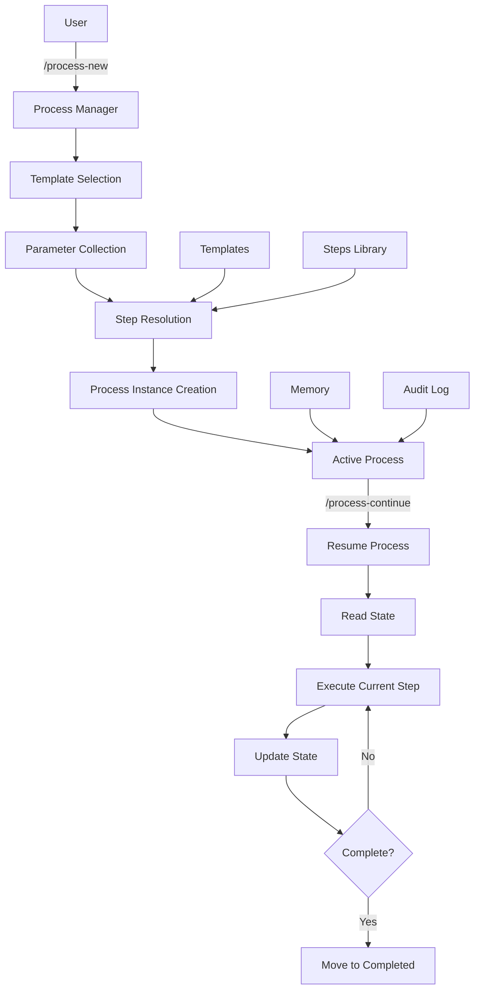

# Agentic Process System

A powerful system for managing long-running, multi-step workflows with AI agents. Create reusable process templates, modular step definitions, and track complex tasks from start to finish with persistent state management.

## Overview

The Agentic Process System enables structured, repeatable workflows for complex development tasks. It provides:

- **Process Templates**: Reusable workflow definitions with parameter substitution
- **Modular Steps**: Self-contained, reusable step definitions that can be composed into processes
- **State Management**: Persistent process state with checkboxes, timestamps, and audit logs
- **AI Integration**: Seamless integration with Cursor IDE and GitHub Copilot
- **Process Tracking**: Resume interrupted processes, track progress, and maintain context across sessions

## Key Features

### Process Management
- Create processes from templates with parameter substitution
- Track progress with checkboxes and timestamps
- Maintain audit logs for all actions
- Resume interrupted processes seamlessly
- Move processes between active/completed/failed states

### Modular Architecture
- **Templates**: Define reusable workflows with placeholders
- **Steps**: Self-contained step definitions with rich guidance
- **Step References**: Compose processes using `@step:category/step-name` syntax
- **Automatic Resolution**: Step references are automatically expanded with full details

### State Persistence
- Process state stored in markdown files
- Memory files for cross-step information sharing
- Audit logs for complete history
- No data loss between sessions

### AI Integration
- Cursor IDE commands (`/process-new`, `/process-continue`)
- GitHub Copilot prompts for process management
- Strict process adherence to prevent deviation
- Proactive guidance for next steps

## Quick Start

### 1. Create a New Process

In Cursor IDE, use the command:
```
/process-new
```

The system will:
1. Check for existing similar processes
2. List available templates
3. Collect required parameters
4. Resolve step references
5. Create process instance with expanded steps

### 2. Continue an Existing Process

To resume a process:
```
/process-continue
```

The system will:
1. List all active processes
2. Show current progress
3. Resume from the last incomplete step

### 3. Process Structure

A process consists of:
- **Process File** (`process.md`): Main workflow definition with steps
- **Memory File** (`memory.md`): Persistent information shared across steps
- **Log File** (`log.md`): Detailed execution log (auto-updated)

## Architecture



## Directory Structure

```
agentic-processes/
├── README.md                    # This file
├── docs/                        # System documentation
│   ├── getting-started.md       # Quick start guide
│   ├── architecture.md          # System architecture
│   └── examples.md              # Usage examples
├── core/                        # Core system components
│   ├── processes/
│   │   ├── templates/           # Process templates
│   │   │   ├── develop-user-story.md
│   │   │   ├── integration-test-fix.md
│   │   │   └── README.md
│   │   ├── steps/               # Modular step definitions
│   │   │   ├── api/             # API-related steps
│   │   │   ├── data/            # Data layer steps
│   │   │   ├── service/         # Service layer steps
│   │   │   ├── testing/         # Testing steps
│   │   │   ├── planning/        # Planning steps
│   │   │   ├── documentation/   # Documentation steps
│   │   │   ├── external-services/ # External service steps
│   │   │   ├── learning/        # Learning/improvement steps
│   │   │   └── README.md
│   │   └── README.md
│   └── README.md                # Core system overview
├── .cursor/                     # Cursor IDE integration
│   └── commands/
│       ├── process-new.md
│       └── process-continue.md
└── .github/                     # GitHub integration
    └── prompts/
        ├── process-new.prompt.md
        └── process-continue.prompt.md
```

## Core Concepts

### Processes

A **process** is an instance of a workflow created from a template. It tracks:
- Current step and progress
- Completed steps with timestamps
- Memory and context
- Audit log of all actions

Processes are stored in:
- `core/processes/active/` - Currently running processes
- `core/processes/completed/` - Finished processes
- `core/processes/failed/` - Failed processes

### Templates

**Templates** define reusable workflows with:
- Parameter placeholders (`{{paramName}}`)
- Step references (`@step:category/step-name`)
- Process flow diagrams (mermaid)
- Sequential step definitions

Templates are stored in `core/processes/templates/`.

### Steps

**Steps** are modular, self-contained definitions that include:
- Description and objectives
- Expected outputs
- Detailed guidance
- Flow diagrams (mermaid)
- Substeps breakdown
- Examples and common pitfalls

Steps are stored in `core/processes/steps/{category}/`.

### Step References

Templates reference steps using:
```markdown
- [ ] Step 1: Implement feature
  - **Step**: `@step:api/implement-controller-layer`
  - **Context**:
    - `targetArea`: {{featureName}}
```

When a process is created, step references are automatically resolved and expanded with full step details.

## Usage Examples

### Example 1: Creating a Process

1. Invoke `/process-new` in Cursor
2. Select template (e.g., "develop-user-story")
3. Provide parameters:
   - `userStoryTitle`: "User Authentication"
   - `userStoryDescription`: "Implement login functionality"
   - `acceptanceCriteria`: "User can log in with email/password"
4. System creates process with all steps expanded
5. Begin working on Step 1

### Example 2: Process State

A process file tracks state:
```markdown
## Current State
**Active Step**: Step 3 - Create detailed step plans
**Current Action**: Analyzing high-level plan
**Details**: Reviewing implementation tasks

## Steps
- [x] Step 1: Create high-level plan
  **Completed At**: 2025-01-15 10:30
- [x] Step 2: Validate process-steps exist
  **Completed At**: 2025-01-15 11:15
- [ ] Step 3: Create detailed step plans
  **Started At**: 2025-01-15 11:20
```

### Example 3: Memory File

Memory files store information across steps:
```markdown
## Step 1: Create High-Level Plan
**Information Produced**: 
- Approved plan in `ai/plans/user-authentication/plan.md`
- 5 implementation tasks identified

**Decisions Made**:
- Use JWT for authentication
- Store sessions in Redis

**Files Created**:
- `ai/plans/user-authentication/plan.md`
```

## Integration

### Cursor IDE

Commands available in Cursor chat:
- `/process-new` - Create a new process
- `/process-continue` - Resume an existing process

Commands are defined in `.cursor/commands/`.

### GitHub Copilot

Prompts available in GitHub Copilot Chat:
- `/process-new` - Create a new process
- `/process-continue` - Resume an existing process

Prompts are defined in `.github/prompts/`.

## Contributing

### Adding New Templates

1. Create template file in `core/processes/templates/`
2. Follow template structure (see `core/processes/templates/README.md`)
3. Include parameter placeholders
4. Reference steps using `@step:category/step-name` syntax
5. Add mermaid flow diagram

### Adding New Steps

1. Create step file in `core/processes/steps/{category}/`
2. Follow step template (see `core/processes/steps/step-template.md`)
3. Include all required sections:
   - Description
   - Output
   - Guidance
   - Flow diagram
   - Substeps
   - Examples
   - Common pitfalls

### Best Practices

- **Templates**: Keep focused, use parameters for flexibility
- **Steps**: Be self-contained, provide rich guidance
- **Naming**: Use kebab-case for files, descriptive names
- **Documentation**: Update README files when adding content

## Documentation

- [Getting Started](docs/getting-started.md) - Detailed quick start guide
- [Architecture](docs/architecture.md) - System architecture deep dive
- [Examples](docs/examples.md) - More usage examples
- [Core System](core/README.md) - Core system overview
- [Templates Guide](core/processes/templates/README.md) - Template authoring
- [Steps Guide](core/processes/steps/README.md) - Step creation guide

## License

[Add your license here]

---

**Built for structured, repeatable workflows with AI agents.**
