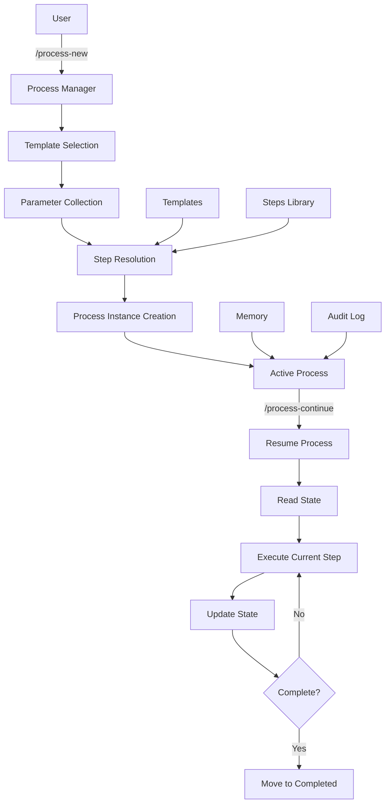

# Agentic Process System

A powerful system for managing long-running, multi-step workflows with AI agents. Create reusable process templates, modular step definitions, and track complex tasks from start to finish with persistent state management.

## Overview

The Agentic Process System enables structured, repeatable workflows for complex development tasks. It provides:

- **Process Templates**: Reusable workflow definitions with parameter substitution
- **Modular Steps**: Self-contained, reusable step definitions that can be composed into processes
- **State Management**: Persistent process state with checkboxes, timestamps, and audit logs
- **AI Integration**: Seamless integration with Cursor IDE and GitHub Copilot
- **Process Tracking**: Resume interrupted processes, track progress, and maintain context across sessions

## Key Features

### Process Management
- Create processes from templates with parameter substitution
- Track progress with checkboxes and timestamps
- Maintain audit logs for all actions
- Resume interrupted processes seamlessly
- Move processes between active/completed/failed states

### Modular Architecture
- **Templates**: Define reusable workflows with placeholders
- **Steps**: Self-contained step definitions with rich guidance
- **Step References**: Compose processes using `@framework-step:category/step-name` or `@user-step:category/step-name` syntax
- **Pluggable Resources**: Add your own templates, steps, components, and guidelines

### State Persistence
- Process state stored in markdown files
- Memory files for cross-step information sharing
- Audit logs for complete history
- No data loss between sessions

### AI Integration
- Cursor IDE commands (`/process-new`, `/process-continue`)
- GitHub Copilot prompts for process management
- Strict process adherence to prevent deviation
- Proactive guidance for next steps

## Quick Start

### 1. Create a New Process

In Cursor IDE, use the command:
```
/process-new
```

The system will:
1. Check for existing similar processes
2. List available templates
3. Collect required parameters
4. Resolve step references
5. Create process instance with expanded steps

### 2. Continue an Existing Process

To resume a process:
```
/process-continue
```

The system will:
1. List all active processes
2. Show current progress
3. Resume from the last incomplete step

### 3. Process Structure

A process consists of:
- **Process File** (`process.md`): Main workflow definition with steps
- **Memory File** (`memory.md`): Persistent information shared across steps
- **Log File** (`log.md`): Detailed execution log (auto-updated)

## Architecture



## Directory Structure

The framework uses a **pluggable resources** model with two locations:

### Framework Resources (`.processes/`)

Core templates, steps, and infrastructure provided by the framework:

```
agentic-processes/
├── .processes/                  # Framework-provided resources
│   ├── templates/               # Process templates (by category)
│   │   ├── development/         # Feature development templates
│   │   ├── testing/             # Testing templates
│   │   ├── review/              # Review templates
│   │   ├── infrastructure/      # Infrastructure templates
│   │   └── README.md
│   ├── steps/                   # Modular step definitions
│   │   ├── api/                 # API-related steps
│   │   ├── data/                # Data layer steps
│   │   ├── service/             # Service layer steps
│   │   ├── testing/             # Testing steps
│   │   ├── planning/            # Planning steps
│   │   └── ...
│   └── prompts/                 # Process management prompts
├── .user-processes/             # User resources & process instances
│   ├── active/                  # Currently running processes
│   ├── completed/               # Finished processes
│   ├── failed/                  # Failed processes
│   ├── templates/               # User-defined templates
│   ├── steps/                   # User-defined steps
│   ├── components/              # User-defined components
│   └── guidelines/              # Project-specific guidelines
└── docs/                        # Documentation
```

### User Resources (`.user-processes/`)

Your project-specific resources and all process instances. **Created on-demand** - folders only exist when needed:

```
your-project/
└── .user-processes/             # Created when first process starts
    ├── active/                  # Running process instances
    ├── completed/               # Created when processes complete
    ├── failed/                  # Created when processes fail
    ├── templates/               # Created when you add custom templates
    ├── steps/                   # Created when you add custom steps
    ├── components/              # Created when you add shared components
    └── guidelines/              # Created when you add project guidelines
```

## Core Concepts

### Processes

A **process** is an instance of a workflow created from a template. It tracks:
- Current step and progress
- Completed steps with timestamps
- Memory and context
- Audit log of all actions

Processes are stored in `.user-processes/`:
- `.user-processes/active/` - Currently running processes
- `.user-processes/completed/` - Finished processes
- `.user-processes/failed/` - Failed processes

### Templates

**Templates** define reusable workflows with:
- Parameter placeholders (`{{paramName}}`)
- Step references (`@framework-step:category/step-name` or `@user-step:category/step-name`)
- Process flow diagrams (mermaid)
- Sequential step definitions

Templates are stored in:
- **Framework templates**: `.processes/templates/{category}/`
- **User templates**: `.user-processes/templates/{category}/`

### Steps

**Steps** are modular, self-contained definitions that include:
- Description and objectives
- Expected outputs
- Detailed guidance
- Flow diagrams (mermaid)
- Substeps breakdown
- Examples and common pitfalls

Steps are stored in:
- **Framework steps**: `.processes/steps/{category}/`
- **User steps**: `.user-processes/steps/{category}/`

### Step References

Templates reference steps using explicit prefixes:

```markdown
# Framework steps (from .processes/steps/)
- [ ] Step 1: Implement feature
  - **Step**: `@framework-step:api/implement-controller-layer`

# User steps (from .user-processes/steps/)
- [ ] Step 2: Apply project conventions
  - **Step**: `@user-step:my-category/my-custom-step`
```

The prefix makes it clear where each resource comes from:
- `@framework-step:` → `.processes/steps/`
- `@user-step:` → `.user-processes/steps/`
- `@framework-template:` → `.processes/templates/`
- `@user-template:` → `.user-processes/templates/`

## Usage Examples

### Example 1: Creating a Process

1. Invoke `/process-new` in Cursor
2. Select template (e.g., "develop-user-story")
3. Provide parameters:
   - `userStoryTitle`: "User Authentication"
   - `userStoryDescription`: "Implement login functionality"
   - `acceptanceCriteria`: "User can log in with email/password"
4. System creates process with all steps expanded
5. Begin working on Step 1

### Example 2: Process State

A process file tracks state:
```markdown
## Current State
**Active Step**: Step 3 - Create detailed step plans
**Current Action**: Analyzing high-level plan
**Details**: Reviewing implementation tasks

## Steps
- [x] Step 1: Create high-level plan
  **Completed At**: 2025-01-15 10:30
- [x] Step 2: Validate process-steps exist
  **Completed At**: 2025-01-15 11:15
- [ ] Step 3: Create detailed step plans
  **Started At**: 2025-01-15 11:20
```

### Example 3: Memory File

Memory files store information across steps:
```markdown
## Step 1: Create High-Level Plan
**Information Produced**: 
- Approved plan in `ai/plans/user-authentication/plan.md`
- 5 implementation tasks identified

**Decisions Made**:
- Use JWT for authentication
- Store sessions in Redis

**Files Created**:
- `ai/plans/user-authentication/plan.md`
```

## How It Works

### 1. Template Selection

User selects a template from `.processes/templates/`.

### 2. Parameter Collection

System collects required parameters and substitutes placeholders.

### 3. Step Resolution

System resolves all step references:
- `@framework-step:` → reads from `.processes/steps/{category}/`
- `@user-step:` → reads from `.user-processes/steps/{category}/`
- Applies context parameters

### 4. Process Creation

System creates process instance in `.user-processes/active/`:
- Process file with step references
- Memory file initialized
- Status set to "Running"

### 5. Process Execution

Process Manager:
- Tracks current step
- Updates state and memory
- Maintains audit log
- Enforces step order

### 6. Process Completion

When complete:
- Status updated to "Completed"
- Process moved to `.user-processes/completed/`

## Integration

### Cursor IDE

Commands available in Cursor chat:
- `/process-new` - Create a new process
- `/process-continue` - Resume an existing process

Commands are defined in `.cursor/commands/`.

### GitHub Copilot

Prompts available in GitHub Copilot Chat:
- `/process-new` - Create a new process
- `/process-continue` - Resume an existing process

Prompts are defined in `.github/prompts/`.

## Contributing

### Adding Your Own Templates

1. Create template file in `.user-processes/templates/{category}/`
2. Follow template structure (see `.processes/templates/README.md`)
3. Include parameter placeholders
4. Reference steps using `@framework-step:` or `@user-step:` syntax
5. Add mermaid flow diagram

### Adding Your Own Steps

1. Create step file in `.user-processes/steps/{category}/`
2. Follow step template (see `.processes/steps/step-template.md`)
3. Include all required sections:
   - Description
   - Output
   - Guidance
   - Flow diagram
   - Substeps
   - Examples
   - Common pitfalls

### Best Practices

- **Templates**: Keep focused and specific, use parameters for flexibility, reference existing steps, include flow diagrams, document when to use
- **Steps**: Be self-contained, provide rich guidance, include examples, document common pitfalls, use flow diagrams for complex steps
- **Processes**: Follow step guidance exactly, update memory as you go, check state regularly, complete steps fully before moving on, document decisions in memory
- **Naming**: Use kebab-case for files, descriptive names
- **Documentation**: Update README files when adding content

## Documentation

- [Getting Started](docs/getting-started.md) - Detailed quick start guide
- [Architecture](docs/architecture.md) - System architecture deep dive
- [Examples](docs/examples.md) - More usage examples
- [Templates Guide](.processes/templates/README.md) - Template authoring
- [Steps Guide](.processes/steps/README.md) - Step creation guide

## License

[Add your license here]

---

**Built for structured, repeatable workflows with AI agents.**
