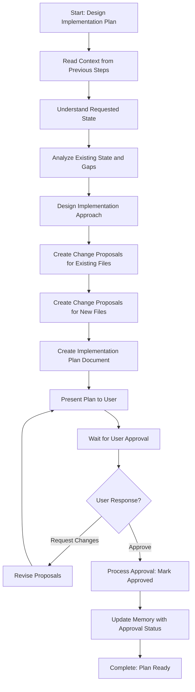

# New Step Specification: Design Implementation Plan

## Step Details

**Step Name**: Design Implementation Plan  
**Step Path**: `core/processes/steps/planning/design-implementation-plan.md`  
**Category**: Planning  
**Purpose**: Design a comprehensive implementation plan for implementing or updating a concept (pattern, structure, standard, or approach) across non-code files. The plan includes understanding the requested state, designing how files should be modified or created, and creating detailed change proposals for both existing file modifications and new file creation.

## Context

This step is needed for Step 4 of the `set-concept` template. The current step reference `@step:planning/create-high-level-plan` is designed for code development (API/Service/Repository layers, user stories, LLD) and does not fit the non-code focus of `set-concept`.

## Step Requirements

### Inputs (from previous steps)
- **From Step 1**: Concept definition, characteristics, requirements, and success criteria
- **From Step 3**: Findings report documenting current state, existing implementations (if any), gaps identified, and files that need to be created
- **From Process Parameters**: 
  - `conceptDescription`: Description of the concept to implement
  - `requestedState`: (optional) How files should look after implementation
  - `verificationCriteria`: (optional) Criteria to verify successful implementation

### Outputs
- **Implementation plan document**: `implementation-plan.md` containing:
  - Requested state specification (how files should look after implementation)
  - Step-by-step approach for implementing the concept
  - Change proposals for:
    - Modifications to existing files (with detailed instructions)
    - Creation of new files (with content specifications)
  - Rationale for each change proposal
  - Verification approach (how to confirm implementation is complete)
- **Memory update**: Summary written to memory.md with plan document path, total change proposals, and plan summary

### Key Characteristics
- **File-oriented**: Works with any file type (documentation, markdown, processes, AI agentic files, configuration, etc.)
- **State-aware**: Understands existing state (from Step 3) and designs requested state
- **Change proposals**: Creates detailed proposals for both file modifications and new file creation
- **User approval required**: Plan must be approved before proceeding to Step 5 (Apply Changes)
- **Non-code focus**: Designed for concepts/patterns/standards applied to non-code files, not code development

## Step Structure

### Header Comment Block
```markdown
<!--
Step: Design Implementation Plan
Purpose: Design a comprehensive implementation plan for implementing or updating a concept (pattern, structure, standard, or approach) across non-code files. The plan includes understanding the requested state, designing how files should be modified or created, and creating detailed change proposals for both existing file modifications and new file creation.
-->
```

### Required Sections

1. **Description**
   - Clear explanation of what the step does
   - Emphasis on non-code files (documentation, processes, AI agentic files, best practices, etc.)
   - Clarification that this is for concepts/patterns/standards, not code development

2. **Output**
   - Implementation plan document (`implementation-plan.md`)
   - Change proposals (for modifications and new file creation)
   - Memory update with plan summary

3. **Guidance**
   - **Specific Actions**: Step-by-step workflow
   - **Files/Folders**: What to read, create, update
   - **Tools**: Tools to use (read_file, write, codebase_search, etc.)
   - **Best Practices**: Guidelines for creating effective plans

4. **Memory File Usage**
   - When to use memory
   - What to read from previous steps
   - What to write to current step section

5. **Flow Diagram**
   - Mermaid flowchart showing the workflow
   - Key nodes: Read context → Understand requested state → Design plan → Create change proposals → Present to user → Wait for approval

6. **Substeps**
   - Read context from previous steps
   - Understand requested state (from parameters or derive from concept)
   - Analyze existing state (from Step 3 findings)
   - Design implementation approach
   - Create change proposals for existing files
   - Create change proposals for new files
   - Create implementation plan document
   - Present plan to user
   - Wait for approval
   - Process approval response

## Detailed Substeps

### Substep 1: Read Context from Previous Steps
- Read from memory.md Step 1 section: concept definition, characteristics, requirements, success criteria
- Read from memory.md Step 3 section: findings report path, current state, existing implementations, gaps identified, files that need to be created
- Read from process.md: `conceptDescription`, `requestedState` (if provided), `verificationCriteria` (if provided)
- Read findings report from Step 3 to understand current state
- Document context parameters in log.md

### Substep 2: Understand Requested State
- If `requestedState` parameter is provided:
  - Use it as the specification for how files should look after implementation
  - Clarify any ambiguities in the requested state
- If `requestedState` parameter is not provided:
  - Derive requested state from concept description and characteristics
  - Design how files should look to fully implement the concept
  - Consider examples and patterns from concept definition
- Document requested state specification clearly
- Ensure requested state addresses all gaps identified in Step 3

### Substep 3: Analyze Existing State and Gaps
- Review findings report from Step 3
- Understand current implementation state (if any)
- Identify specific gaps that need to be addressed
- List files that need modification
- List files that need to be created
- Map gaps to change proposals needed

### Substep 4: Design Implementation Approach
- Break down implementation into logical steps
- Determine order of changes (dependencies, prerequisites)
- Identify which files to modify first
- Identify which files to create first
- Consider impact of changes on related files
- Design verification approach (how to confirm implementation is complete)

### Substep 5: Create Change Proposals for Existing Files
- For each existing file that needs modification:
  - Read the file to understand current content
  - Identify specific changes needed
  - Create detailed change proposal with:
    - File path
    - Current state (what exists now)
    - Requested state (what should exist)
    - Change description (what needs to change)
    - Detailed change instructions (step-by-step)
    - Rationale (why this change is needed)
- Organize proposals by file or by logical grouping

### Substep 6: Create Change Proposals for New Files
- For each new file that needs to be created:
  - Determine file path and name
  - Design file content based on concept requirements
  - Create detailed change proposal with:
    - File path (where to create)
    - File name
    - File content specification (what should be in the file)
    - Content structure and organization
    - Rationale (why this file is needed)
- Ensure new files align with concept requirements and requested state

### Substep 7: Create Implementation Plan Document
- Create `implementation-plan.md` with:
  - Header: Implementation Plan for {conceptName}
  - Summary section:
    - Concept name and description
    - Current state summary (from Step 3)
    - Requested state specification
    - Total files to modify
    - Total files to create
    - Total change proposals
  - Requested State Specification:
    - Detailed description of how files should look after implementation
    - Key characteristics and requirements
    - Examples or patterns (if applicable)
  - Implementation Approach:
    - Step-by-step approach for implementing the concept
    - Order of changes and dependencies
    - Verification approach
  - Change Proposals:
    - Organized by file or logical grouping
    - For each proposal:
      - Change ID (unique identifier)
      - File path
      - Type (modification or new file)
      - Current state (for modifications)
      - Requested state / Content specification
      - Change description
      - Detailed change instructions
      - Rationale
  - Verification Criteria:
    - How to verify implementation is complete
    - What to check after applying changes
  - Approval section (to be filled after user response):
    - Status: Pending Approval
    - Instructions for user on how to approve plan

### Substep 8: Present Plan to User and Wait for Approval
- Present implementation-plan.md to user
- Explain that user can:
  - Approve the plan (all change proposals)
  - Approve specific change proposals by change ID
  - Request modifications to specific proposals
  - Request clarification on any aspect
- Wait for user response
- **IMMEDIATELY log user interaction in log.md** (before processing response)

### Substep 9: Process User Approval Response
- If user requests modifications:
  - Identify which proposals need revision
  - Revise specific proposals based on user feedback
  - Update implementation-plan.md with revised proposals
  - Update memory.md with revision notes
  - Log revision in log.md
  - Return to Substep 8 (Present Plan to User)
- If user approves (all or specific proposals):
  - Parse user response to identify approved change IDs
  - Mark approved proposals in implementation-plan.md
  - Update memory.md with:
    - Approval status: approved
    - List of approved change IDs
    - Total approved: {count}
  - Log approval in log.md
  - Step complete - plan ready for Step 5 (Apply Changes)

## Memory File Usage

**When to Use Memory:**
- Always use memory for this step - implementation plan is needed by Step 5

**Memory Usage for This Step:**
- **Read from**: 
  - Step 1 section in memory.md - concept definition, characteristics, requirements, success criteria
  - Step 3 section in memory.md - findings report path, current state, existing implementations, gaps, files to create
  - process.md - conceptDescription, requestedState, verificationCriteria
- **Write to**: Current step section in memory.md
  - Information Produced:
    - Implementation plan document path (e.g., `implementation-plan.md`)
    - Requested state specification
    - Total change proposals (modifications and new files)
    - List of files to modify
    - List of files to create
    - Approval status
    - List of approved change IDs (if approved)
  - Decisions Made:
    - Requested state design (if not provided)
    - Implementation approach selected
    - Change proposal structure and organization
  - Files Modified/Created:
    - `implementation-plan.md`
    - memory.md (plan summary)
  - Notes:
    - Any assumptions made about requested state
    - Rationale for implementation approach
    - Dependencies between changes

## Flow Diagram



## Key Differences from create-high-level-plan

1. **Focus**: Non-code files vs. code development
2. **Output**: Implementation plan with change proposals vs. high-level plan with LLD and user story breakdown
3. **Scope**: Concepts/patterns/standards vs. feature development
4. **Change Proposals**: Detailed proposals for file modifications and creation vs. high-level task breakdown
5. **No LLD**: Does not include Low Level Design (code-focused)
6. **No User Story**: Does not work with user stories
7. **File-oriented**: Works with any file type, not just code files

## Examples of Use Cases

1. **Documentation Standard**: Implementing a documentation standard across all markdown files
   - Concept: Consistent header structure, metadata format, section organization
   - Files: All `.md` files in `docs/` directory
   - Changes: Modify existing docs to match standard, create template file

2. **Process Template Structure**: Applying a standard structure to all process templates
   - Concept: Consistent parameter format, step organization, memory usage patterns
   - Files: All process templates in `core/processes/templates/`
   - Changes: Modify templates to include required sections, create example template

3. **AI Agentic File Format**: Standardizing AI agentic file format across project
   - Concept: Consistent file structure, metadata, instruction format
   - Files: All AI agentic files (prompts, instructions, etc.)
   - Changes: Modify existing files to match format, create template file

4. **Best Practices Documentation**: Implementing best practices documentation structure
   - Concept: Consistent organization, examples, common pitfalls sections
   - Files: All best practices files
   - Changes: Modify existing files to include required sections, create new best practices files

## Notes

- This step is generic and reusable for any concept implementation across non-code files
- The step emphasizes detailed change proposals to enable Step 5 (Apply Changes) to execute without additional decisions
- User approval is mandatory before proceeding to Step 5
- The step should handle both simple (single file) and complex (multiple files, dependencies) scenarios
- Change proposals should be detailed enough that Step 5 can apply them without ambiguity
