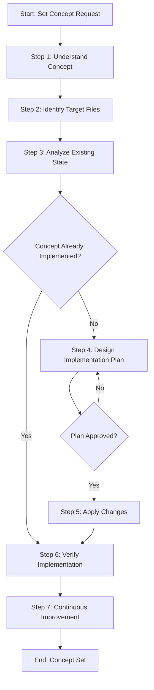

# Template Design: set-concept

## Requirements Analysis

### Problem Statement

Users need a systematic way to implement or update a concept across files in their codebase. A "concept" is a pattern, structure, standard, or approach that should be consistently applied to non-code files (documentation, processes, AI agentic files, best practices, etc.). The process must:

1. Fully understand what the concept means and its characteristics
2. Understand the current state (how the concept is currently represented, if at all)
3. Understand the desired state (how files should look after the concept is implemented)
4. Design a complete implementation plan
5. Execute the implementation completely (modifying existing files and creating new files as needed)
6. Verify the concept is fully implemented
7. Handle cases where the concept is already implemented (skip implementation if already complete)

**Important Distinction**: This template is for applying concepts/patterns/standards to non-code files. It is NOT for code development or feature development, which have dedicated process templates. However, implementing a concept may require creating new files (e.g., template files, configuration files, documentation files) if they are needed to fully implement the concept.

### Key Characteristics

- **Concept-focused**: Specifically for applying concepts/patterns/standards to non-code files, NOT for code development
- **File-oriented**: Works with non-code file types (documentation, markdown, processes, AI agentic files, configuration, etc.)
- **File creation support**: Can create new files when needed to fully implement the concept
- **State-aware**: Understands both existing and requested states
- **Complete**: Ensures full implementation, not partial
- **Idempotent**: Handles cases where concept is already implemented

## Purpose Statement

The `set-concept` template provides a systematic workflow for implementing or updating a concept (pattern, structure, standard, or approach) across non-code files. This template guides users through understanding the concept, analyzing the current state, designing an implementation plan, applying changes (including creating new files when necessary), and verifying complete implementation.

**Scope Clarification**: 
- ✅ **For**: Applying concepts/patterns/standards to non-code files - modifying existing files and creating supporting files as needed
- ❌ **NOT for**: Code development, feature development, or any code-related changes (code has dedicated process templates)

## Use Cases

### When to Use This Template

1. **Implementing a New Concept**
   - Introducing a new pattern, structure, or approach across non-code files
   - Examples:
     - Implementing a documentation standard across all markdown files
     - Setting up a process template structure across process files
     - Adding best practices documentation to all relevant files
     - Creating AI agentic file templates and applying them consistently
     - Establishing naming conventions for documentation files

2. **Updating an Existing Concept**
   - A concept is partially implemented or needs to be updated
   - Examples:
     - Migrating from one documentation format to another
     - Updating process template structure across all process files
     - Updating best practices documentation to reflect new standards
     - Updating AI agentic file structure to a new format

### When NOT to Use This Template

- **Verifying Concept Implementation**: Use dedicated verification process templates for checking if a concept is already implemented or verifying compliance
- **Code development / Feature development**: Use dedicated code development process templates for building new features, implementing new functionality, or creating new business logic
- **Any code-related changes**: This template is specifically for non-code files
- **Simple single-file changes**: Use direct editing for one-off changes
- **Bug fixes**: Use bug-fix template for fixing specific issues
- **Refactoring**: Use refactoring template for code restructuring

## Step Breakdown

### Estimated Step Count: 7 steps

1. **Understand Concept**: Understand what the concept is, its characteristics, requirements, and requested state
2. **Identify Target Files**: Determine which files need the concept (existing files and potentially new files to create)
3. **Analyze Existing State**: Review how the concept is currently represented (if at all)
4. **Design Implementation Plan**: Define requested state and plan changes (modifications and new file creation)
5. **Apply Changes**: Implement the concept (modify existing files and create new files as needed)
6. **Verify Implementation**: Ensure the concept is fully implemented
7. **Continuous Improvement**: Analyze process execution and implement improvements

## Parameters

### Required Parameters

1. **`conceptName`** (string)
   - Name or identifier for the concept being implemented
   - Examples: `"documentation-standard"`, `"process-template-structure"`, `"ai-agentic-file-pattern"`, `"best-practices-format"`
   - Used throughout all steps to reference the concept

2. **`conceptDescription`** (string)
   - Detailed description of what the concept is, its characteristics, and requirements
   - Example: `"All documentation files must have a header section with title, description, and last updated date"`
   - Used in understanding step and verification criteria

3. **`targetFiles`** (string | array)
   - Files or file patterns where the concept should be implemented
   - Can be: specific file paths, glob patterns, or scope descriptions
   - Examples: `"**/*.md"`, `["docs/**/*.md"]`, `"all process files in core/processes/"`
   - Used in file identification step
   - Note: May identify files that need to be created if they don't exist

### Optional Parameters

1. **`existingState`** (string, optional)
   - Description of how the concept is currently represented (if known)
   - Example: `"Some documentation files have headers, but inconsistent format"`
   - Default: Will be discovered during analysis
   - Used in existing state analysis step

2. **`requestedState`** (string, optional)
   - Detailed description of how files should look after implementation
   - Example: `"All documentation files must have standardized header with title, description, last updated date, and author"`
   - Default: Derived from `conceptDescription` if not provided
   - Used in requested state definition and verification

3. **`verificationCriteria`** (string | array, optional)
   - Specific criteria to verify the concept is implemented
   - Example: `["All files have header section", "All headers include title", "All headers include last updated date"]`
   - Default: Derived from `conceptDescription`
   - Used in verification steps

4. **`excludePatterns`** (array, optional)
   - File patterns to exclude from processing
   - Example: `["**/node_modules/**", "**/.git/**"]`
   - Default: Common exclusions (node_modules, .git, build, etc.)
   - Used in file identification step

## Process Flow

The process follows this logical flow:

1. **Understanding Phase**: Understand the concept fully
2. **Discovery Phase**: Identify target files (existing and new) and analyze existing state
3. **Planning Phase**: Define requested state and design implementation plan (including new files to create)
4. **Implementation Phase**: Apply changes (modify existing files and create new files as needed)
5. **Verification Phase**: Verify complete implementation
6. **Learning Phase**: Continuous improvement

## Mermaid Flow Diagram



## Step Organization

### Step 1: Understand Concept
- **Step Reference**: `@step:planning/understand-context`
- **Description**: Fully understand the concept, its characteristics, requirements, and success criteria. Gather all necessary context about what the concept means and how it should be implemented.
- **Output**: Context documentation with concept definition, characteristics, requirements, and success criteria
- **Parameters Used**: `conceptName`, `conceptDescription`

### Step 2: Identify Target Files
- **Step Reference**: `@step:investigation/identify-files`
- **Description**: Identify which files need the concept implemented based on `targetFiles` parameter. This includes both existing files that need modification and new files that may need to be created to fully implement the concept.
- **Output**: List of target files (existing and new files to create), saved to `identified-files.json`
- **Parameters Used**: `targetFiles`, `excludePatterns`

### Step 3: Analyze Existing State
- **Step Reference**: `@step:investigation/review-verify-document`
- **Description**: Review identified existing files to understand how the concept is currently represented (if at all). Analyze current implementation state and document findings. Identify which files exist and which need to be created.
- **Output**: Findings report documenting current state, existing implementations (if any), gaps identified, and files that need to be created
- **Parameters Used**: `conceptDescription`, `existingState` (if provided)
- **Verification Criteria**: Check if concept is already implemented in existing files

### Step 4: Design Implementation Plan
- **Step Reference**: `@step:planning/create-high-level-plan`
- **Description**: Understand the requested state (how files should look after implementation) and design a comprehensive plan for implementing the concept. The plan includes modifications to existing files and creation of new files as needed. Break down into actionable steps with change proposals.
- **Output**: Implementation plan with requested state specification, step-by-step approach, and change proposals (for both file modifications and new file creation)
- **Parameters Used**: `conceptDescription`, `requestedState` (if provided), `existingState` (from Step 3), `verificationCriteria`
- **Decision Point**: User must approve plan before proceeding

### Step 5: Apply Changes
- **Step Reference**: `@step:common/apply-changes`
- **Description**: Apply all approved changes to implement the concept. This includes modifying existing files and creating new files as specified in the implementation plan. Execute the implementation plan completely.
- **Output**: Modified files, newly created files, change application report
- **Parameters Used**: Implementation plan from Step 4

### Step 6: Verify Implementation
- **Step Reference**: `@step:investigation/review-verify-document`
- **Description**: Verify that the concept is fully implemented across all target files (both modified and newly created). This step is part of the implementation process to ensure completeness after applying changes. Check against verification criteria to confirm the implementation was successful. Note: This is not a standalone verification process - use dedicated verification templates if you only need to check if a concept is already implemented.
- **Output**: Verification report confirming concept is fully implemented, or list of gaps if not complete
- **Parameters Used**: `verificationCriteria`, `requestedState`

### Step 7: Continuous Improvement & Learning
- **Step Reference**: `@step:learning/continuous-improvement`
- **Description**: Analyze process execution and implement improvements for future iterations
- **Output**: Analysis report, implemented improvements
- **Context**: `processLogPath`, `processName`, `templateName`

## Design Notes

- **Reused Steps**: The template reuses existing generic steps from planning, investigation, and common categories
- **Flow Diagram**: Simplified flow diagram handles essential decision logic (already implemented check, plan approval)
- **Generic Language**: Step descriptions use generic language applicable to any concept type
- **File Creation**: Steps explicitly support creating new files when needed to fully implement the concept
- **Non-Code Focus**: All examples and use cases focus on non-code files
- **Step 6 Clarification**: Step 6 verifies implementation as part of the implementation process, not as standalone verification (use dedicated verification templates for standalone verification)

## Template File Structure

The actual template file (`set-concept.md`) should follow this structure:

### Header Comment Block
```markdown
<!--
Template: Set Concept
Purpose: Systematic workflow for implementing or updating a concept (pattern, structure, standard, or approach) across non-code files
Required Parameters: conceptName, conceptDescription, targetFiles
Optional Parameters: existingState, requestedState, verificationCriteria, excludePatterns
When to use: When you need to implement or update a concept across non-code files (documentation, processes, AI agentic files, best practices, etc.)
-->
```

### Context Section
The template should include a Context section with:
- `repository`: {{repository}} (or static value if always the same)
- `conceptName`: {{conceptName}}
- `targetFiles`: {{targetFiles}}
- Any other context variables needed for the process

### Step Format
Each step should follow this format:
```markdown
- [ ] Step N: [Step Name]
  - **Step**: `@step:category/step-name`
  - **Description**: [Detailed description]
  - **Output**: [What this step produces]
  - **Parameters Used**: [List of parameters]
  - **Context**: (if applicable)
```

## Validation Considerations

- All required parameters must be provided
- Target files must be identifiable (existing files and/or new files to create)
- Concept description must be clear enough to derive verification criteria
- Implementation plan must be actionable (including file creation if needed)
- Verification must be comprehensive (checking both modified and newly created files)
