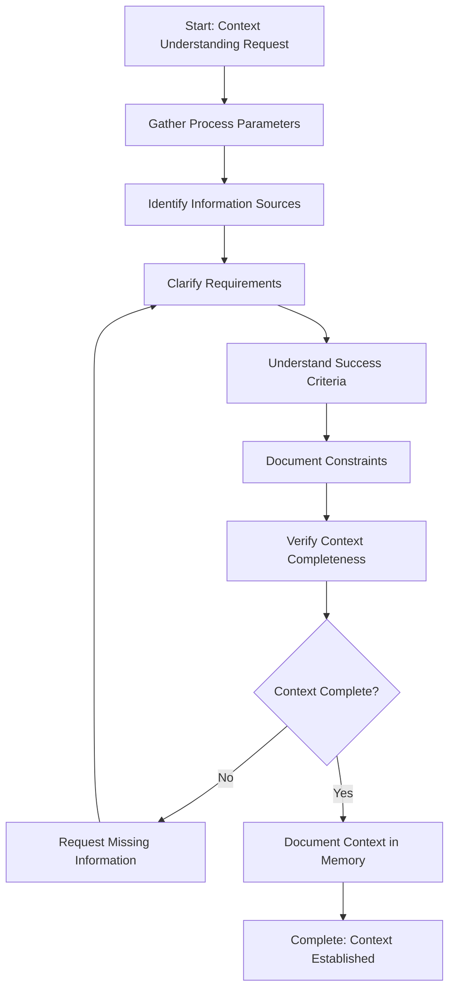

# Step Design: Understand Context

## Requirements Analysis

**Need**: A general-purpose step that can be used at the beginning of any process type (investigations, implementations, reviews, etc.) to establish a clear foundation by understanding context, sources, and requirements.

**Problem Solved**: Processes often start without sufficient context, leading to:
- Missing information that causes rework
- Unclear success criteria
- Undocumented constraints or requirements
- Lack of understanding of information sources

**Why Existing Steps Don't Meet the Need**: 
- `create-high-level-plan` is specific to user story planning with LLD and Q&A
- `create-detailed-step-plans` is for breaking down high-level plans
- No general-purpose context-gathering step exists

## Purpose Statement

Fully understand the context, sources, and requirements for a task or process. Clarify what needs to be accomplished, identify relevant information sources, understand success criteria, and document any specific requirements or constraints. Gather all necessary context to proceed with the work.

## Use Cases

**When to Use:**
- At the beginning of any process to establish foundation
- When starting an investigation process (e.g., review-and-verify template)
- When starting an implementation process
- When starting a review or analysis process
- When context parameters are provided but need clarification
- When information sources need to be identified

**When NOT to Use:**
- When context is already fully understood and documented
- When the process is a continuation of previous work with established context
- When the step is specifically for planning (use `create-high-level-plan` instead)

## Category Selection

**Category**: `planning`

**Rationale**: 
- This step is about understanding and planning the foundation before work begins
- It fits with other planning steps like `create-high-level-plan` and `create-detailed-step-plans`
- It's a preparatory step that happens before execution
- The planning category is appropriate for context-gathering activities

## Step Structure Plan

### Required Sections:
1. **Header Comment Block**: Step name and purpose
2. **Step Title**: `# Step: Understand Context`
3. **Description**: Detailed description of what needs to be done
4. **Output**: Clearly defined deliverables (context documentation, requirements, sources, criteria)
5. **Guidance**: Detailed instructions with:
   - Mandatory logging section
   - Specific Actions (gather context, identify sources, document requirements, etc.)
   - Files/Folders (memory.md, process.md)
   - Tools (codebase_search, read_file, etc.)
   - Best Practices
6. **Memory File Usage**: When and how to use memory
7. **Flow**: Mermaid flowchart diagram
8. **Substeps**: Concrete, actionable tasks
9. **Examples**: 2-3 concrete scenarios (investigation, implementation, review)
10. **Common Pitfalls**: 2-3 warnings about potential issues

## Flow Diagram Design



## Substeps Outline

1. **Gather Process Parameters**
   - Extract all parameters from process context
   - Identify required vs optional parameters
   - Note any parameter placeholders that need substitution
   - Document parameter values and their meanings

2. **Identify Information Sources**
   - Determine what files, directories, or documentation need to be reviewed
   - Identify relevant codebase areas
   - List external resources if applicable
   - Note any missing sources

3. **Clarify Requirements**
   - Extract explicit requirements from process description
   - Identify implicit requirements from context
   - Document what needs to be accomplished
   - Note any ambiguous requirements that need clarification

4. **Understand Success Criteria**
   - Identify how success will be measured
   - Document expected outcomes
   - Note any acceptance criteria
   - Understand verification methods

5. **Document Constraints**
   - Identify technical constraints
   - Note time or resource constraints
   - Document any limitations or restrictions
   - Record any dependencies

6. **Verify Context Completeness**
   - Check if all necessary information is available
   - Identify any gaps in understanding
   - Verify that success criteria are clear
   - Ensure requirements are unambiguous

7. **Request Missing Information** (conditional)
   - If context is incomplete, identify what's missing
   - Formulate specific questions using this format:
     ```markdown
     ## Q&A - Context Information Needed
     
     Questions to clarify missing or unclear context information:
     
     - [ ] Q1: [Specific question about missing information]
       - Context: [Why this information is needed]
       - Category: Parameters / Sources / Requirements / Success Criteria / Constraints
       - **Answer:** _[User provides answer here]_
     
     - [ ] Q2: [Another specific question]
       - Context: [Why this information is needed]
       - Category: Parameters / Sources / Requirements / Success Criteria / Constraints
       - **Answer:** _[User provides answer here]_
     
     *Note: This section should be empty if all context information is available. User must answer all questions before context documentation is complete.*
     ```
   - Question categories:
     - **Parameters**: Missing or unclear process parameter values
     - **Sources**: Unidentified files, directories, or documentation locations
     - **Requirements**: Ambiguous or incomplete requirements
     - **Success Criteria**: Undefined success measures or acceptance criteria
     - **Constraints**: Unknown technical limitations, dependencies, or restrictions
   - Best practices for questions:
     - Be specific: Ask about concrete information, not general concepts
     - Provide context: Explain why the information is needed
     - Categorize: Group questions by category for organization
     - Wait for answers: Do not proceed until all questions are answered
   - Present questions to user
   - Wait for responses before proceeding
   - Update context documentation with answers once provided

8. **Document Context in Memory**
   - Write gathered context to memory.md
   - Organize by categories (parameters, sources, requirements, criteria, constraints)
   - Include any decisions made during context gathering
   - Note any assumptions or clarifications needed

## Examples Outline

### Example 1: Investigation Process
**Context**: Review and verify template with investigation scope
**Actions**: Gather investigation scope, identify verification criteria, find relevant files
**Result**: Complete context documented for investigation

### Example 2: Implementation Process
**Context**: Feature implementation with user story
**Actions**: Extract feature requirements, identify affected components, understand acceptance criteria
**Result**: Foundation established for implementation work

### Example 3: Review Process
**Context**: Code review process with specific focus area
**Actions**: Understand review scope, identify review criteria, locate code to review
**Result**: Clear understanding of what needs to be reviewed

## Common Pitfalls Outline

### Pitfall 1: Assuming Context Without Verification
**Problem**: Proceeding with assumptions instead of gathering actual context
**Solution**: Always verify context parameters, ask clarifying questions, document assumptions

### Pitfall 2: Incomplete Source Identification
**Problem**: Missing relevant files or documentation that should be reviewed
**Solution**: Use codebase search tools, check related directories, review process parameters thoroughly

### Pitfall 3: Unclear Success Criteria
**Problem**: Not understanding how to measure completion or success
**Solution**: Explicitly identify and document success criteria, ask user if unclear

## Design Decisions

1. **Self-Contained**: Step does not reference other steps, can be used independently
2. **General-Purpose**: Works for any process type, not specific to investigations
3. **Iterative**: Can loop back if context is incomplete (request missing info)
4. **Memory-Focused**: Primary output is memory.md documentation
5. **Parameter-Aware**: Handles process parameters from template context
6. **Tool-Enabled**: Uses codebase_search, read_file, and other tools to gather context

## Approval Checklist

- [ ] Purpose statement is clear and accurate
- [ ] Use cases cover all relevant scenarios
- [ ] Category selection (planning) is appropriate
- [ ] Flow diagram accurately represents the workflow
- [ ] Substeps are concrete and actionable
- [ ] Examples are relevant and helpful
- [ ] Common pitfalls address real issues
- [ ] Step structure includes all required sections
- [ ] Design is self-contained (no step references)
- [ ] Design is general-purpose (not investigation-specific)

