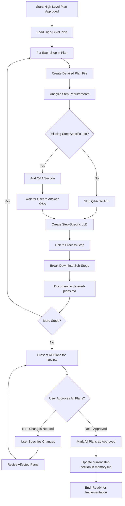

# Process Step: Create Detailed Step Plans

## Required Components

- [mandatory-logging.md](_components/mandatory-logging.md) - Logging guidelines

## Category
Planning

## Description
Generate detailed implementation plans for each step in an approved high-level plan. This step breaks down high-level steps into actionable sub-steps, identifies step-specific missing information through Q&A sections, creates step-specific Low Level Designs, and links each detailed plan to a specific process-step that will execute it.

**Important Prerequisites:**
- This step assumes all required process-steps already exist in the `core/processes/steps/` library
- If any required process-steps are missing, they must be created first (before running this step)

**Approval Workflow:**
- This step includes an iterative approval process
- After creating all detailed plans, present them to the user for review
- User can request changes or approve
- If changes requested, revise the affected plans and present again
- Repeat until all detailed plans are approved
- This step is complete only when user explicitly approves all detailed plans

## When to Use
- After a high-level plan has been approved
- Before beginning implementation of a user story or feature
- When you need to break down complex steps into manageable pieces
- When step-specific technical details need to be clarified

## Process Flow



## Input
- Path to approved high-level plan: `plans/{user-story-name}/plan.md`
- Memory file: previous step section in memory.md containing plan directory and approval status

## Output
- Multiple detailed plan files: `plans/{user-story-name}/step-{n}-{step-name}.md`
- Updated memory file: current step section in memory.md with index of all detailed plans
- Each detailed plan includes:
  - Overview and parent plan reference
  - Q&A section for missing step-specific information (if needed)
  - Step-specific Low Level Design (created after Q&A is resolved)
  - Linked process-step reference (@step:category/step-name)
  - Breakdown into actionable sub-steps with complexity ratings

## Detailed Plan File Naming Convention

**Pattern:** `step-{n}-{step-name}.md`

**Examples:**
- `step-1-api-layer.md` (for "Implement API Layer" step)
- `step-2-service-layer.md` (for "Implement Service Layer" step)
- `step-3-repository-layer.md` (for "Implement Repository Layer" step)
- `step-4-unit-tests.md` (for "Write Unit Tests" step)

**Rules:**
- `{n}` matches the step number from the high-level plan
- `{step-name}` is a kebab-case version of the step title (lowercase, hyphens for spaces)
- Keep names short but descriptive
- All detailed plans for a user story live in the same directory: `plans/{user-story-name}/`

## Connection to Parent Plan

Each detailed plan must clearly reference its parent:

```markdown
## Parent Plan
Reference: plans/{user-story-name}/plan.md - Step {n}: {Step Title}
```

This maintains traceability between high-level and detailed planning.

## Q&A Section Guidance for Detailed Plans

### When to Add a Q&A Section

Add a Q&A section to a detailed plan when **step-specific technical details** are missing that are necessary for implementation. Even if the high-level plan's Q&A covered general requirements, detailed plans may need additional clarifications.

### Types of Step-Specific Information to Request

| Category | Examples |
|----------|----------|
| **API Contracts** | Specific endpoint paths, request/response schemas, query parameters, headers, error response formats |
| **Database Details** | Collection names, field names and types, indexes, document structure, query patterns |
| **Configuration** | Environment variables, connection strings, API keys, feature flags, configuration file locations |
| **Business Logic** | Step-specific calculation formulas, validation rules, error handling behavior, edge cases |
| **External Services** | Integration endpoints, authentication methods for this step, retry policies, timeout values |
| **Technical Implementation** | Library versions, code patterns to follow, naming conventions, file locations |

### Q&A Section Format

```markdown
## Q&A - Step-Specific Information Needed

Questions for this specific step if details are missing:
- [ ] Q1: [Specific question about API contract details]
  - Context: [Why this information is needed for this step]
  - **Answer:** _[User provides answer here]_

- [ ] Q2: [Question about database schema specifics]
  - Context: [Why this information is needed for this step]
  - **Answer:** _[User provides answer here]_

- [ ] Q3: [Question about configuration or environment setup]
  - Context: [Why this information is needed for this step]
  - **Answer:** _[User provides answer here]_

(This section should be empty if all information is available)
```

### Important Instructions

1. **Never Assume Technical Details**: If high-level plan Q&A didn't cover step-specific implementation details, add them to the detailed plan Q&A
2. **Be Specific**: Ask about concrete implementation details, not general concepts
3. **Provide Context**: Explain why each piece of information is needed for this particular step
4. **Wait for Answers**: Do not proceed with creating the step-specific LLD until all Q&A questions are answered
5. **Mark as Complete**: Once user answers all questions, check off each question and proceed with LLD

### Example Q&A Section

**Good Example (Specific and Actionable):**
```markdown
## Q&A - Step-Specific Information Needed

- [ ] Q1: What is the exact endpoint path for the new API? (e.g., /api/v1/partners/{partnerId}/offers)
  - Context: Needed to define the route in the controller
  - **Answer:** _[User provides answer here]_

- [ ] Q2: What fields should be in the OfferRequest DTO and their data types?
  - Context: Need to create the request contract with proper validation
  - **Answer:** _[User provides answer here]_

- [ ] Q3: Should we use the existing ApiResponse<T> wrapper or a custom response format?
  - Context: Determines the return type and serialization approach
  - **Answer:** _[User provides answer here]_
```

**Bad Example (Too General):**
```markdown
## Q&A - Step-Specific Information Needed

- [ ] Q1: How should the API work?
- [ ] Q2: What about the database?
```

## Process-Step Linking Mechanism

Each detailed plan must specify which process-step will execute it.

### Format

```markdown
## Linked Process Step

**Process Step:** @step:category/step-name

**Description:** Brief description of what this process-step does

**Reference:** Link to process-step file if available
```

### Examples

**API Layer Step:**
```markdown
## Linked Process Step

**Process Step:** @step:api/implement-controller-layer

**Description:** Implements API controllers, request/response DTOs, and validation following the service flow pattern.

**Reference:** `core/processes/steps/api/implement-controller-layer.md`
```

**Service Layer Step:**
```markdown
## Linked Process Step

**Process Step:** @step:service/implement-service-layer

**Description:** Implements business logic managers, service interfaces, arguments, and results following SOLID principles.

**Reference:** `core/processes/steps/service/implement-service-layer.md`
```

**Repository Layer Step:**
```markdown
## Linked Process Step

**Process Step:** @step:data/implement-repository-layer

**Description:** Implements MongoDB repositories and entity models following the repository pattern.

**Reference:** `core/processes/steps/data/implement-repository-layer.md`
```

### Validation

When creating detailed plans, verify that:
1. The referenced process-step exists in `core/processes/steps/{category}/{step-name}.md`
2. The process-step is appropriate for the task at hand
3. If the process-step doesn't exist, flag it for creation before proceeding

## Detailed Plan Structure Template

````markdown
# Detailed Plan: [Step Name]

## Overview
[1-2 paragraphs explaining what this step accomplishes and its role in the overall user story]

## Parent Plan
Reference: plans/{user-story-name}/plan.md - Step {n}: {Step Title}

## Q&A - Step-Specific Information Needed
Questions for this specific step if details are missing:
- [ ] Q1: [Specific implementation question]
  - Context: [Why needed]
  - **Answer:** _[User provides answer here]_

- [ ] Q2: [Another specific question]
  - Context: [Why needed]
  - **Answer:** _[User provides answer here]_

(Remove this section if all information is available)

## Low Level Design

### Component Overview
[Description of components to be created/modified - high-level architecture only, no code]

### Architecture Diagram
```mermaid
[Relevant class diagram, sequence diagram, or component diagram showing structure]
```

### Files to Create/Modify
- `path/to/file1.cs` - Purpose and responsibilities
- `path/to/file2.cs` - Purpose and responsibilities

### Key Classes/Interfaces
**ClassName**
- Responsibility: [What it does]
- Properties: [Key properties list]
- Methods: [Key methods list]

**NOTE**: Do NOT include code examples. Only structural information.

### Data Flow
[Explain how data flows through this step's components - text description only]

### Error Handling
[Describe error handling strategy for this step - text description only]

### Dependencies
- External libraries or packages needed
- Other components this step depends on

## Linked Process Step

**Process Step:** @step:category/step-name

**Description:** [Brief description]

**Reference:** `core/processes/steps/category/step-name.md`

## Implementation Steps

- [ ] {n}.1. [First sub-step] [Complexity: X]
  - Details: [What to do]
  - Output: [What is created]
  
- [ ] {n}.2. [Second sub-step] [Complexity: Y]
  - Details: [What to do]
  - Output: [What is created]

- [ ] {n}.3. [Third sub-step] [Complexity: Z]
  - Details: [What to do]
  - Output: [What is created]

## Testing Considerations
[Specific testing considerations for this step that will be addressed in later testing steps]

## Success Criteria
- [ ] All files created/modified as specified
- [ ] Code follows project conventions and SOLID principles
- [ ] Dependencies properly injected
- [ ] Error handling implemented
- [ ] Code compiles without errors
````

## Guidance

<!-- @include: _components/mandatory-logging.md -->

## Guidance on Presenting Plans for Approval

After creating all detailed plans for a user story, present them to the user in an organized manner:

### Presentation Format

```
I've created detailed plans for all {n} steps in the high-level plan:

**Step 1: [Step Name]**
- File: plans/{user-story-name}/step-1-{step-name}.md
- Linked Process Step: @step:category/step-name
- Complexity: X
- Sub-steps: {n}
- Q&A Status: ✅ No questions / ⚠️ {n} questions need answers

**Step 2: [Step Name]**
- File: plans/{user-story-name}/step-2-{step-name}.md
- Linked Process Step: @step:category/step-name
- Complexity: Y
- Sub-steps: {n}
- Q&A Status: ✅ No questions / ⚠️ {n} questions need answers

[... continue for all steps ...]

---

**Summary:**
- Total detailed plans: {n}
- Total sub-steps: {sum}
- Total complexity: {sum}
- Plans with Q&A questions: {n}

**Next Steps:**
1. Please review each detailed plan (files listed above)
2. Answer any Q&A questions in plans that have them
3. Let me know if you'd like any changes to the plans

**Approval Request:**
Do you approve all detailed plans, or would you like me to revise any of them?
- Reply "approved" or "approve all" to proceed with implementation
- Reply with specific changes needed for any plan (e.g., "revise step 2 to include error handling for edge case X")
- I'll revise the affected plans and present them again for your review
```

### Review Checklist for User

Provide this checklist to help users review:

- [ ] Each step has a clear, actionable plan
- [ ] Low Level Design is comprehensive and accurate
- [ ] Linked process-steps are appropriate for each task
- [ ] Sub-steps are granular enough (complexity < 7 each)
- [ ] All Q&A questions have been answered
- [ ] No critical information is missing
- [ ] Plans align with project conventions and patterns
- [ ] Implementation approach makes sense

## Handling Revisions and Approval Workflow

### The Revision Process

When user requests changes to any detailed plan:

1. **Identify Affected Plans**: Determine which plan(s) need revision based on user feedback
2. **Make Changes**: Update the specific plan file(s) with requested modifications
3. **Document Changes**: Add a revision note at the top of modified plans:
   ```markdown
   ## Revision History
   - **Revision 1** (YYYY-MM-DD HH:MM): [Description of changes made based on user feedback]
   ```
4. **Re-present**: Show the revised plan(s) to the user with a summary of changes
5. **Request Re-approval**: Ask if the revisions address their concerns

### Approval States

Track approval state in current step section in memory.md:

```markdown
# Detailed Plans Index

## User Story: {user-story-name}
High-Level Plan: plans/{user-story-name}/plan.md

## Detailed Plans

| Step | Plan File | Process Step | Status | Approval Date |
|------|-----------|--------------|--------|---------------|
| 1 | step-1-api-layer.md | @step:api/implement-controller-layer | Approved | 2025-11-13 14:30 |
| 2 | step-2-service-layer.md | @step:service/implement-service-layer | Revision Requested | - |
| 3 | step-3-repository-layer.md | @step:data/implement-repository-layer | Pending Review | - |

## Approval Status: In Progress
- Plans Approved: 1/3
- Plans Pending: 1/3
- Plans Needing Revision: 1/3
```

### When to Consider Plans Approved

All detailed plans are considered approved when:
- User explicitly says "approved", "approve all", "LGTM", or similar affirmative response
- All Q&A questions have been answered
- All requested revisions have been incorporated
- User confirms they're satisfied with all plans

### Iteration Example

**First Presentation:**
```
Agent: I've created 3 detailed plans. [Shows all plans]
User: Step 2 needs more detail on error handling
Agent: [Revises step-2-service-layer.md to add error handling section]
Agent: I've updated Step 2 with comprehensive error handling. [Shows revised plan]
User: That's better, but also add retry logic for external API calls
Agent: [Revises step-2-service-layer.md again to add retry logic]
Agent: I've added retry logic to Step 2. [Shows revised plan again]
User: Perfect! Approve all plans
Agent: ✅ All detailed plans approved. Ready for implementation.
```

### Exit Criteria

This step exits successfully only when:
- [ ] All detailed plans exist and are complete
- [ ] All Q&A questions answered
- [ ] All user-requested revisions incorporated
- [ ] User explicitly approves all plans
- [ ] Memory file updated with "Approved" status for all plans
- [ ] Approval timestamp recorded

## Reference: Planning Best Practices

For guidance on creating high-quality detailed plans, reference these knowledge base documents:

- Project-specific planning best practices for complexity estimation
- Project-specific planning best practices for task breakdown
- Project-specific planning best practices for Low Level Designs (if available)

## Success Criteria

This step is complete when:

- [ ] Detailed plan file created for each step in high-level plan
- [ ] Each detailed plan follows the template structure
- [ ] Each detailed plan includes Q&A section if information is missing
- [ ] Each detailed plan includes step-specific Low Level Design (after Q&A resolved)
- [ ] Each detailed plan is linked to a valid process-step
- [ ] Each detailed plan breaks step into sub-steps with complexity < 7
- [ ] All detailed plans stored in correct directory with proper naming
- [ ] Plans presented to user in organized format for review
- [ ] User feedback received and any requested changes incorporated
- [ ] Revision cycle repeated until user explicitly approves all plans
- [ ] All plans marked as "approved" in current step section in memory.md
- [ ] Memory file current step section in memory.md updated with final approval status and timestamp

## Notes

- This step focuses on **planning**, not implementation
- All implementation happens in subsequent steps that execute the linked process-steps
- If a required process-step doesn't exist, create it before running this step
- **Approval happens within this step** - the step includes an iterative approval workflow and only exits when user approves all plans
- Users may request revisions to plans before approval - iterate as needed until approval is granted
- This step is self-contained and handles the entire workflow: creation, Q&A, revision, and approval

