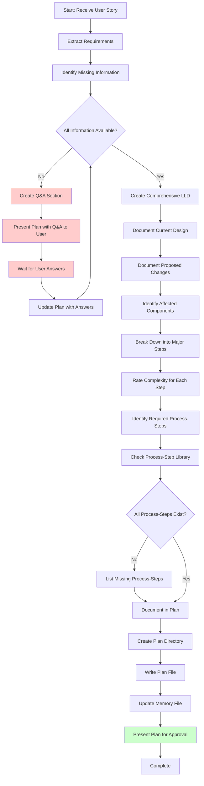

<!--
Step: Create High-Level Plan
Purpose: Generate a comprehensive task plan with complexity ratings, LLD, and Q&A for missing information
-->

# Step: Create High-Level Plan

## Description

Create a comprehensive high-level plan for the user story following the Task Planner format. This step generates a structured plan document that includes an overview, requirements, Q&A section for missing information, comprehensive Low Level Design (LLD), and a breakdown of major implementation steps with complexity ratings. The plan also identifies which process-steps will be needed for each implementation step.

**Critical Requirements:**
- **Never assume information that is not provided** - If external APIs, infrastructure, third-party libraries, business rules, data structures, or any other implementation details are not fully specified, create a Q&A section
- **Wait for Q&A answers** - The user must answer all Q&A questions before the plan can be approved
- **LLD after Q&A** - Complete the Low Level Design section only after all Q&A questions are resolved
- **Validate process-steps exist** - Check if required process-steps exist in the library, list any missing ones

## Output

- New directory created: `plans/{user-story-name}/`
- High-level plan file: `plans/{user-story-name}/plan.md`
- Plan includes:
  - Overview and requirements
  - Q&A section if information is missing (should be empty if all details provided)
  - Comprehensive Low Level Design with before/after diagrams (completed after Q&A)
  - Major implementation steps with complexity ratings (1-9 scale)
  - Required process-steps identified and validated
  - List of missing process-steps if any need to be created
- Memory file updated: current step section in memory.md with plan directory path

## Guidance

**Specific Actions:**

1. **Gather Requirements**
   - Extract user story title, description, and acceptance criteria
   - Identify what components will be affected (API, Service, Repository, etc.)
   - Understand the feature's purpose and goals

2. **Identify Missing Information**
   - Check if external APIs are involved: Do we have documentation? Code examples? Authentication details?
   - Check if infrastructure setup is needed: Do we have connection strings? Setup instructions?
   - Check if third-party libraries are required: Do we know which ones? How to use them?
   - Check if business rules are fully specified: Are validation rules clear? Are calculations defined?
   - Check if data structures are documented: Do we know the schema? Field types? Relationships?
   - List any assumptions that need user confirmation
   - **Create Q&A section with specific questions** - Do not proceed with LLD until answers are provided

3. **Wait for Q&A Answers (if needed)**
   - Present the plan with Q&A section to the user
   - Wait for explicit answers to all questions
   - Update the plan with provided information
   - Only then proceed to complete the LLD

4. **Create Low Level Design (after Q&A resolved)**
   - Document current system design with diagrams
   - Document proposed changes with diagrams
   - Show data flow, component interactions, and architectural patterns
   - List affected components: controllers, services, repositories, DTOs, entities
   - Include class diagrams, sequence diagrams, or architecture diagrams as appropriate
   - Reference existing patterns from the codebase

5. **Break Down into Major Steps**
   - Identify all major implementation steps needed (as many as required for the feature)
   - Typical pattern: API Layer → Service Layer → Repository Layer → Unit Tests → Integration Tests → Documentation
   - Additional steps may include: External Service Integration, Database Migrations, Event Publishers/Subscribers, etc.
   - Rate complexity for each step (1-9 scale, reference project-specific planning best practices)
   - Steps with complexity 7+ must be flagged for further breakdown in detailed planning
   - Ensure each step maps to a specific deliverable

6. **Identify Required Process-Steps**
   - For each implementation step, determine which process-step from `core/processes/steps/` will execute it
   - Check if the required process-steps exist in the library
   - List any missing process-steps that need to be created before detailed planning
   - Common steps: `@step:api/implement-controller-layer`, `@step:service/implement-service-layer`, `@step:data/implement-repository-layer`, `@step:testing/write-unit-tests-service`, `@step:testing/write-integration-tests-api`

7. **Store in Memory**
   - Update current step section in memory.md with:
     - Plan directory path
     - User story title and description
     - Approval timestamp (once approved)
     - Key requirements and constraints
     - List of missing process-steps if any

**Files/Folders:**
- Create: `plans/{user-story-name}/` directory
- Create: `plans/{user-story-name}/plan.md` file
- Update: current step section in memory.md memory file
- Reference: `.github/prompts/start-task-plan.prompt.md` for plan format
- Reference: Project-specific planning best practices for complexity guidance
- Reference: Project-specific planning best practices for breakdown guidance
- Check: `core/processes/steps/` for existing process-steps

**Tools:**
- Use `file_search` to check if process-steps exist: `core/processes/steps/**/*.md`
- Use `semantic_search` to find similar existing implementations in the codebase
- Use `read_file` to understand existing patterns and conventions
- Use `grep_search` to find relevant code examples

**Best Practices:**
- Keep steps at high-level (not too granular, not too broad)
- Each step should represent a significant milestone
- Include as many steps as needed - don't artificially limit the number
- Complexity 7+ requires breakdown in detailed planning phase
- Use consistent naming for user story directory (kebab-case)
- Always include testing steps (unit and integration)
- Always include documentation update as final step
- **Never assume - always ask via Q&A** when information is incomplete or unclear
- Be specific in Q&A questions - ask for exact details needed (URLs, code examples, schemas, etc.)
- Present Q&A section clearly and wait for user to provide answers
- Only complete LLD after all Q&A questions are answered
- Include mermaid diagrams in LLD for visual clarity
- Reference project conventions from `.github/instructions/`

**Common Information Gaps to Watch For:**
- External API endpoints, authentication, request/response formats
- Database schemas, collection names, indexes
- Third-party library usage, configuration, examples
- Infrastructure setup requirements (Docker, message queues, caches)
- Business rules, validation logic, calculations not in requirements
- Error handling strategies and edge cases
- Configuration values, environment variables
- Integration points with other services
- Performance requirements, caching strategies

## Memory File Usage

**When to Use Memory Files:**
- Always use memory file for this step - tracks the plan location and key information

**Memory Files for This Step:**
- **Write to**: current step section in memory.md - Store:
  - Plan directory: `plans/{user-story-name}/`
  - Plan file path: `plans/{user-story-name}/plan.md`
  - User story title and description
  - Approval status and timestamp
  - Key requirements summary
  - List of major steps with complexity ratings
  - List of missing process-steps if any need to be created

## Flow



## Example High-Level Plan Structure

```markdown
# Plan: [User Story Title]

## Overview
[Brief description of what this feature accomplishes and why it's needed]

## Requirements
- User Story: [Title]
- Description: [User story description]
- Acceptance Criteria:
  - [Criterion 1]
  - [Criterion 2]
  - [Criterion 3]
- Constraints:
  - [Any technical or business constraints]

## Q&A - Information Needed
Questions to ask the user if information is missing:
- [ ] Q1: [Specific question about external API, infrastructure, etc.]
  - Example: "What is the endpoint URL for the XYZ API? Do you have documentation or code examples?"
  - **Answer:** _[User provides answer here]_

- [ ] Q2: [Specific question about business logic or validation rules]
  - Example: "What are the validation rules for field X? Should we allow negative values?"
  - **Answer:** _[User provides answer here]_

- [ ] Q3: [Specific question about data structures or schemas]
  - Example: "What fields should be included in the MongoDB collection? Do you have a schema?"
  - **Answer:** _[User provides answer here]_

*Note: This section should be empty if all information is available. User must answer all questions before plan approval.*

## Low Level Design
*This section is completed after all Q&A questions are resolved.*

### Current System Design
```mermaid
[Diagram showing current state]
```
[Description of how the system currently works]

### Proposed Changes
```mermaid
[Diagram showing proposed state]
```
[Description of how the system will work after changes]

### Affected Components
**API Layer:**
- Controllers: [List of controller classes]
- Request DTOs: [List of request models]
- Response DTOs: [List of response models]

**Service Layer:**
- Interfaces: [List of service interfaces]
- Implementations: [List of service classes]
- Arguments: [List of argument models]
- Results: [List of result models]

**Repository Layer:**
- Interfaces: [List of repository interfaces]
- Implementations: [List of repository classes]
- Entities: [List of MongoDB entities]

**External Services:**
- [Any external service integrations]

### Key Interfaces and Data Flow
[Detailed explanation of how data flows through the system]

## Steps

### 1. Implement API Layer [Complexity: 5]
- [ ] 1.1. Create Request/Response DTOs
- [ ] 1.2. Implement Controller with endpoints
- [ ] 1.3. Add request validation
- [ ] 1.4. Implement mapping extensions
- **Required Process-Step**: `@step:api/implement-controller-layer`

### 2. Implement Service Layer [Complexity: 6]
- [ ] 2.1. Define service interface
- [ ] 2.2. Create Arguments and Results models
- [ ] 2.3. Implement business logic manager
- [ ] 2.4. Add validation and error handling
- **Required Process-Step**: `@step:service/implement-service-layer`

### 3. Implement Repository Layer [Complexity: 4]
- [ ] 3.1. Define entity model
- [ ] 3.2. Create repository interface
- [ ] 3.3. Implement MongoDB repository
- [ ] 3.4. Add necessary indexes
- **Required Process-Step**: `@step:data/implement-repository-layer`

### 4. Write Unit Tests [Complexity: 5]
- [ ] 4.1. Write service layer unit tests
- [ ] 4.2. Write repository unit tests
- [ ] 4.3. Achieve >80% code coverage
- **Required Process-Step**: `@step:testing/write-unit-tests-service`

### 5. Write Integration Tests [Complexity: 4]
- [ ] 5.1. Create integration test setup
- [ ] 5.2. Write end-to-end test scenarios
- [ ] 5.3. Test all acceptance criteria
- **Required Process-Step**: `@step:testing/write-integration-tests-api`

### 6. Update Documentation [Complexity: 2]
- [ ] 6.1. Add API documentation comments
- [ ] 6.2. Update README if needed
- [ ] 6.3. Add flow documentation if complex

## Missing Process-Steps
The following process-steps are required but do not exist yet and must be created:
- [ ] None - all required process-steps exist

*If any are missing, they must be created before proceeding with detailed planning.*

## Testing Requirements
- Unit tests with >80% coverage for service layer
- Integration tests covering all acceptance criteria
- Test error scenarios and edge cases

## Success Criteria
- [ ] High-level plan created with all sections complete
- [ ] Q&A section resolved (empty or all questions answered)
- [ ] LLD completed with comprehensive diagrams
- [ ] All major steps identified with complexity ratings
- [ ] Required process-steps validated
- [ ] Plan approved by user
- [ ] Memory file updated

## Dependencies
- Existing codebase patterns and conventions
- Process-step library availability
- User providing missing information via Q&A

## Estimated Effort
- Total Complexity Score: [Sum of all step complexities]
- Estimated Time: [Based on complexity scores]
```

## Notes

- **Q&A section is critical** - Do not skip this or make assumptions
- User must review and answer Q&A before plan can be approved
- LLD must be comprehensive - it guides all detailed planning
- Complexity ratings help identify which steps need further breakdown
- Missing process-steps must be addressed before detailed planning begins
- Always follow the project's plan format from `start-task-plan.prompt.md`
- The high-level plan is the foundation for all detailed step plans

