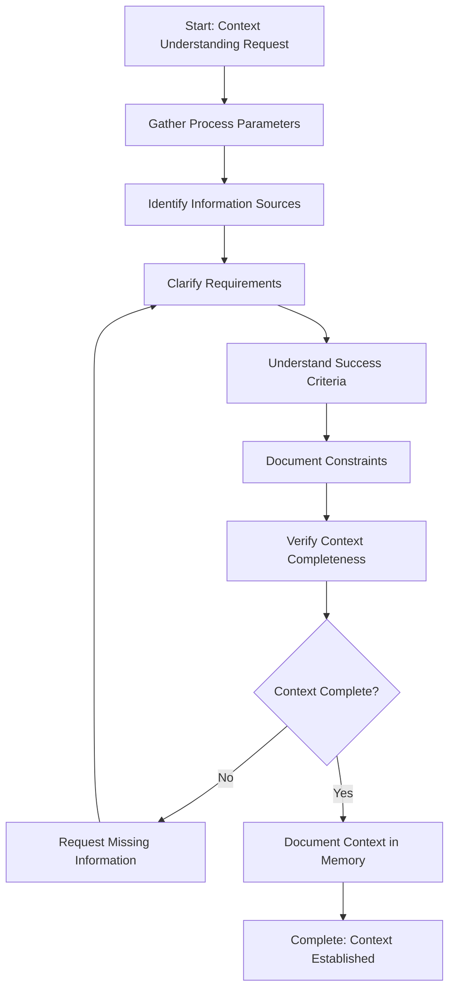

<!--
Step: Understand Context
Purpose: Fully understand the context, sources, and requirements for a task or process. Clarify what needs to be accomplished, identify relevant information sources, understand success criteria, and document any specific requirements or constraints. Gather all necessary context to proceed with the work.
-->

# Step: Understand Context

## Description

Fully understand the context, sources, and requirements for a task or process. This step establishes a clear foundation by gathering all necessary context information before proceeding with work. It clarifies what needs to be accomplished, identifies relevant information sources, understands success criteria, and documents any specific requirements or constraints.

This step is general-purpose and can be used at the beginning of any process type (investigations, implementations, reviews, etc.) to ensure all necessary context is understood and documented before work begins.

## Output

- Context documentation in memory.md organized by categories:
  - Process parameters (values and meanings)
  - Information sources (files, directories, documentation)
  - Requirements (explicit and implicit)
  - Success criteria (how success will be measured)
  - Constraints (technical, time, resource, dependencies)
- Q&A section (if context is incomplete) with specific questions for missing information
- Complete context understanding verified and documented
- Any decisions made during context gathering documented

## Guidance

**⚠️ MANDATORY: Log User Interactions Immediately**

Before making ANY file changes in response to user input:
- [ ] Log user interaction in `log.md` under current step's "User Interactions" section
- [ ] Include timestamp, user request, reason, and agent response
- [ ] **STOP** if user interaction not logged - log it first before proceeding

**Reference**: See `docs/process-management.md` for complete logging guidelines.

**Specific Actions:**

Follow the substeps below in sequence. Each substep contains detailed instructions for completing that part of the context gathering process. The workflow is: gather parameters → identify sources → clarify requirements → understand success criteria → document constraints → verify completeness → request missing info (if needed) → document in memory.

**Files/Folders:**
- Read: `process.md` (process description and parameters)
- Update: `memory.md` (current step section with context documentation)
- Reference: Process context parameters from template

**Tools:**
- Use `read_file` to read process.md and understand process description
- Use `codebase_search` to find relevant files or areas when scope is mentioned
- Use `grep` to search for specific patterns or references
- Use `list_dir` to explore directory structures if needed

**Best Practices:**
- Never assume context - always verify parameters and requirements
- Ask clarifying questions if anything is ambiguous
- Document all assumptions explicitly
- Organize context information clearly in memory.md
- Use specific, actionable questions when requesting missing information
- Wait for user answers before proceeding if context is incomplete
- Verify context completeness before moving to next step

## Memory File Usage

**When to Use Memory:**
- Always use memory for this step - it's the primary output
- Use when this step produces context information needed by later steps
- Use when this step makes decisions that should be documented

**Memory Usage for This Step:**
- **Read from**: Process context (process.md parameters and description)
- **Write to**: Current step section in memory.md
  - Information Produced: 
    - Process parameters (values and meanings)
    - Information sources (files, directories, documentation)
    - Requirements (explicit and implicit)
    - Success criteria (how success will be measured)
    - Constraints (technical, time, resource, dependencies)
  - Decisions Made: 
    - Any clarifications or interpretations made during context gathering
    - Assumptions documented
    - Information source selections
  - Files Modified/Created: 
    - memory.md (context documentation)
  - Notes: 
    - Any Q&A questions and answers
    - References to process parameters
    - Any gaps or areas that may need future clarification

## Flow



### Substeps

- [ ] **Substep 1: Gather Process Parameters**
  - Read `process.md` to extract all parameters from the process context
  - Identify required vs optional parameters
  - Note any parameter placeholders (e.g., `{{parameterName}}`) that need substitution
  - Document parameter values and their meanings
  - Check if parameters are clear or need clarification

- [ ] **Substep 2: Identify Information Sources**
  - Determine what files, directories, or documentation need to be reviewed
  - Use `codebase_search` to find relevant codebase areas if scope is mentioned
  - Use `read_file` to examine process description and context
  - List external resources if applicable (documentation, APIs, etc.)
  - Note any missing sources that cannot be located

- [ ] **Substep 3: Clarify Requirements**
  - Extract explicit requirements from process description in `process.md`
  - Identify implicit requirements from context parameters
  - Document what needs to be accomplished
  - Note any ambiguous requirements that need clarification
  - Understand the scope and boundaries of the work

- [ ] **Substep 4: Understand Success Criteria**
  - Identify how success will be measured
  - Document expected outcomes
  - Note any acceptance criteria from process parameters
  - Understand verification methods
  - Clarify what "done" means for this task

- [ ] **Substep 5: Document Constraints**
  - Identify technical constraints (libraries, frameworks, patterns to use)
  - Note time or resource constraints if mentioned
  - Document any limitations or restrictions
  - Record any dependencies that must be satisfied
  - Note any assumptions being made

- [ ] **Substep 6: Verify Context Completeness**
  - Check if all necessary information is available
  - Identify any gaps in understanding
  - Verify that success criteria are clear
  - Ensure requirements are unambiguous
  - Confirm that information sources are identified

- [ ] **Substep 7: Request Missing Information** (conditional - only if context is incomplete)
  - If context is incomplete, identify what's missing
  - Formulate specific questions using this format:
    ```markdown
    ## Q&A - Context Information Needed
    
    Questions to clarify missing or unclear context information:
    
    - [ ] Q1: [Specific question about missing information]
      - Context: [Why this information is needed]
      - Category: Parameters / Sources / Requirements / Success Criteria / Constraints
      - **Answer:** _[User provides answer here]_
    
    - [ ] Q2: [Another specific question]
      - Context: [Why this information is needed]
      - Category: Parameters / Sources / Requirements / Success Criteria / Constraints
      - **Answer:** _[User provides answer here]_
    
    *Note: This section should be empty if all context information is available. User must answer all questions before context documentation is complete.*
    ```
  - Question categories:
    - **Parameters**: Missing or unclear process parameter values
    - **Sources**: Unidentified files, directories, or documentation locations
    - **Requirements**: Ambiguous or incomplete requirements
    - **Success Criteria**: Undefined success measures or acceptance criteria
    - **Constraints**: Unknown technical limitations, dependencies, or restrictions
  - Best practices for questions:
    - Be specific: Ask about concrete information, not general concepts
    - Provide context: Explain why the information is needed
    - Categorize: Group questions by category for organization
    - Wait for answers: Do not proceed until all questions are answered
  - Present questions to user clearly
  - Wait for responses before proceeding
  - Update context documentation with answers once provided
  - Re-verify context completeness after receiving answers

- [ ] **Substep 8: Document Context in Memory**
  - Write gathered context to current step section in `memory.md`
  - Organize by categories:
    - **Parameters**: All process parameters with values and meanings
    - **Information Sources**: Files, directories, documentation to reference
    - **Requirements**: What needs to be accomplished
    - **Success Criteria**: How success will be measured
    - **Constraints**: Technical, time, resource limitations
  - Include any decisions made during context gathering
  - Note any assumptions or clarifications needed
  - Document any Q&A questions and answers if applicable

**Notes:**
- Substeps 1-6 are always executed sequentially
- Substep 7 is conditional - only execute if context verification reveals gaps
- Substep 8 is always executed after context is complete
- If Substep 7 is executed, return to Substep 3 after receiving answers to re-clarify requirements with new information

## Examples

### Example 1: Investigation Process

**Context**: Review and verify template with investigation scope parameter

**Actions:**
1. Gather process parameters: Extract `investigationScope` and `verificationCriteria` from process context
2. Identify information sources: Use codebase_search to find files related to the investigation scope
3. Clarify requirements: Understand what needs to be investigated based on scope parameter
4. Understand success criteria: Identify verification criteria and how compliance will be verified
5. Document constraints: Note any file patterns to exclude or specific areas to focus on
6. Verify context completeness: Check if scope and criteria are clear
7. Request missing information (if needed): Ask about unclear scope or missing criteria
8. Document in memory: Write all context to memory.md organized by category

**Result**: Complete context documented in memory.md with investigation scope, verification criteria, relevant files identified, and clear understanding of what needs to be investigated

### Example 2: Implementation Process

**Context**: Feature implementation with user story and acceptance criteria

**Actions:**
1. Gather process parameters: Extract feature name, description, and acceptance criteria
2. Identify information sources: Locate related code files, documentation, and existing patterns
3. Clarify requirements: Extract explicit requirements from user story, identify implicit requirements
4. Understand success criteria: Document acceptance criteria as success measures
5. Document constraints: Note technical stack, patterns to follow, dependencies
6. Verify context completeness: Ensure all requirements and criteria are clear
7. Request missing information (if needed): Ask about ambiguous requirements or missing technical details
8. Document in memory: Write feature context, requirements, acceptance criteria, and constraints to memory.md

**Result**: Foundation established with complete understanding of feature requirements, success criteria, affected components, and constraints documented in memory.md

### Example 3: Review Process

**Context**: Code review process with specific focus area parameter

**Actions:**
1. Gather process parameters: Extract review focus area and criteria
2. Identify information sources: Locate code files in the focus area
3. Clarify requirements: Understand what aspects should be reviewed (code quality, patterns, bugs, etc.)
4. Understand success criteria: Identify review criteria and what constitutes a successful review
5. Document constraints: Note review standards, conventions, or patterns to verify against
6. Verify context completeness: Ensure focus area and review criteria are clear
7. Request missing information (if needed): Ask about unclear focus area or missing review criteria
8. Document in memory: Write review context, focus area, criteria, and standards to memory.md

**Result**: Clear understanding of review scope, criteria, and standards documented in memory.md, ready to proceed with review work

## Common Pitfalls

### Pitfall 1: Assuming Context Without Verification

**Problem:** Proceeding with assumptions instead of gathering actual context from process parameters and description. This leads to misunderstandings and rework.

**Solution:** 
- Always read and extract actual values from process.md
- Verify parameter meanings rather than assuming
- Ask clarifying questions if anything is ambiguous
- Document all assumptions explicitly in memory.md

### Pitfall 2: Incomplete Source Identification

**Problem:** Missing relevant files, directories, or documentation that should be reviewed, leading to incomplete context understanding.

**Solution:** 
- Use codebase_search tools to find relevant areas when scope is mentioned
- Check related directories systematically
- Review process parameters thoroughly for source hints
- List all identified sources in memory.md for later reference

### Pitfall 3: Unclear Success Criteria

**Problem:** Not understanding how to measure completion or success, leading to uncertainty about when the work is done.

**Solution:** 
- Explicitly identify and document success criteria
- Extract acceptance criteria from process parameters if available
- Ask user if success criteria are unclear
- Document verification methods in memory.md
- Ensure criteria are measurable and specific

