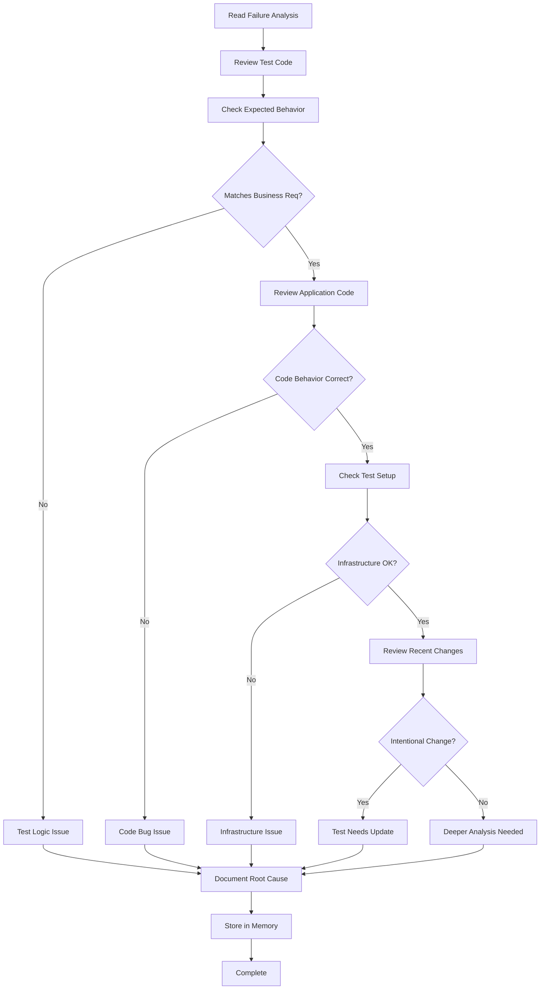

<!--
Step: Diagnose Integration Test Failure
Purpose: Analyze test failure to identify root cause - test logic issue, code bug, or infrastructure problem
-->

# Step: Diagnose Integration Test Failure

## Description

Systematically analyze the captured test failure information to determine the root cause. This step distinguishes between three types of issues: incorrect test logic/expectations, bugs in the application code being tested, or infrastructure/setup problems. The goal is to make an informed decision about what needs to be fixed.

## Output

- Root cause identified and categorized (test issue, code issue, or infrastructure issue)
- Test logic correctness validated against business requirements
- Test data and setup reviewed for issues
- Recent code changes analyzed for impact
- Decision rationale documented
- All findings stored in current step section of memory.md

## Guidance

**Specific Actions:**
- Review the test failure information from previous step in memory.md
- Validate that the test's expected behavior matches actual business requirements
- Check if test assertions are correct for the scenario being tested
- Review test data setup (mocks, fixtures, test databases)
- Examine recent code changes that might have broken the test
- Determine if the test infrastructure (Docker, message queues, databases) is properly configured
- Distinguish between "test is wrong" vs "code is wrong" vs "setup is wrong"
- Document the reasoning behind the root cause determination

**Files/Folders:**
- Read from: Previous step section in memory.md - Previously captured failure information
- Work in: `{{testProject}}` (default: `Tests/IntegrationTests`)
- Test class: `{{testClass}}`
- May need to review: Application code being tested, test setup/fixtures, Docker configuration

**Tools:**
- Read test code to understand what it's validating
- Read application code that the test is exercising
- Check git history: `git log --oneline --all --since="2 weeks ago" -- <file-path>`
- Review business requirements documentation if available
- Examine test setup code (TestBase, fixtures, initialization)

**Best Practices:**
- Start with the simplest explanation - is the test expectation clearly wrong?
- Check if recent code changes intentionally changed behavior (breaking test is expected)
- Look for environmental issues (timing, race conditions, state pollution from other tests)
- Verify test data is valid and complete
- Consider if the test is testing the right thing
- Don't assume the code is correct - it might genuinely have a bug
- **If additional visibility is needed**, add temporary logging with `// TODO: REMOVE - Added by agent for debugging` and re-run the test

## Memory Usage

**When to Use Memory:**
- Always use memory for this step - it stores the diagnostic analysis for later use
- Read from previous step to get the failure context
- Write comprehensive root cause analysis for the fix decision step

**Memory Usage for This Step:**
- **Read from**: Previous step section in memory.md - Test failure information
- **Write to**: Current step section in memory.md - Store comprehensive root cause analysis:
  - Information Produced:
    - Test purpose and expected behavior
    - Business requirement validation (does test expectation match requirements?)
    - Test logic analysis (are assertions correct?)
    - Test data and setup validation
    - Application code analysis (relevant code being tested)
    - Recent changes review (commits that might have affected test)
    - Infrastructure check (Docker, databases, message queues, mocks)
    - Root cause determination (test issue, code issue, or infrastructure issue)
    - Evidence supporting the determination
    - Confidence level in the diagnosis
  - Decisions Made: Root cause category and rationale
  - Notes: Any additional context or observations

## Flow

### Substeps

- [ ] **Substep 1**: Read previous step section in memory.md to review captured failure information, error messages, and stack traces
- [ ] **Substep 2**: Examine the test code (`{{testClass}}`) to understand:
  - What the test is trying to validate
  - What behavior it expects
  - What assertions it makes
  - How test data is set up
- [ ] **Substep 3**: Validate test expectations against business requirements:
  - Check if expected behavior matches documented requirements
  - Verify test assertions are logically correct
  - Confirm test data represents valid scenarios
  - Identify if test expectations are outdated
- [ ] **Substep 4**: Review the application code being tested:
  - Locate the service/manager/controller being tested
  - Understand the actual behavior implementation
  - Check if implementation matches expected behavior
  - Identify any obvious bugs or issues in the code
- [ ] **Substep 5**: Check for recent code changes:
  - Use `git log` to review commits affecting the test or tested code
  - Determine if changes intentionally modified behavior
  - Check if test was updated along with code changes
  - Identify if breaking change was made without updating test
- [ ] **Substep 6**: Validate test infrastructure and setup:
  - Review test base class and setup methods
  - Check Docker configuration and container status
  - Verify mock configurations and dependencies
  - Confirm database/message queue setup is correct
  - Look for timing issues or race conditions
- [ ] **Substep 7**: Determine root cause category:
  - **Test Issue**: Test logic is wrong, assertions are incorrect, or test data is invalid
  - **Code Issue**: Application code has a bug or doesn't implement correct behavior
  - **Infrastructure Issue**: Test setup, Docker, mocks, or environment configuration is wrong
- [ ] **Substep 8**: **If diagnosis is unclear**, add temporary logging to gather more evidence:
  - Add logs in application code at decision points (marked with `// TODO: REMOVE - Added by agent for debugging`)
  - Add logs in test code to verify setup and state
  - Re-run test and capture enhanced output
  - Use additional output to refine root cause determination
- [ ] **Substep 9**: Update current step section in memory.md with complete diagnostic analysis:
  - Information Produced:
    - Test purpose and what it validates
    - Expected behavior vs. actual behavior comparison
    - Business requirement validation results
    - Test logic correctness assessment
    - Application code analysis findings
    - Recent changes impact assessment
    - Infrastructure and setup validation results
    - Root cause category determination (test issue / code issue / infrastructure issue)
    - Evidence and reasoning supporting the determination
    - Confidence level in the diagnosis
  - Decisions Made: Root cause category and rationale
  - Files Modified/Created: Any files with temporary logging added (if applicable)
  - Notes: Any additional observations or caveats
  - Infrastructure validation results
  - **Root cause determination** with category (test/code/infrastructure)
  - Evidence and reasoning supporting the determination
  - Confidence level (high/medium/low)
  - Any temporary logging added for diagnosis

**Notes:**
- The quality of this analysis directly impacts the success of the fix
- Be thorough - missing the real root cause will lead to incorrect fixes
- It's okay to have medium or low confidence - document uncertainties
- If genuinely unsure, note what additional information would help
- Consider multiple contributing factors - root cause may not be singular
- Temporary debug logging is acceptable for better visibility but must be marked and removed later

## Examples

### Example 1: Test Logic Issue

**Scenario**: Test `OfferValidatorTests.ShouldRejectNegativeAmount` is failing

**Root Cause Analysis**:
1. Test expects validator to return `IsValid = false` for negative amounts
2. Test assertion: `Assert.False(result.IsValid)`
3. Actual behavior: Validator returns `IsValid = true`
4. **Investigation**: Review validator code - it correctly rejects negative amounts
5. **Investigation**: Review test setup - test creates offer with amount `-100`
6. **Investigation**: Check recent changes - validator was updated to allow negative amounts for refunds
7. **Root Cause**: Business requirements changed - negative amounts are now valid for refund scenarios
8. **Category**: Test Issue - test expectations are outdated
9. **Evidence**: Git commit shows intentional change to support refunds
10. **Fix Decision**: Update test to reflect new business rules or make test more specific (reject negative amounts for non-refund offers)

### Example 2: Code Bug Issue

**Scenario**: Test `PaymentCalculatorTests.ShouldCalculateCorrectFee` is failing

**Root Cause Analysis**:
1. Test expects fee calculation: amount * 0.03 (3%)
2. Test assertion: `Assert.Equal(30.00m, result.Fee)` for amount 1000
3. Actual behavior: Test gets `Fee = 3.00m`
4. **Investigation**: Review calculator code - found multiplication by 0.03 but result is divided by 10 instead of 100
5. **Investigation**: Review test - test logic and expectations are correct
6. **Investigation**: Check recent changes - fee calculation was recently refactored
7. **Root Cause**: Bug introduced in recent refactoring - incorrect division
8. **Category**: Code Issue - application code has a bug
9. **Evidence**: Code has `amount * 0.03 / 10` should be `amount * 0.03` or `amount * 3 / 100`
10. **Fix Decision**: Fix the calculator code to use correct calculation

### Example 3: Infrastructure Issue

**Scenario**: Test `MongoRepositoryTests.ShouldSaveAndRetrieveEntity` is failing

**Root Cause Analysis**:
1. Test expects to save entity and retrieve it by ID
2. Test assertion: `Assert.NotNull(retrieved)` and `Assert.Equal(entity.Id, retrieved.Id)`
3. Actual behavior: NullReferenceException on retrieved entity
4. **Investigation**: Review repository code - save and find logic looks correct
5. **Investigation**: Review test setup - uses TestContainers for MongoDB
6. **Investigation**: Check Docker logs - MongoDB container is not fully initialized before test runs
7. **Investigation**: Check test base class - no wait for MongoDB readiness
8. **Root Cause**: Test infrastructure - MongoDB container not ready when test executes
9. **Category**: Infrastructure Issue - test setup timing problem
10. **Evidence**: Docker logs show connection attempts before MongoDB is ready to accept connections
11. **Fix Decision**: Add health check or wait logic in test setup to ensure MongoDB is ready before tests run
