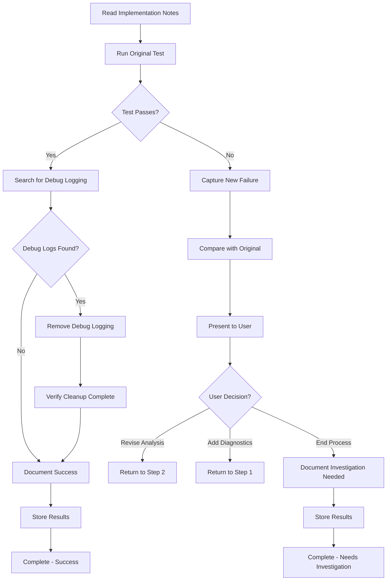

<!--
Step: Verify Test Passes
Purpose: Run the originally failing test to verify the fix works, and clean up temporary debug logging
-->

# Step: Verify Test Passes

## Description

Execute the originally failing test to verify that the implemented fix resolves the issue. If the test passes, remove any temporary debug logging that was added during the diagnostic process and mark the fix as successful. If the test still fails, present the failure to the user and offer options to continue debugging or end the process.

## Output

- Test execution results captured
- Test pass/fail status determined
- If passed: Temporary debug logging removed from all files
- If passed: Success confirmation
- If failed: New failure information captured
- All results stored in current step section of memory.md
- Final status documented

## Guidance

**Specific Actions:**
- Run the specific test that was originally failing
- Capture complete test execution output
- Determine if test passes or fails
- **If test passes:**
  - Remove all temporary debug logging added during diagnosis (marked with `// TODO: REMOVE - Added by agent for debugging`)
  - Verify no debug artifacts remain
  - Document successful fix
- **If test fails:**
  - Capture new failure information
  - Present failure to user
  - Offer options: revise analysis, add more diagnostics, or end process
  - Wait for user decision on next steps
- Store all results in memory for reference

**Files/Folders:**
- Read from: previous step section in memory.md, Files Modified/Created from previous step
- Work in: `{{testProject}}` (default: `Tests/IntegrationTests`)
- Test to run: `{{testClass}}.{{testName}}`
- Files to clean: Any files with temporary debug logging (from Files Modified/Created from previous step)

**Tools:**
- Run test: `dotnet test --filter "FullyQualifiedName~{{testClass}}.{{testName}}"`
- Run with verbose output if needed: `dotnet test --filter "FullyQualifiedName~{{testClass}}.{{testName}}" --verbosity detailed`
- Search for debug markers: `grep_search` or `semantic_search` for `// TODO: REMOVE - Added by agent for debugging`
- Edit files to remove logging: `replace_string_in_file`

**Best Practices:**
- Run the exact same test that was originally failing
- Capture full output for comparison with original failure
- Be thorough when removing debug logging - check all modified files
- Don't remove legitimate logging that was already in the codebase
- Only remove logging marked with the specific debug comment
- If test fails, provide clear information to help user decide next steps
- Document the final outcome clearly

## Memory File Usage

**When to Use Memory Files:**
- Always use memory file for this step to document validation results
- Read from previous implementation notes to know what was changed
- Write comprehensive validation results for process completion

**Memory Files for This Step:**
- **Read from**:
  - previous step section in memory.md - Implementation details
  - Files Modified/Created from previous step - Files that were modified (may contain debug logging)
- **Write to**:
  - current step section of memory.md - Store validation results including:
    - Test execution command used
    - Test pass/fail status
    - Test output (relevant portions)
    - If passed: Confirmation that debug logging was removed
    - If passed: List of files cleaned
    - If failed: New failure information
    - If failed: Comparison with original failure
    - If failed: User's decision on next steps
    - Final outcome (success, retry with different approach, or investigation needed)

## Flow



### Substeps

- [ ] **Substep 1**: Read previous step section in memory.md and Files Modified/Created from previous step to understand what was implemented and which files were modified
- [ ] **Substep 2**: Run the originally failing test: `dotnet test --filter "FullyQualifiedName~{{testClass}}.{{testName}}"`
- [ ] **Substep 3**: Capture the complete test execution output
- [ ] **Substep 4**: Determine if the test passed or failed
- [ ] **Substep 5**: **If test PASSED**:
  - [ ] 5a. Search all modified files for temporary debug logging markers: `// TODO: REMOVE - Added by agent for debugging`
  - [ ] 5b. For each file with debug logging:
    - Read the file to locate debug log statements
    - Remove each debug log statement (including the marker comment)
    - Ensure surrounding code remains intact
    - Verify no debug artifacts remain
  - [ ] 5c. Confirm all temporary logging has been removed
  - [ ] 5d. Document successful fix and cleanup
- [ ] **Substep 6**: **If test FAILED**:
  - [ ] 6a. Capture the new failure information (error message, stack trace)
  - [ ] 6b. Compare new failure with original failure from initial failure analysis from first step
  - [ ] 6c. Present failure information to user with three options:
    - **Option A**: Revise analysis (suggests fix may have been incorrect, return to Step 2)
    - **Option B**: Add more diagnostics (suggests need more information, return to Step 1)
    - **Option C**: End process (suggests further investigation needed outside this process)
  - [ ] 6d. Wait for user decision
  - [ ] 6e. Document user's decision and reason
- [ ] **Substep 7**: Create current step section of memory.md with complete validation documentation:
  - Test execution command and test name
  - Test pass/fail status
  - Test output (full or relevant excerpts)
  - **If passed**:
    - Confirmation of successful fix
    - List of files where debug logging was removed
    - Confirmation that cleanup is complete
  - **If failed**:
    - New failure details
    - Comparison with original failure (same issue, different issue, progress made?)
    - User's decision and next steps
  - Final outcome status

**Notes:**
- This is the final validation step - be thorough
- Successful test pass means the fix worked
- Debug logging cleanup is critical - don't skip it
- If test fails, help user understand whether to iterate or stop
- Document the outcome clearly for future reference
- Consider running the test multiple times if it was previously intermittent

## Examples

### Example 1: Test Passes - Remove Debug Logging

**Scenario**: Test `OfferValidatorTests.ShouldRejectNegativeAmountForNonRefundOffers` now passes after fixing test logic

**Actions**:
1. Run: `dotnet test --filter "FullyQualifiedName~OfferValidatorTests.ShouldRejectNegativeAmountForNonRefundOffers"`
2. Test output shows: ✓ Test passed
3. Search for debug logging in `Tests/IntegrationTests/Validators/OfferValidatorTests.cs`
4. Found 2 debug log statements:
   ```csharp
   // TODO: REMOVE - Added by agent for debugging
   _logger.LogInformation("Offer type: {OfferType}", offer.OfferType);
   ```
5. Remove both debug log statements
6. Verify no other debug markers exist
7. Document in current step section of memory.md:
   - Test passed successfully
   - Fixed test expectations to match new business rules
   - Removed 2 debug log statements from OfferValidatorTests.cs
   - Cleanup complete
   - **Final outcome: Success**

### Example 2: Test Fails - Same Error

**Scenario**: Test `PaymentCalculatorTests.ShouldCalculateCorrectFee` still fails with same calculation error

**Actions**:
1. Run test and capture output
2. Test output shows: Fee = 3.00m, expected 30.00m (same as original failure)
3. Compare with original failure - identical issue
4. Present to user: "Test still fails with the same error. The fix may not have addressed the root cause."
5. Offer options:
   - Option A: Revise analysis - perhaps root cause was misidentified
   - Option B: Add diagnostics - perhaps need more visibility into calculation flow
   - Option C: End process - need manual investigation
6. User chooses Option A
7. Document in current step section of memory.md:
   - Test failed with same error as original
   - Fix did not resolve the issue
   - User decision: Revise analysis (return to Step 2)
   - **Final outcome: Retry with revised analysis**

### Example 3: Test Fails - Different Error (Progress Made)

**Scenario**: Test `MongoRepositoryTests.ShouldSaveAndRetrieveEntity` fails but with different error

**Actions**:
1. Run test and capture output
2. Original error: MongoDB connection timeout
3. New error: Entity saved but has null property after retrieval
4. Compare - progress made! MongoDB connection now works, but new issue found
5. Present to user: "Test still fails but error changed. MongoDB connection is now working, but there's a serialization issue."
6. Offer options with context:
   - Option A: Revise analysis - to address the new serialization issue
   - Option B: Add diagnostics - to understand property serialization
   - Option C: End process - if this is a separate issue to fix later
7. User chooses Option A
8. Document in current step section of memory.md:
   - Original issue (connection timeout) is fixed
   - New issue discovered (null property after retrieval)
   - Progress made but test not fully passing
   - User decision: Revise analysis to fix serialization issue
   - **Final outcome: Retry with focus on new issue**

### Example 4: Test Passes - No Debug Logging Added

**Scenario**: Test `FundManagerTests.ShouldCreateFund` passes, no debug logging was needed during diagnosis

**Actions**:
1. Run test: Test passes
2. Search for debug logging markers in modified files
3. No markers found - no debug logging was added
4. Document in current step section of memory.md:
   - Test passed successfully
   - Fixed business logic in FundManager
   - No temporary logging was added during diagnosis
   - **Final outcome: Success**

