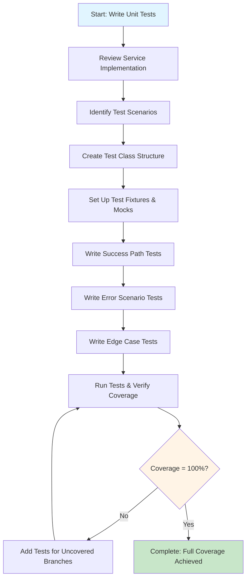

# Process Step: Write Unit Tests for Service Layer

## Step Metadata
- **Prerequisites**: Service layer implementation completed, business logic finalized
- **Outputs**: Comprehensive unit test files for service layer with full code coverage

## Description

This step guides the creation of comprehensive unit tests for the service layer with the goal of achieving full (100%) code coverage. Unit tests verify business logic in isolation by mocking dependencies, ensuring that each service method behaves correctly under various conditions including success scenarios, error cases, and edge cases. Every code path, branch, and condition should be tested. For project-specific testing patterns, frameworks, and conventions, reference the testing best practices documentation.

## Pre-Implementation: Verify Existing Patterns ✅

Before creating new tests, review existing test patterns to ensure consistency and leverage reusable helpers:

### Existing Test Files
- [ ] Search for tests of similar service components in `Tests/UnitTests/`
- [ ] Review test class naming conventions (e.g., `ManagerTests`, `CalculatorTests`)
- [ ] Check test method naming patterns (e.g., `MethodName_Scenario_ExpectedResult`)
- [ ] Note common test organization patterns (Arrange-Act-Assert)

### Mocking Patterns
- [ ] Check `Tests/UnitTests/Helpers/Mocks/` for existing mock helper classes
- [ ] Note naming convention: `Mock<InterfaceName>` (e.g., `MockLogger`, `MockFundRepository`)
- [ ] Review mocking library usage (FakeItEasy, Moq, etc.)
- [ ] Identify reusable mock extension methods
- [ ] Check for parameterized mock helpers (e.g., `MockSendOffersProcessingNotification()`)

### Test Helper Utilities
- [ ] Search `Tests/UnitTests/Helpers/` for reusable test utilities
- [ ] Check for test data builders or factories
- [ ] Look for assertion helpers or custom matchers
- [ ] Note any test fixture or setup helpers
- [ ] Review extension methods for testing (e.g., `EmptyMock*` methods)

### Framework Patterns
- [ ] Identify testing framework in use (xUnit, NUnit, MSTest)
- [ ] Review attribute usage for test organization ([Fact], [Theory], [TestCase])
- [ ] Check async test patterns (`async Task` methods)
- [ ] Note test isolation patterns (test data, cleanup)

### Coverage Patterns
- [ ] Review how existing tests achieve 100% coverage
- [ ] Check patterns for testing exception scenarios
- [ ] Note approaches for testing different code branches
- [ ] Review edge case testing strategies
- [ ] Identify common test scenarios (null checks, empty collections, boundary values)

### Integration with Existing Tests
- [ ] Check if service is already tested elsewhere (e.g., in handler tests)
- [ ] Determine if new assertions should be added to existing tests
- [ ] Review whether new test file is needed or tests should be added to existing file
- [ ] Note any shared test setup or fixtures

### Documentation
- [ ] Document discovered test patterns in process memory file
- [ ] Note similar test files as reference examples
- [ ] Record any deviations from standard patterns with rationale
- [ ] List reusable mock helpers and utilities found

## Test Code Patterns Reference

For comprehensive unit test patterns and examples, see: Project-specific unit testing best practices

### Quick Decision Guide

**When to create test helper classes:**
- ✅ Create extension method if mocking same parameterless method 3+ times
- ✅ Create helper class with `.That.Matches()` if verifying same arguments 3+ times
- ❌ Use inline mocking if method used < 3 times

**FakeItLazy patterns:**
- Use generated `EmptyMock{MethodName}()` extensions for void/Task methods
- Use `.Where()` pattern helper for complex method signatures
- Use `.That.Matches()` for parameterized argument assertions

**Examples from this project:**
- `HttpClientWrapperTestExtensions.EmptyMockSendWithRetryAsync()` - Extension method pattern
- `MockIpcnSenderManager.MockSendOffersProcessingNotification()` - Helper class pattern

## When to Use This Step

Use this step when you need to:
- Create unit tests for newly implemented service layer components
- Add test coverage for new service methods
- Update existing tests after modifying service logic
- Improve test coverage for under-tested services
- Add missing edge case or error scenario tests

## Context Parameters

The following parameters should be provided when executing this step:

- `{{serviceName}}`: The name of the service to test
- `{{serviceNamespace}}`: Namespace of the service
- `{{methodsToTest}}`: List of service methods that need test coverage
- `{{dependencies}}`: List of dependencies to mock

## Step Flow

## Implementation Steps

### 1. Review Service Implementation and Requirements
- [ ] Examine the service class in `{{serviceNamespace}}/{{serviceName}}.cs`
- [ ] Understand all methods in `{{methodsToTest}}`
- [ ] Identify all dependencies that need to be mocked ({{dependencies}})
- [ ] Review business logic and validation rules
- [ ] Review existing test patterns in `Tests/`
- [ ] Reference project-specific unit testing patterns

### 2. Identify Test Scenarios
- [ ] List happy path scenarios (successful operations)
- [ ] List error scenarios (validation failures, exceptions)
- [ ] List edge cases (null inputs, boundary conditions, empty collections)
- [ ] List different input combinations for complex methods
- [ ] Consider async behavior and cancellation scenarios
- [ ] Document expected outcomes for each scenario

### 3. Create Test Class Structure
- [ ] Create test file following project test organization
- [ ] Name it according to project conventions (typically `{ServiceName}Tests.cs`)
- [ ] Set up test class with appropriate attributes/decorators
- [ ] Add test initialization/setup method
- [ ] Declare fields for the service under test and its dependencies
- [ ] Reference project-specific test organization patterns for project-specific structure
- [ ] Follow existing test patterns in the codebase

### 4. Set Up Test Fixtures and Mocks
- [ ] Declare fields for all dependencies in {{dependencies}}
- [ ] Declare field for the service under test
- [ ] **Use FakeItLazy Source Generator**: The project uses FakeItLazy which auto-generates extension methods for mocks
  - Check `Tests/UnitTests/Helpers/Markers/FakeItLazyNamespacesPointers.cs` for configured namespaces
  - FakeItLazy generates `._Mock{MethodName}()` extension methods for cleaner mock setup
  - Example: `_repository._MockGet(id).Returns(entity)` instead of `A.CallTo(() => _repository.Get(id)).Returns(entity)`
- [ ] In test initialization method:
  - [ ] Create mock/fake instances using `A.Fake<TInterface>()`
  - [ ] Instantiate the service under test with mocked dependencies
  - [ ] **Use Entity Generator (EG) for test data** where appropriate
    - Import: `using Payoneer.WorkingCapital.Infra.Tests.EntitiesGenerator;`
    - Usage: `var entity = EG<EntityType>._;` for simple generation
    - Usage: `var entity = EG<EntityType>.Builder.Set(x => x.Property, value).Build();` for customization
    - Prefer EG for complex objects, manual creation for simple data
- [ ] Set up common test data that will be reused across tests
- [ ] Reference project-specific mocking strategies for mocking patterns
- [ ] Reference project-specific test data generation patterns for test data creation

**FakeItLazy Best Practices**:
- Extension methods follow pattern: `._Mock{MethodName}(parameters)`
- Setup: `_mockDependency._MockGetById(id).Returns(entity);`
- Verification for specific calls: `_mockDependency._MockGetById(id).MustHaveHappenedOnceExactly();`
- Verification for "must not have happened": Use `A.CallTo(() => _mockDependency.GetById(A<string>._)).MustNotHaveHappened();`
- Use for repositories, managers, and other frequently mocked dependencies
- Fall back to standard `A.CallTo(() => ...)` for methods without generated extensions

**Entity Generator (EG) Best Practices**:
- Use `EG<T>._` for quick instance generation with random/default values
- Use `.Builder` pattern when you need to set specific properties
- Reduces test boilerplate and makes tests more maintainable
- Especially useful for DTOs, messages, and domain entities
- Note: EG cannot set properties to `null` - use manual object creation for null test cases

### 5. Write Success Path Tests
- [ ] For each method in {{methodsToTest}}, write tests for successful scenarios
- [ ] Use project's test naming convention
- [ ] Structure each test with Arrange-Act-Assert (AAA) pattern:
  - [ ] **Arrange** - Set up test data and configure mocks
  - [ ] **Act** - Call the method under test
  - [ ] **Assert** - Verify results and mock interactions
- [ ] Reference project-specific unit testing patterns for test structure
- [ ] Reference project-specific assertion patterns for assertions
- [ ] Follow existing test patterns in the codebase

### 6. Write Error Scenario Tests
- [ ] Write tests for failure scenarios
- [ ] Configure mocks to throw exceptions or return error states
- [ ] Test validation failures by setting up invalid data
- [ ] Verify expected failure results
- [ ] Verify exception types and error messages
- [ ] Verify that appropriate dependencies were called in error scenarios
- [ ] Reference project-specific unit testing patterns for error testing patterns

### 7. Write Edge Case Tests
- [ ] Test boundary conditions and edge values
- [ ] Test with null, default, empty, and zero values
- [ ] Test empty collections and missing data scenarios
- [ ] Use parameterized tests for testing multiple similar scenarios
- [ ] Test all enum values and state combinations if applicable
- [ ] Reference project-specific unit testing patterns for edge case patterns

### 8. Run Tests and Verify Coverage
- [ ] Run all tests using test runner
- [ ] Verify all tests pass
- [ ] Generate code coverage report
- [ ] Verify 100% code coverage for the service class
- [ ] Identify any uncovered code paths, branches, or conditions
- [ ] Add additional tests for all uncovered scenarios until full coverage is achieved
- [ ] Ensure every branch of conditional logic (if/else, switch, ternary) is tested
- [ ] Verify all exception handling paths are covered

### 9. Verification Checklist
- [ ] Test class follows project structure and conventions
- [ ] All test methods are properly decorated/attributed
- [ ] Test method names follow project naming convention
- [ ] All tests follow AAA (Arrange-Act-Assert) pattern
- [ ] Using project's mocking framework correctly
- [ ] Using project's test data generation approach
- [ ] Using project's assertion framework correctly
- [ ] Mock/fake verifications are in place
- [ ] Tests are independent and properly isolated
- [ ] **Code coverage is 100% for the service layer**
- [ ] **Every code branch, condition, and exception path is tested**
- [ ] Tests follow existing patterns in the codebase

## Reference Documentation

- **Existing Test Patterns**: Review existing test files in the project for:
  - Test class organization and structure
  - Mocking framework usage patterns
  - Test data generation patterns
  - Test method naming conventions
  - Assertion framework patterns
- **Testing Best Practices**:
  - Project-specific unit testing patterns
  - Project-specific mocking strategies
  - Project-specific test data generation patterns
  - Project-specific assertion patterns
- **Code Conventions**: Follow project's coding guidelines and conventions

## Best Practices

Refer to the following resources for implementation guidance:

- **Test Organization**: Review existing tests for:
  - File and folder structure conventions
  - Test class setup and initialization patterns
  - Private field declarations pattern (testable instance and dependencies)
  - Test method organization (regions, grouping)
- **Testing Framework**: Study existing tests for proper use of:
  - Test class and method attributes/decorations
  - Test initialization and setup patterns
  - Parameterized testing approaches
  - Async test patterns
- **Mocking/Faking**: Reference project-specific mocking strategies for:
  - Creating mocks/fakes
  - Configuring mock behavior (returns, exceptions)
  - Verifying mock interactions
  - Extension methods for mock setup
- **Test Data Generation**: Reference project-specific test data generation patterns for:
  - Simple data generation patterns
  - Custom data builder patterns
  - Complex object construction
- **Assertions**: Reference project-specific assertion patterns for:
  - Assertion framework usage
  - Common assertion patterns
  - Collection and exception assertions
- **Code Conventions**: Follow project's coding guidelines and conventions

## Output

Upon completion of this step, you should have:

1. **Test File**: Test file in appropriate test directory following project structure
2. **Comprehensive Test Coverage**: Tests covering all success paths, error scenarios, edge cases, and conditional branches
3. **Full Code Coverage**: 100% coverage for the service class - every line, branch, and condition tested
4. **Verified Tests**: All tests passing and properly isolated
5. **Documentation**: Clear test names that serve as living documentation