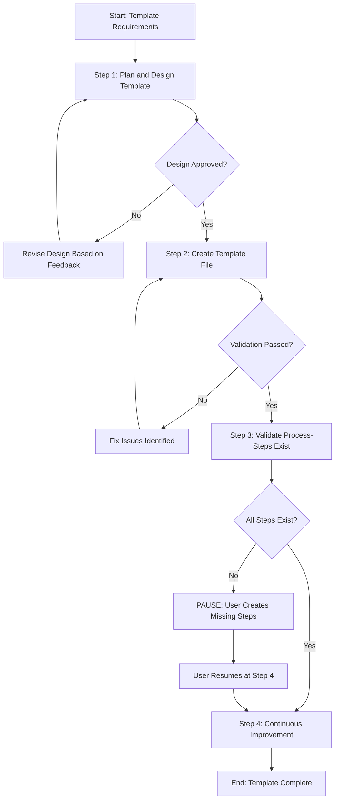

<!--
Template: Create Process Template
Purpose: End-to-end workflow for creating new process templates from requirements through testing and documentation
Required Parameters: templateName, templatePurpose, useCases
Optional Parameters: exampleParameters
When to use: When you need to create a new process template for the Agentic Process System
-->

# Process: Create {{templateName}} Template

**Template**: create-process-template
**Status**: Not Started

## Current State
**Active Step**: Not started yet
**Current Action**: Waiting to begin
**Details**: Process will start when first step is initiated

## Description
Create a new process template named {{templateName}} that {{templatePurpose}}. This template will guide users through {{useCases}}.

## Parameters
- `templateName`: {{templateName}}
- `templatePurpose`: {{templatePurpose}}
- `useCases`: {{useCases}}
- `exampleParameters`: {{exampleParameters}}

## Context
- `repository`: agentic-processes
- `templateDirectory`: core/processes/templates/
- `templateFile`: core/processes/templates/{{templateName}}.md
- `referenceGuide`: core/processes/templates/README.md

## Process Flow

## Steps

- [ ] Step 1: Plan and design template
  - **Step**: `@step:template/plan-and-design-template`
  - **Description**: Analyze requirements for the new template, define its purpose, identify use cases, plan the step breakdown, identify all required and optional parameters, design the process flow structure, create the mermaid flow diagram, and plan the step organization. This step establishes the complete foundation and design for the template.
  - **Output**: Requirements document, purpose statement, use cases documentation, step breakdown plan, parameter lists (required and optional), process flow structure outline, mermaid flow diagram code, step organization plan
  - **Iterative Review**: User can request changes to the design, flow, or parameters; revise and re-present until satisfactory
  - **Approval Checkpoint**: User must explicitly approve the complete template design (requirements, purpose, use cases, parameters, and flow) before proceeding to Step 2
  - **Decision**:
    - **IF** user approves:
      - Proceed to Step 2 (Create Template File)
    - **ELSE** (user does not approve):
      - Revise design based on user feedback
      - Return to Step 1 (Plan and Design Template)
  - **Note**: This step is complete only when user approves the complete design

- [ ] Step 2: Create template file
  - **Step**: `@step:template/create-template-file`
  - **Description**: Create the template file in `core/processes/templates/` with the proper filename and write all sections including the header comment block, process header, parameters section, context section, process flow diagram, and all sequential step definitions. Each step must reference an actual process-step file using `@step:category/step-name` syntax. Include the mandatory continuous improvement step as the final step. Then comprehensively validate the template by verifying all required sections are present, checking parameter placeholders are properly documented, ensuring the flow diagram matches the steps, and reviewing compliance with best practices.
  - **Output**: Complete template file with all sections, validation reports (structure, parameters, diagram alignment, best practices compliance)
  - **Decision**:
    - **IF** validation passes (all checks pass):
      - Proceed to Step 3 (Validate Process-Steps Exist)
    - **ELSE** (validation fails - issues found):
      - Fix issues identified in validation reports
      - Re-run validation until all checks pass
  - **Note**: Only proceed to Step 3 when all validation checks pass

- [ ] Step 3: Validate required process-steps exist
  - **Step**: `@step:template/validate-process-steps-exist`
  - **Description**: Analyze the template to identify which process-steps are referenced and verify they exist in `core/processes/steps/`. Extract all `@step:category/step-name` references from the template and check if each step file exists.
  - **Output**: Validation report of existing vs. missing process-steps
  - **Checkpoint**: If missing process-steps are found:
    - **PAUSE the process**
    - Notify user of missing process-steps and where to create them
    - List each missing step with format: `@step:{category}/{step-name}` → should be in `core/processes/steps/{category}/{step-name}.md`
    - User must create missing process-steps manually in `core/processes/steps/{category}/`
    - Reference: `core/processes/steps/README.md` and `core/processes/steps/step-template.md` for step creation guidelines
    - User resumes process at Step 4 once all process-steps exist
  - **Note**: Only proceed to Step 4 if all required process-steps exist

### Final Phase: Learning & Improvement

- [ ] Step 4: Continuous Improvement & Learning
  - **Step**: `@step:learning/continuous-improvement`
  - **Description**: Analyze process log and implement improvements for future iterations
  - **Context**:
    - `processLogPath`: core/processes/active/{process-name}/log.md
    - `processName`: Create {{templateName}} Template
    - `templateName`: create-process-template
  - **Output**: Analysis report, implemented improvements, updated templates/steps
  - **Iterative Workflow**: For each improvement: propose → investigate → implement → request approval → next
  - **Note**: User must approve each improvement before proceeding to the next one

## Memory File

**Memory Location**: `./memory.md`

This process uses a unified memory file to track state and share information between steps. Key information stored includes:

- **Step 1**: Requirements, purpose, use cases, step breakdown plan, parameter lists, process flow structure, mermaid diagram code, step organization plan
- **Step 2**: Template file creation with all sections (header, parameters, context, flow diagram, steps), validation reports
- **Step 3**: Process-step validation results (existing vs. missing steps)
- **Step 4**: Continuous improvement analysis and implemented improvements

## Errors & Notes
<!-- Add any notes, warnings, or observations here during execution -->

## Audit Log
<!-- Automatically maintained by Process Manager -->

