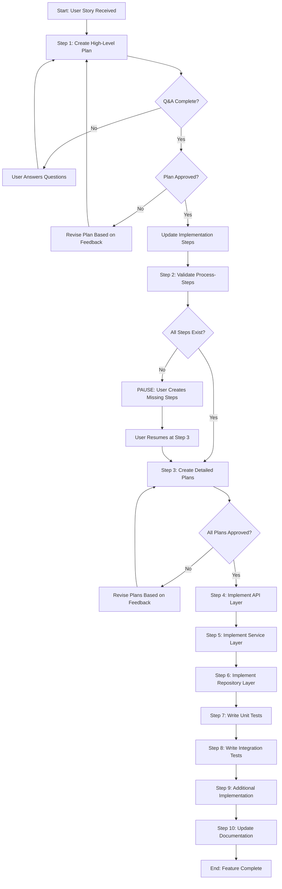

<!--
Template: Develop User Story
Purpose: End-to-end implementation of user stories from planning through testing
Required Parameters: userStoryTitle, userStoryDescription, acceptanceCriteria
When to use: Implementing new features via user stories with systematic planning and execution
-->

# Process: {{userStoryTitle}}

**Template**: develop-user-story
**Status**: Not Started

## Current State
**Active Step**: Not started yet
**Current Action**: Waiting to begin
**Details**: Process will start when first step is initiated

## Description
{{userStoryDescription}}

## Parameters
- `userStoryTitle`: {{userStoryTitle}}
- `userStoryDescription`: {{userStoryDescription}}
- `acceptanceCriteria`: {{acceptanceCriteria}}

## Context
- `repository`: paycloud-wc-lending-partnerships
- `userStory`: {{userStoryTitle}}
- `planDirectory`: plans/{user-story-name}/

## Acceptance Criteria
{{acceptanceCriteria}}

## Process Flow

## Steps

### Phase 1: Planning

- [ ] Step 1: Create high-level plan
  - **Step**: `@step:planning/create-high-level-plan`
  - **Description**: Generate comprehensive task plan with Q&A for missing info, LLD, and complexity ratings
  - **Context**:
    - `userStoryTitle`: {{userStoryTitle}}
    - `userStoryDescription`: {{userStoryDescription}}
    - `acceptanceCriteria`: {{acceptanceCriteria}}
    - `planDirectory`: plans/{user-story-name}/
  - **Output**: High-level plan in `plans/{user-story-name}/plan.md`
  - **Q&A Checkpoint**: If plan includes Q&A section, user must answer questions before proceeding
  - **LLD Checkpoint**: Complete Low Level Design after Q&A is resolved
  - **Iterative Review**: User can request changes to the plan; revise and re-present until satisfactory
  - **⚠️ APPROVAL CHECKPOINT - STOP AND WAIT**: User must explicitly approve the high-level plan before proceeding. Present deliverables, ask "Do you approve? (approve/modify/reject)", and WAIT for user response. Do NOT proceed automatically.
  - **Post-Approval Action**: Once plan is approved, update the Implementation Steps section (Phase 2) of this process file with the actual tasks from the approved high-level plan
  - **Note**: This step is complete only when user approves the plan and implementation steps are updated

- [ ] Step 2: Validate required process-steps exist
  - **Description**: Analyze approved plan to identify which process-steps are needed and verify they exist
  - **Actions**:
    - Review each implementation step in the approved high-level plan
    - List the process-steps required (e.g., `@step:api/implement-controller-layer`, `@step:service/implement-service-layer`, etc.)
    - Check if each required process-step exists in `core/processes/steps/`
    - If any are missing, list them with suggested category locations
  - **Output**: Validation report of existing vs. missing process-steps
  - **Checkpoint**: If missing process-steps are found:
    - **PAUSE the process**
    - Notify user of missing process-steps and where to create them
    - User must create missing process-steps manually in `core/processes/steps/{category}/`
    - Reference: `core/processes/steps/README.md` for step creation guidelines
    - User resumes process at Step 3 once all process-steps exist
  - **Note**: Only proceed to Step 3 if all required process-steps exist
  
  ### Process-Step Correlation Guidelines
  
  When mapping implementation steps to process-step templates, use these decision criteria:
  
  **By Implementation Type:**
  
  **External Services** (`@step:external-services/*`):
  - Creating new API client for external service
  - Implementing HTTP communication with third-party APIs
  - Adding authentication patterns (Apigee, OAuth, API keys)
  - **Keywords**: "API client", "external service", "HTTP integration", "third-party", "REST API"
  
  **Service Layer** (`@step:service/*`):
  - Implementing managers, calculators, checkers, validators
  - Creating business logic components
  - Modifying existing service handlers or subscribers
  - **Keywords**: "manager", "calculator", "service", "handler", "subscriber", "business logic"
  
  **Repository** (`@step:data/*`):
  - Creating new repository classes
  - Adding data access methods
  - Implementing database queries
  - **Keywords**: "repository", "data access", "database", "MongoDB", "query"
  
  **API Controllers** (`@step:api/*`):
  - Creating new controller endpoints
  - Adding HTTP endpoints for external consumption
  - **Keywords**: "controller", "endpoint", "API route", "HTTP verb", "REST endpoint"
  
  **Testing** (`@step:testing/*`):
  - `write-unit-tests-service`: Testing service layer components
  - `write-integration-tests-api`: Testing API endpoints end-to-end
  - **Keywords**: "unit test", "integration test", "test coverage"
  
  **Documentation** (`@step:documentation/*`):
  - Creating or updating flow documentation
  - Adding component documentation
  - **Keywords**: "documentation", "flow doc", "component doc"
  
  **Common Mistakes to Avoid:**
  
  ❌ **Integration Points ≠ Integration Tests**
  - "Integrate with offers file processing" → Use `@step:service/implement-service-layer`
  - "Add integration test assertions" → Use `@step:testing/write-integration-tests-api`
  
  ❌ **Handlers are Service Layer, not API Layer**
  - "Update S3 handler" → Use `@step:service/implement-service-layer`
  - "Create controller" → Use `@step:api/implement-controller`
  
  ❌ **Don't confuse external services with service layer**
  - "Create IPCN API client" → Use `@step:external-services/implement-api-client`
  - "Create IPCN manager" → Use `@step:service/implement-service-layer`
  
  **Validation Checklist:**
  
  For each implementation step:
  - [ ] Identify primary action (create vs. modify, what type of component)
  - [ ] Match keywords to process-step category
  - [ ] Verify alignment with project structure (WebApi/, Service/, ExternalServices/, etc.)
  - [ ] Document the mapping in memory file for reference

- [ ] Step 3: Create detailed step plans
  - **Step**: `@step:planning/create-detailed-step-plans`
  - **Description**: Break down each high-level step into detailed implementation plan with step-specific Q&A, LLD, and process-step links
  - **Context**:
    - `planDirectory`: plans/{user-story-name}/
    - `highLevelPlan`: plans/{user-story-name}/plan.md
  - **Output**: Multiple detailed plan files in `plans/{user-story-name}/step-{n}-{step-name}.md`
  - **Q&A Checkpoint**: For each detailed plan, if Q&A section exists, user must answer step-specific questions
  - **LLD Checkpoint**: Create step-specific LLD after step Q&A is resolved
  - **Presentation**: Present all detailed plans together for user review
  - **Iterative Approval**: User can request changes; revise and re-present until approved
  - **⚠️ APPROVAL CHECKPOINT - STOP AND WAIT**: User must explicitly approve all detailed plans before proceeding. Present all plans, ask "Do you approve? (approve/modify/reject)", and WAIT for user response. Do NOT proceed automatically.
  - **Note**: This step is complete only when user approves all detailed plans

### Phase 2: Implementation

**Note**: These implementation steps will be updated after the high-level plan (Step 1) is approved. The actual tasks from `plans/{user-story-name}/plan.md` will replace this placeholder section.

**Instructions for updating after plan approval**:
1. Review the approved high-level plan's Implementation Tasks section
2. Replace this section with actual steps derived from the approved plan
3. Each task from the plan should become a step here with:
   - Task name and description
   - Link to detailed step plan (if created in Step 3)
   - Process-step reference (e.g., `@step:api/implement-controller-layer`)
   - Dependencies from the plan
   - Acceptance criteria from the plan
   - Complexity rating from the plan

**Example structure** (this will be replaced with actual tasks):

- [ ] Step 4: [Task Name from Plan]
  - **Step**: `@step:{category}/{step-name}`
  - **Detailed Plan**: `plans/{user-story-name}/step-{n}-{name}.md` (if applicable)
  - **Complexity**: [⭐ Low / ⭐⭐ Medium / ⭐⭐⭐ High]
  - **Description**: [Task description from plan]
  - **Files to Create/Update**: [List from plan]
  - **Acceptance Criteria**: [Criteria from plan]
  - **Dependencies**: [Task dependencies from plan]
  - **Estimated Effort**: [Effort from plan]
  - **Output**: [Expected outputs from plan]

<!-- PLACEHOLDER: Steps 4-N will be added here after high-level plan approval -->

- [ ] Step N+1: Write Unit Tests
  - **Step**: `@step:testing/write-unit-tests-service`
  - **Detailed Plan**: `plans/{user-story-name}/step-X-unit-tests.md` (if created in Step 3)
  - **Description**: Write comprehensive unit tests for service layer with 100% code coverage
  - **Context**:
    - Follow AAA pattern (Arrange, Act, Assert)
    - Mock dependencies using testing framework
    - Test all edge cases and error scenarios
    - Achieve full code coverage
  - **Output**: Unit test files in `Tests/UnitTests/`
  - **Coverage Target**: 100%
  - **References**: Project-specific testing best practices (add to your project's knowledge base)

- [ ] Step N+2: Write Integration Tests
  - **Step**: `@step:testing/write-integration-tests-api`
  - **Detailed Plan**: `plans/{user-story-name}/step-Y-integration-tests.md` (if created in Step 3)
  - **Description**: Write end-to-end integration tests for API endpoints
  - **Context**:
    - Use TestServer/HttpClient for API testing
    - Use WireMock for external service mocking
    - Follow Story Builder pattern for test data
    - Verify database state changes
    - Test message queue interactions if applicable
  - **Output**: Integration test files in `Tests/IntegrationTests/`
  - **References**: Existing integration tests, project-specific integration testing patterns

- [ ] Step N+3: Update documentation
  - **Step**: `@step:documentation/update-documentation`
  - **Description**: Update all relevant documentation
  - **Actions**:
    - Update flow documentation in `ai/docs/flows/` if new workflow introduced
  - **Output**: Updated documentation files

### Final Phase: Learning & Improvement

- [ ] Step N+4: Continuous Improvement & Learning
  - **Step**: `@step:learning/continuous-improvement`
  - **Description**: Analyze process log and implement improvements for future iterations
  - **Context**:
    - `processLogPath`: core/processes/active/{process-name}/log.md
    - `processName`: {{userStoryTitle}}
    - `templateName`: develop-user-story
  - **Output**: Analysis report, implemented improvements, updated templates/steps
  - **Iterative Workflow**: For each improvement: propose → investigate → implement → request approval → next
  - **Note**: User must approve each improvement before proceeding to the next one

## Memory File

**Memory Location**: `./memory.md`

This process uses a unified memory file to track state and share information between steps. Key information stored includes:

- **Step 1**: Approved high-level plan details
- **Step 2**: Process-step validation results
- **Step 3**: Detailed plans index with approval status
- **Implementation Steps**: Execution state and completion tracking

## Errors & Notes
<!-- Add any notes, warnings, or observations here during execution -->

## Audit Log
<!-- Automatically maintained by Process Manager -->
