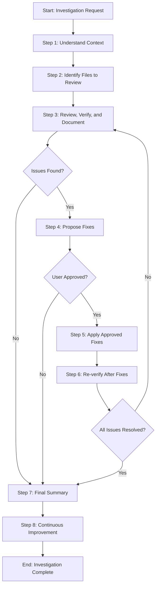

<!--
Template: Review and Verify
Purpose: Generic investigation and verification workflow for reviewing code, files, references, or any aspect of a codebase with iterative review-fix-verify cycles
Required Parameters: investigationScope, verificationCriteria
Optional Parameters: targetFiles, excludePatterns
When to use: When you need to systematically investigate, review, and verify aspects of a codebase (file references, project-specific content, code quality, etc.) with iterative fixes
-->

# Process: Review and Verify {{investigationScope}}

**Template**: review-and-verify
**Status**: Not Started

## Current State
**Active Step**: Not started yet
**Current Action**: Waiting to begin
**Details**: Process will start when first step is initiated

## Description
Systematically investigate and verify {{investigationScope}} against {{verificationCriteria}}. This process will review relevant files, verify against criteria, document findings, propose fixes if issues are found, apply approved fixes, and iterate until all issues are resolved.

## Parameters
- `investigationScope`: {{investigationScope}}
- `verificationCriteria`: {{verificationCriteria}}
- `targetFiles`: {{targetFiles}}
- `excludePatterns`: {{excludePatterns}}

## Context
- `repository`: (current repository)
- `investigationScope`: {{investigationScope}}
- `verificationCriteria`: {{verificationCriteria}}
- `targetFiles`: {{targetFiles}}
- `excludePatterns`: {{excludePatterns}}

## Process Flow

## Steps

- [ ] Step 1: Understand context
  - **Step**: `@step:planning/understand-context`
  - **Description**: Fully understand the context, sources, and requirements for this investigation. Clarify what needs to be investigated, identify relevant information sources, understand verification criteria, and document any specific requirements or constraints. Gather all necessary context to proceed with the investigation.
  - **Output**: Context documentation, requirements definition, sources identified, verification criteria documented
  - **Context**:
    - `investigationScope`: {{investigationScope}}
    - `verificationCriteria`: {{verificationCriteria}}

- [ ] Step 2: Identify files to review
  - **Step**: `@step:investigation/identify-files`
  - **Description**: Determine which files and directories need to be reviewed based on the investigation scope. If targetFiles parameter is provided, use those; otherwise, identify relevant files based on scope. Apply excludePatterns if provided. Create a comprehensive list of files to review.
  - **Output**: List of files and directories to review, file identification report
  - **Context**:
    - `targetFiles`: {{targetFiles}}
    - `excludePatterns`: {{excludePatterns}}
    - `investigationScope`: {{investigationScope}}

- [ ] Step 3: Review, verify, and document findings
  - **Step**: `@step:investigation/review-verify-document`
  - **Description**: Systematically review each identified file for content relevant to the investigation scope. Read files, analyze content, extract relevant information, and verify against criteria. For each item found, verify whether it meets the criteria. Identify any violations, issues, or items that do not meet the criteria. Categorize issues by type and severity. Create a comprehensive summary of findings - if no issues were found, document that all items passed verification; if issues were found, document each issue with details including location, description, and how it violates the criteria. Prepare findings for presentation to the user.
  - **Output**: Review report with findings from each file, verification report, list of issues found (if any), categorization of issues, findings summary document, issue details (if issues found), verification status report
  - **Context**:
    - `investigationScope`: {{investigationScope}}
    - `verificationCriteria`: {{verificationCriteria}}
  - **Decision**:
    - **IF** no issues found:
      - Proceed to Step 7 (Final Summary)
    - **ELSE** (issues found):
      - Proceed to Step 4 (Propose Fixes)

- [ ] Step 4: Propose fixes
  - **Step**: `@step:investigation/propose-fixes`
  - **Description**: For each issue identified, propose specific fixes. Analyze each issue to determine the best fix approach. Provide detailed fix proposals including what needs to change, how to change it, and why this fix addresses the issue. Present fixes in a clear, actionable format to the user and wait for approval. User can approve all fixes, approve some fixes, reject fixes, or request modifications.
  - **Output**: Fix proposals document, detailed fix instructions for each issue, fix rationale, user approval status
  - **Decision**:
    - **IF** user approves fixes:
      - Proceed to Step 5 (Apply Approved Fixes)
    - **ELSE** (user rejects or no approval):
      - Proceed to Step 7 (Final Summary)
  - **Note**: This step only runs if issues were found in Step 3

- [ ] Step 5: Apply approved fixes
  - **Step**: `@step:investigation/apply-fixes`
  - **Description**: Apply all user-approved fixes to the relevant files. Make the necessary changes to files based on approved fix proposals. Ensure fixes are applied correctly and completely. Document which fixes were applied and to which files.
  - **Output**: Modified files with fixes applied, fix application report, list of changes made
  - **Note**: This step only runs if user approved fixes in Step 4

- [ ] Step 6: Re-verify after fixes
  - **Step**: `@step:investigation/re-verify`
  - **Description**: After fixes are applied, re-verify the modified content against the verification criteria. Check that the fixes resolved the issues and that no new issues were introduced. Verify that all previously identified issues are now resolved.
  - **Output**: Re-verification report, status of previously identified issues, new issues found (if any)
  - **Decision**:
    - **IF** all issues resolved:
      - Proceed to Step 7 (Final Summary)
    - **ELSE** (issues remain):
      - Return to Step 3 (Review, Verify, and Document Findings) to iterate

- [ ] Step 7: Final summary
  - **Step**: `@step:investigation/final-summary`
  - **Description**: Provide a final comprehensive summary of the investigation. Include the investigation scope, what was reviewed, findings, fixes applied (if any), final verification status, and any remaining issues or recommendations. Present a clear conclusion of the investigation.
  - **Output**: Final investigation summary, conclusion report, recommendations (if any)

### Final Phase: Learning & Improvement

- [ ] Step 8: Continuous Improvement & Learning
  - **Step**: `@step:learning/continuous-improvement`
  - **Description**: Analyze process log and implement improvements for future iterations
  - **Context**:
    - `processLogPath`: core/processes/active/{process-name}/log.md
    - `processName`: Review and Verify {{investigationScope}}
    - `templateName`: review-and-verify
  - **Output**: Analysis report, implemented improvements, updated templates/steps
  - **Iterative Workflow**: For each improvement: propose → investigate → implement → request approval → next
  - **Note**: User must approve each improvement before proceeding to the next one

## Memory File

**Memory Location**: `./memory.md`

This process uses a unified memory file to track state and share information between steps. Key information stored includes:

- **Step 1**: Context documentation, requirements, sources identified, verification criteria
- **Step 2**: List of files to review, file identification results
- **Step 3**: Review findings, verification results, issues found, categorization, findings summary, issue details
- **Step 4**: Fix proposals, fix instructions, user approval status
- **Step 5**: Applied fixes, modified files
- **Step 6**: Re-verification results, remaining issues
- **Step 7**: Final summary, conclusions
- **Step 8**: Continuous improvement analysis and implemented improvements

## Errors & Notes
<!-- Add any notes, warnings, or observations here during execution -->

## Audit Log
<!-- Automatically maintained by Process Manager -->

