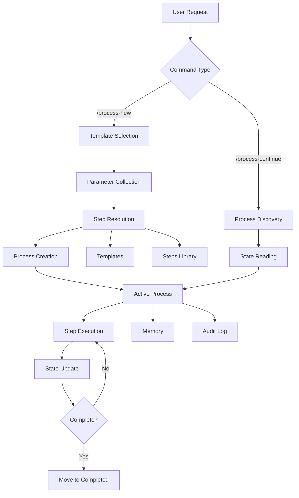

# Agentic Process System Architecture

This document provides a detailed overview of the Agentic Process System architecture, components, and how they work together.

## System Overview

The Agentic Process System is a markdown-based workflow management system designed for AI agents. It provides structured, repeatable processes with persistent state management.

## Core Components

### 1. Process Manager

The Process Manager is the central component that:
- Creates processes from templates
- Resolves step references
- Tracks process state
- Updates process files
- Manages process lifecycle

**Location**: Defined in integration files (`.cursor/commands/`, `.github/prompts/`)

### 2. Templates

Templates define reusable workflows with:
- Parameter placeholders
- Step references
- Process flow diagrams
- Sequential step definitions

**Location**: `.processes/templates/`

**Structure**:
```markdown
<!--
Template: Template Name
Purpose: What this template is for
Required Parameters: param1, param2
-->

# Process: {{processName}}
## Steps
- [ ] Step 1: Description
  - **Step**: `@step:category/step-name`
```

### 3. Steps

Steps are modular, self-contained definitions with:
- Description and objectives
- Expected outputs
- Detailed guidance
- Flow diagrams
- Substeps
- Examples

**Location**: `.processes/steps/{category}/`

**Categories**:
- `api/` - API layer steps
- `data/` - Data layer steps
- `service/` - Service layer steps
- `testing/` - Testing steps
- `planning/` - Planning steps
- `documentation/` - Documentation steps
- `external-services/` - External service steps
- `learning/` - Learning/improvement steps

### 4. Process Instances

Process instances are created from templates and contain:
- Process file (`process.md`)
- Memory file (`memory.md`)
- Log file (`log.md`)

**Location**: `.processes/{state}/process-{name}-{YYYYMMDD}/`

**States**:
- `active/` - Currently running
- `completed/` - Finished successfully
- `failed/` - Encountered errors

## Data Flow



## Step Resolution Process

When a process is created from a template:

1. **Template Reading**: Read template file
2. **Reference Scanning**: Find all `@step:category/step-name` references
3. **Step Loading**: For each reference:
   - Read step file from `.processes/steps/{category}/{step-name}.md`
   - Extract all sections (Description, Output, Guidance, Flow, Substeps, Examples)
4. **Expansion**: Replace reference with full step content
5. **Context Application**: Apply context parameters from template
6. **Process Creation**: Create process instance with expanded steps

## State Management

### Process State

Process state is maintained in `process.md`:

```markdown
## Current State
**Active Step**: Step 3 - Description
**Current Action**: Working on specific task
**Details**: Additional context

## Steps
- [x] Step 1: Completed
  **Completed At**: 2025-01-15 10:30
- [ ] Step 2: In Progress
  **Started At**: 2025-01-15 11:00
```

### Memory State

Memory state is maintained in `memory.md`:

```markdown
## Step 1: Step Name
**Information Produced**: What was created
**Decisions Made**: Technical decisions
**Files Modified/Created**: List of files
**Notes**: Additional context
```

### Audit Log

Audit log is automatically maintained:

```markdown
## Audit Log
- [2025-01-15 10:30] Step 1 completed
- [2025-01-15 11:00] Step 2 started
- [2025-01-15 11:15] File created: path/to/file.cs
```

## Process Lifecycle

### Creation

1. User invokes `/process-new`
2. Template selected
3. Parameters collected
4. Steps resolved
5. Process instance created in `active/`
6. Status set to "Running"

### Execution

1. Process Manager reads current state
2. Identifies next incomplete step
3. Executes step according to guidance
4. Updates state, memory, and audit log
5. Moves to next step

### Completion

1. All steps marked complete
2. Status updated to "Completed"
3. Process moved to `completed/`
4. Final summary provided

### Failure

1. Error encountered
2. Status updated to "Failed"
3. Error details added to Errors & Notes
4. Process moved to `failed/`
5. Troubleshooting suggestions provided

## Integration Points

### Cursor IDE

**Location**: `integrations/cursor/commands/`

**Commands**:
- `process-new.md` - Process creation command
- `process-continue.md` - Process continuation command

**Usage**: Commands are invoked in Cursor chat using `/process-new` or `/process-continue`

### GitHub Copilot

**Location**: `integrations/github/prompts/`

**Prompts**:
- `process-new.prompt.md` - Process creation prompt
- `process-continue.prompt.md` - Process continuation prompt

**Usage**: Prompts are invoked in GitHub Copilot Chat using `/process-new` or `/process-continue`

## File Structure

```
agentic-processes/
├── core/
│   └── processes/
│       ├── templates/          # Process templates
│       ├── steps/              # Modular step definitions
│       ├── active/             # Running processes
│       ├── completed/          # Finished processes
│       └── failed/             # Failed processes
├── integrations/
│   ├── cursor/                 # Cursor IDE integration
│   └── github/                 # GitHub integration
└── docs/                       # Documentation
```

## Design Principles

### 1. Markdown-Based

All process definitions and state are stored in markdown files:
- Human-readable
- Version control friendly
- Easy to edit manually if needed

### 2. Modular Steps

Steps are self-contained and reusable:
- DRY principle
- Consistent patterns
- Easy maintenance

### 3. Persistent State

State is always persisted:
- No data loss between sessions
- Resume from any point
- Complete audit trail

### 4. Strict Adherence

Process Manager enforces strict adherence:
- Cannot skip steps
- Cannot work out of order
- Cannot deviate from process

### 5. Automatic Updates

System automatically updates:
- Process state
- Audit logs
- Memory files
- Log files

## Extension Points

### Adding New Templates

1. Create template file in `.processes/templates/`
2. Follow template structure
3. Reference existing steps
4. Add to template list

### Adding New Steps

1. Create step file in `.processes/steps/{category}/`
2. Follow step template
3. Include all required sections
4. Add examples and guidance

### Custom Integrations

Integration files can be customized:
- Add new commands/prompts
- Modify behavior
- Add custom logic

## Performance Considerations

- **File I/O**: All operations are file-based, suitable for small to medium workflows
- **Step Resolution**: Steps are resolved once during process creation
- **State Updates**: Incremental updates to process files
- **Memory Usage**: Minimal - all state in markdown files

## Security Considerations

- **File Access**: Processes can read/write files in workspace
- **Process Isolation**: Each process in its own directory
- **State Validation**: Process Manager validates state before operations
- **Audit Trail**: Complete history of all actions

## Future Enhancements

Potential improvements:
- Process templates with versioning
- Step dependency graphs
- Process analytics
- Multi-process coordination
- Remote process execution

---

For more details, see:
- [Getting Started](getting-started.md)
- [Examples](examples.md)
- [Core System](../core/README.md)

