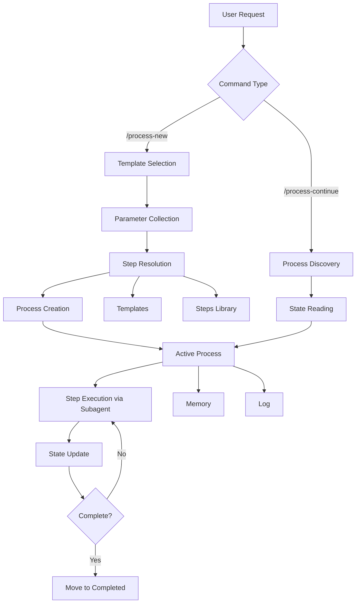
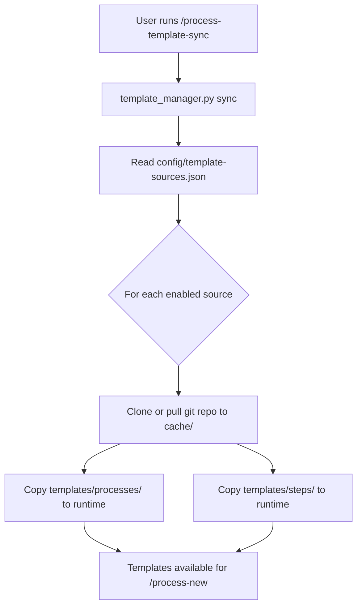

# Agentic Process System Architecture

This document provides a detailed overview of the Agentic Process System architecture, components, and how they work together.

## System Overview

The Agentic Process System is a plugin-based workflow management system designed for AI agents. It provides structured, repeatable processes with persistent state management, working seamlessly with Claude Code.

## Plugin Architecture

The framework is distributed as a plugin that can be installed via marketplace or local directory:

```
agentic-processes/                    # Plugin root
├── .claude-plugin/plugin.json        # Claude Code plugin manifest
├── agents/                           # Auto-discovered agents
├── commands/                         # Auto-discovered commands
├── hooks/hooks.json                  # Hook configuration
├── scripts/                          # Hook and utility scripts
│   ├── process_manager.py            # Process state management
│   ├── template_manager.py           # Git-based template operations
│   └── ...hook scripts...
├── skills/                           # Skills for AI discoverability
├── config/                           # Default configuration files
│   └── template-sources.default.json
├── types/                            # TypeScript types + schema.json
└── AGENTS.md                         # Agent discovery file
```

### Component Auto-Discovery

Claude Code automatically discovers:
- **Agents**: From `agents/` directory
- **Commands**: From `commands/` directory
- **Skills**: From `skills/` directory
- **Hooks**: From `hooks/hooks.json`

## Core Components

### 1. Process Manager

The Process Manager is the central component that:
- Creates processes from templates
- Resolves step references
- Tracks process state
- Updates process files
- Manages process lifecycle

**Location**: Defined in `commands/` directory

### 2. Templates

Templates define reusable workflows with:
- Parameter placeholders
- Step references
- Process flow diagrams
- Sequential step definitions

**Location**: `~/.claude/agentic-processes/templates/processes/{category}/` (synced from git sources)

**Structure**:
```markdown
<!--
Template: Template Name
Purpose: What this template is for
Required Parameters: param1, param2
-->

# Process: {{processName}}
## Steps
- [ ] Step 1: Description
  - **Step**: `step-name` (references subfolder of the process template directory)
```

### 3. Steps

Steps are modular, self-contained definitions with:
- Description and objectives
- Expected outputs
- Detailed guidance
- Flow diagrams
- Substeps
- Examples

**Location**: Steps are subfolders of their process template directory. The `templates/steps/` directory serves as a blueprint catalog for authoring reference only.

**Categories**:
- `api/` - API layer steps
- `common/` - Common/shared steps
- `data/` - Data layer steps
- `service/` - Service layer steps
- `testing/` - Testing steps
- `planning/` - Planning steps
- `documentation/` - Documentation steps
- `external-services/` - External service steps
- `guideline/` - Guideline steps
- `investigation/` - Investigation steps
- `learning/` - Learning/improvement steps
- `multi-repo/` - Multi-repo steps
- `template/` - Template authoring steps

### 4. Process Instances

Process instances are created from templates and contain:
- Process file (`process.json`) - Machine-readable state for tooling/UI
- Memory directory (`memory/`) - Topic-based files for persistent information shared across steps
- Log file (`log.json`) - Detailed execution log

**Location**: `~/.claude/agentic-processes/{state}/process-{name}-{YYYYMMDD}-{shortid}/`

**States**:
- `active/` - Currently running
- `completed/` - Finished successfully
- `failed/` - Encountered errors

### 5. Subagents

The framework uses subagents for context isolation:

- **step-executor**: Executes individual process steps. Invoked via the `step-executor-delegation` skill (`context: fork`, `agent: step-executor`). The skill content is the only task message the step-executor receives — the orchestrator cannot add extra context.
- **process-spawner**: Creates new processes/sub-processes in isolated context

Subagent files are in `agents/` and are auto-discovered by Claude Code.

### 6. Hooks System

Hooks provide behavioral controls during process execution:

**Hook Types**:
- `stop` / `subagentStop`: Check approval requirements before stopping
- `preToolUse`: Block tools during pending interactions, enforce log-first
- `postToolUse`: Validate process file structure
- `beforeSubmitPrompt`: Create log-first flags

**Platform Integration**:
Scripts integrate with Claude Code's hook system:
- Environment variable: `CLAUDE_PROJECT_DIR` for project directory
- Session tracking: `session_id` for process-session binding
- Output format: Claude Code JSON response format (`decision`/`reason`)

## Data Flow



## Step Resolution Process

When a process is created from a template:

1. **Template Reading**: Read template file from the process template directory
2. **Step Resolution**: For each step with a `stepRef`:
   - `stepRef` is a simple name (e.g., `"understand-context"`) referencing a subfolder of the template directory
   - Resolution path: `{template_dir}/{stepRef}/{stepRef}.json`
   - Framework steps use `@framework-step:name` and resolve from `framework-steps/` directory
3. **Step Loading**: Read step JSON file and extract EmbeddedStepDefinition fields (output, guidance, substeps, flow, etc.)
4. **Context Application**: Apply context parameters from template
5. **Process Creation**: Create process instance in `~/.claude/agentic-processes/active/`

## State Management

### Process State

Process state is maintained in `process.json`:

```json
{
  "type": "process-instance",
  "id": "uuid",
  "status": "running",
  "currentState": {
    "activeStep": {
      "id": "uuid",
      "name": "Step Name",
      "actionSummary": "Working on specific task",
      "totalSubsteps": 10,
      "currentSubstep": {
        "number": 3,
        "name": "Clarify Requirements"
      }
    }
  },
  "steps": [...]
}
```

### Memory State

Memory state is maintained in the `memory/` directory with topic-based files:

```
memory/
  _cross-references.json    # Aggregated decisions and files across all topics
  context.json              # Context and requirements from understand-context step
  identified-files.json     # File identification results
  implementation-decisions.json  # Design and implementation plan data
```

Each topic file follows this structure:
```json
{
  "type": "memory-topic-file",
  "topic": "context",
  "lastUpdated": "2026-01-15T10:30:00.000Z",
  "entries": {
    "step-uuid": {
      "stepName": "Understand concept",
      "informationProduced": {},
      "decisionsMade": [],
      "filesModifiedCreated": []
    }
  }
}
```

## Integration Points

**Skills**: Auto-discovered from `skills/` directory
- `process-new/SKILL.md` - Process creation
- `process-continue/SKILL.md` - Process continuation
- `process-state-update/SKILL.md` - State file updates
- `process-template-sync/SKILL.md` - Template source management

**Agents**: Auto-discovered from `agents/` and `AGENTS.md`
- `step-executor.md` - Step execution subagent
- `process-spawner.md` - Process spawning subagent

**Hooks**: Configured in `hooks/hooks.json`

**Task Tool Delegation**: Skills include instructions for using the Task tool to invoke subagents.

## File Structure

```
# Plugin (agentic-processes/)
.claude-plugin/plugin.json           # Claude Code manifest
agents/                              # Subagents
commands/                            # Commands
hooks/hooks.json                     # Hook configuration
scripts/                             # Hook and utility scripts
├── process_manager.py               # Process state management
├── template_manager.py              # Git-based template operations
├── models.py                        # Shared data models
└── ...hook scripts...
skills/
├── process-new/SKILL.md             # Start new process
├── process-continue/SKILL.md        # Continue existing process
├── process-state-update/SKILL.md    # Update process state
└── process-template-sync/SKILL.md   # Manage template sources
config/
└── template-sources.default.json    # Default template source config
types/                               # TypeScript types + schema.json
AGENTS.md                            # Agent discovery

# Runtime Location (~/.claude/agentic-processes/)
~/.claude/agentic-processes/
├── config/
│   └── template-sources.json        # User's template source config
├── cache/
│   └── sources/{name}/              # Git clone cache per source
├── templates/
│   ├── processes/{category}/        # Process templates (synced)
│   └── steps/{category}/            # Step templates (synced)
├── guidelines/                      # Project-specific guidelines
├── flags/                           # Runtime flag files
├── active/                          # Running processes
│   └── process-{name}-{date}-{id}/
│       ├── process.json             # Primary state
│       ├── memory/                  # Topic-based memory files
│       │   ├── _cross-references.json
│       │   └── <topic>.json
│       └── log.json                 # Execution log
├── completed/                       # Finished processes
└── failed/                          # Failed processes
```

## Design Principles

### 1. Plugin-First Architecture

The framework is distributed as a plugin for easy installation and updates:
- Marketplace distribution
- Version management
- Automatic component discovery

### 2. Plugin Architecture

Distributed as a Claude Code plugin with automatic component discovery:
- Marketplace distribution and local directory support
- Automatic agent, command, skill, and hook discovery
- Unified hook configuration

### 3. Modular Steps

Steps are self-contained and reusable:
- DRY principle
- Consistent patterns
- Easy maintenance

### 4. Persistent State

State is always persisted:
- No data loss between sessions
- Resume from any point
- Complete audit trail

### 5. Subagent Delegation

Steps are executed via the `step-executor-delegation` skill which forks into the step-executor subagent:
- **Context isolation**: Enforced by `context: fork` — the skill content is the only task message. The orchestrator cannot add extra context.
- **Clear responsibility boundaries**: The skill defines WHAT the step-executor receives. The step-executor.md defines HOW it behaves. The orchestrator handles the workflow around execution.
- **Consistent execution patterns**: All step execution goes through one skill, regardless of which orchestrator (process-continue or process-new) triggers it.

## Git-Based Template Sources

Templates are distributed via git repositories rather than bundled with the plugin. This architecture enables versioning, team sharing, and independent template updates.

### Template Sync Flow



### Source Configuration

Sources are configured in `~/.claude/agentic-processes/config/template-sources.json`. Each source specifies a git URL, branch, and priority. When multiple sources provide the same template, the higher-priority source wins.

### Cache Strategy

Each source is shallow-cloned to `~/.claude/agentic-processes/cache/sources/{source-name}/`. The cache is separate from the installed templates, so a failed sync cannot corrupt the working set.

## Extension Points

### Adding Custom Template Sources

1. Create a git repo with the standard structure: `templates/processes/` and `templates/steps/`
2. Use `/process-template-sync` to add it as a source
3. Sync to install the templates alongside official ones

### Contributing to Official Templates

Official templates are maintained in the [agentic-process-templates](https://github.com/HM/agentic-process-templates) repository. Fork, modify, and submit pull requests.

### Custom Hooks

Add custom hook scripts in `scripts/` and register them in `hooks/hooks.json`.

---

For more details, see:
- [Getting Started](getting-started.md)
- [Examples](examples.md)
