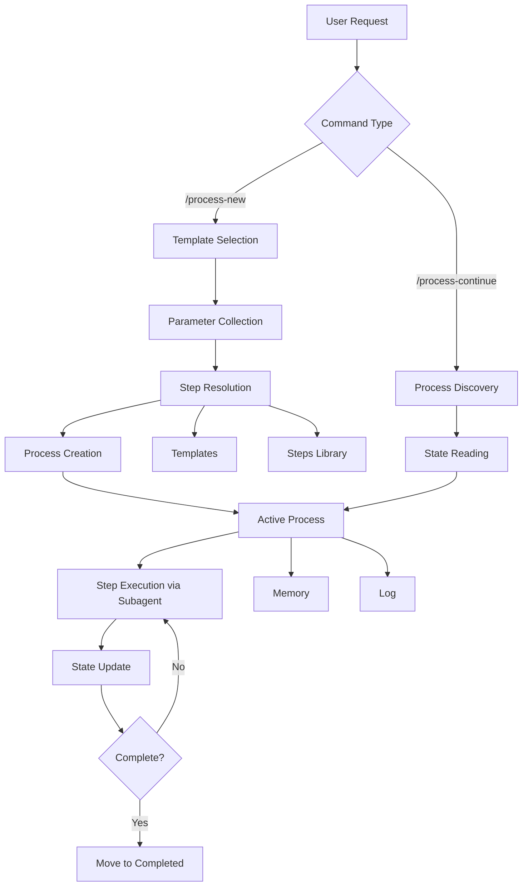

# Agentic Process System Architecture

This document provides a detailed overview of the Agentic Process System architecture, components, and how they work together.

## System Overview

The Agentic Process System is a plugin-based workflow management system designed for AI agents. It provides structured, repeatable processes with persistent state management, working seamlessly with both Cursor IDE and Claude Code.

## Plugin Architecture

The framework is distributed as a plugin that can be installed via marketplace or local directory:

```
agentic-processes/                    # Plugin root
├── .cursor-plugin/plugin.json        # Cursor plugin manifest
├── .claude-plugin/plugin.json        # Claude Code plugin manifest
├── agents/                           # Auto-discovered agents
├── commands/                         # Auto-discovered commands
├── hooks/hooks.json                  # Hook configuration
├── scripts/                          # Platform-agnostic scripts
├── skills/                           # Skills for AI discoverability
├── AGENTS.md                         # Agent discovery file
└── .processes/                       # Framework core
```

### Component Auto-Discovery

Both Cursor and Claude Code automatically discover:
- **Agents**: From `agents/` directory
- **Commands**: From `commands/` directory
- **Skills**: From `skills/` directory
- **Hooks**: From `hooks/hooks.json`

## Core Components

### 1. Process Manager

The Process Manager is the central component that:
- Creates processes from templates
- Resolves step references
- Tracks process state
- Updates process files
- Manages process lifecycle

**Location**: Defined in `commands/` directory with entry prompts in `.processes/prompts/`

### 2. Templates

Templates define reusable workflows with:
- Parameter placeholders
- Step references
- Process flow diagrams
- Sequential step definitions

**Locations**:
- Framework templates: `.processes/templates/{category}/`
- User templates: `.user-processes/templates/{category}/`

**Structure**:
```markdown
<!--
Template: Template Name
Purpose: What this template is for
Required Parameters: param1, param2
-->

# Process: {{processName}}
## Steps
- [ ] Step 1: Description
  - **Step**: `@framework-step:category/step-name`
```

### 3. Steps

Steps are modular, self-contained definitions with:
- Description and objectives
- Expected outputs
- Detailed guidance
- Flow diagrams
- Substeps
- Examples

**Locations**:
- Framework steps: `.processes/steps/{category}/`
- User steps: `.user-processes/steps/{category}/`

**Categories**:
- `api/` - API layer steps
- `data/` - Data layer steps
- `service/` - Service layer steps
- `testing/` - Testing steps
- `planning/` - Planning steps
- `documentation/` - Documentation steps
- `external-services/` - External service steps
- `learning/` - Learning/improvement steps

### 4. Process Instances

Process instances are created from templates and contain:
- Process file (`process.json`) - Machine-readable state for tooling/UI
- Process doc (`process.md`) - Human-readable workflow definition
- Memory file (`memory.json`) - Persistent information shared across steps
- Log file (`log.json`) - Detailed execution log

**Location**: `.user-processes/{state}/process-{name}-{YYYYMMDD}/`

**States**:
- `active/` - Currently running
- `completed/` - Finished successfully
- `failed/` - Encountered errors

### 5. Subagents

The framework uses subagents for context isolation:

- **step-executor**: Executes individual process steps in isolated context
- **process-spawner**: Creates new processes/sub-processes in isolated context

Subagent files are in `agents/` and are auto-discovered by both platforms.

### 6. Hooks System

Hooks provide behavioral controls during process execution:

**Hook Types**:
- `stop` / `subagentStop`: Check approval requirements before stopping
- `preToolUse`: Block tools during pending interactions, enforce log-first
- `postToolUse`: Validate process file structure
- `beforeSubmitPrompt`: Create log-first flags

**Platform Compatibility**:
Scripts use platform detection to work with both Cursor and Claude Code:
- Environment variables: `CURSOR_PROJECT_DIR` vs `CLAUDE_PROJECT_DIR`
- Session IDs: `conversation_id` vs `session_id`
- Output formats: Cursor format vs Claude Code format

## Data Flow



## Step Resolution Process

When a process is created from a template:

1. **Template Reading**: Read template file
2. **Reference Scanning**: Find all step references (`@framework-step:` and `@user-step:`)
3. **Step Loading**: For each reference:
   - `@framework-step:category/name` → read from `.processes/steps/{category}/{name}.md`
   - `@user-step:category/name` → read from `.user-processes/steps/{category}/{name}.md`
   - Extract relevant sections (Description, Output, Guidance)
4. **Context Application**: Apply context parameters from template
5. **Process Creation**: Create process instance in `.user-processes/active/`

## State Management

### Process State

Process state is maintained in `process.json`:

```json
{
  "type": "process-instance",
  "id": "uuid",
  "status": "running",
  "currentState": {
    "activeStepId": "uuid",
    "activeStepName": "Step Name",
    "actionSummary": "Working on specific task"
  },
  "steps": [...]
}
```

### Memory State

Memory state is maintained in `memory.json`:

```json
{
  "type": "memory-file",
  "steps": {
    "step-uuid": {
      "informationProduced": {},
      "decisionsMade": [],
      "filesModifiedCreated": []
    }
  }
}
```

## Integration Points

### Cursor IDE

**Commands**: Auto-discovered from `commands/` directory
- `process-new.md` - Process creation command
- `process-continue.md` - Process continuation command

**Agents**: Auto-discovered from `agents/` directory
- `step-executor.md` - Step execution subagent
- `process-spawner.md` - Process spawning subagent

**Hooks**: Configured in `hooks/hooks.json`

### Claude Code

**Commands**: Auto-discovered from `commands/` directory (same files)

**Agents**: Auto-discovered from `agents/` and `AGENTS.md`

**Hooks**: Same `hooks/hooks.json` with platform-detecting scripts

**Task Tool Delegation**: Commands include Claude Code-specific instructions for using the Task tool to invoke subagents.

## File Structure

```
# Plugin (agentic-processes/)
.cursor-plugin/plugin.json           # Cursor manifest
.claude-plugin/plugin.json           # Claude Code manifest
agents/                              # Subagents
commands/                            # Commands
hooks/hooks.json                     # Hook configuration
scripts/                             # Hook scripts
skills/agentic-processes/SKILL.md   # Main skill
AGENTS.md                            # Agent discovery
.processes/                          # Framework core
├── templates/                       # Process templates
├── steps/                           # Step definitions
├── types/                           # TypeScript types
└── prompts/                         # Entry prompts

# User Resources (.user-processes/ in user's project)
.user-processes/
├── active/                          # Running processes
│   └── process-{name}-{date}/
│       ├── process.json             # Primary state
│       ├── process.md               # Documentation
│       ├── memory.json              # Cross-step info
│       └── log.json                 # Execution log
├── completed/                       # Finished processes
├── failed/                          # Failed processes
├── templates/                       # User templates
├── steps/                           # User steps
└── guidelines/                      # Project guidelines
```

## Design Principles

### 1. Plugin-First Architecture

The framework is distributed as a plugin for easy installation and updates:
- Marketplace distribution
- Version management
- Automatic component discovery

### 2. Platform Agnostic

Works with both Cursor IDE and Claude Code:
- Shared agents, commands, and hooks
- Platform detection in scripts
- Conditional instructions for platform differences

### 3. Modular Steps

Steps are self-contained and reusable:
- DRY principle
- Consistent patterns
- Easy maintenance

### 4. Persistent State

State is always persisted:
- No data loss between sessions
- Resume from any point
- Complete audit trail

### 5. Subagent Delegation

Steps are executed by subagents for:
- Context isolation
- Clear responsibility boundaries
- Consistent execution patterns

## Extension Points

### Adding Your Own Templates

1. Create template file in `.user-processes/templates/{category}/`
2. Follow template structure
3. Reference steps using `@framework-step:` or `@user-step:` prefix
4. Add mermaid flow diagram

### Adding Your Own Steps

1. Create step file in `.user-processes/steps/{category}/`
2. Follow step template (see `.processes/steps/step-template.md`)
3. Include all required sections
4. Add examples and guidance

### Custom Hooks

Add custom hook scripts in `scripts/` and register them in `hooks/hooks.json`.

## Platform Differences

| Feature | Cursor IDE | Claude Code |
|---------|-----------|-------------|
| Session ID field | `conversation_id` | `session_id` |
| File path field | `path` | `file_path` |
| Project dir env | `CURSOR_PROJECT_DIR` | `CLAUDE_PROJECT_DIR` |
| Tool names | `Write`, `StrReplace`, `Shell` | `Write`, `Edit`, `Bash` |
| Subagent invocation | Automatic via agent files | Task tool with agent content |

Scripts handle these differences via platform detection.

---

For more details, see:
- [Getting Started](getting-started.md)
- [Examples](examples.md)
