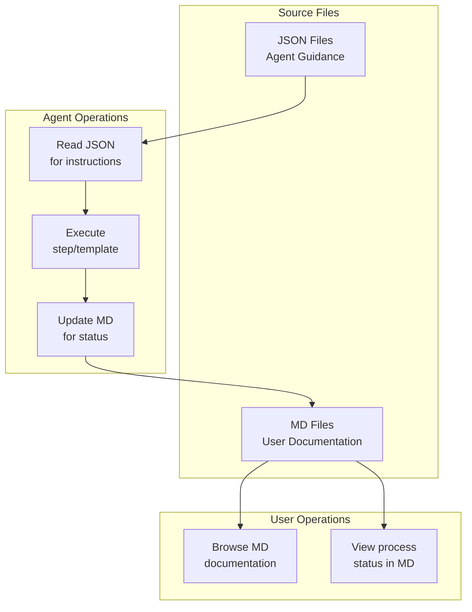
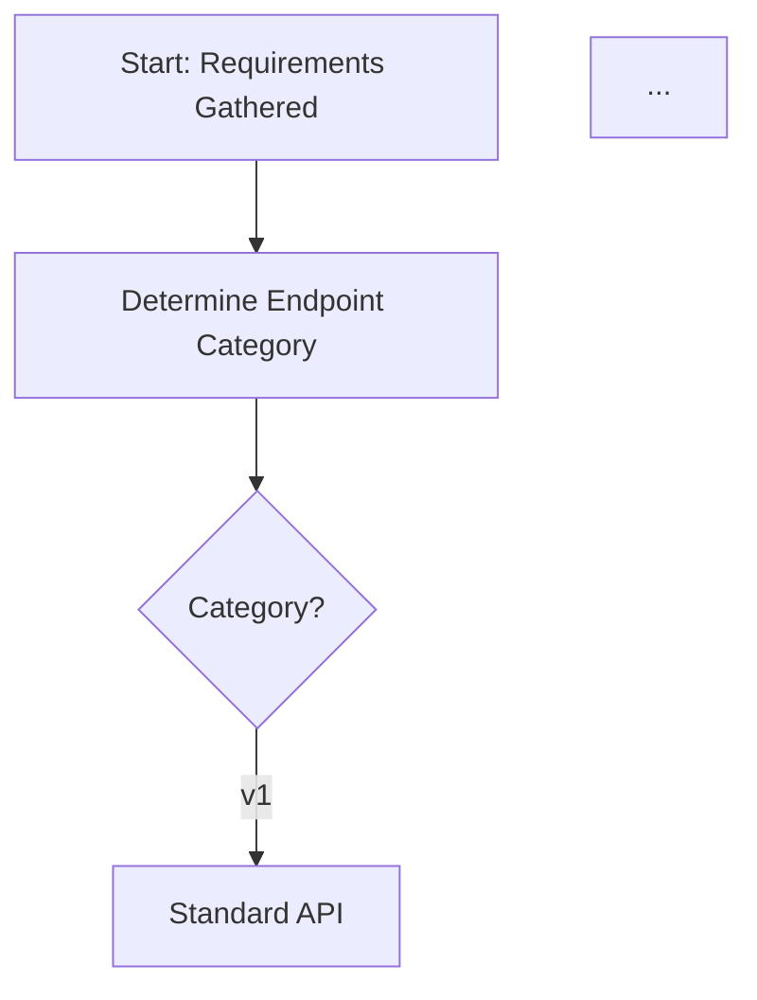

# Concept: JSON-First Agent Architecture

## Overview

This document defines the **JSON-First Agent Architecture** concept for the Agentic Process System. This concept restructures how templates, steps, and prompts are organized to separate agent guidance (JSON) from user documentation (MD).

---

## Concept Parameters

### conceptName
**JSON-First Agent Architecture**

### conceptDescription

Transform the agentic process system from a dual-file approach (where both JSON and MD files contain agent-relevant information) to a JSON-first architecture where:

1. **JSON files** become the **single source of truth for agents** - containing all guidance, instructions, substeps, detailed actions, dependencies, and everything the agent needs to execute
2. **MD files** contain **only user-relevant documentation** - description, purpose & usage, quick reference, and Mermaid flow diagrams for visual understanding
3. The agent **reads JSON files** for execution guidance but **edits MD files** for status updates and user-visible progress tracking

**Key Principles:**
- **Separation of Concerns**: Agent logic in JSON, user docs in MD
- **JSON as Source of Truth**: All agent guidance lives in structured JSON
- **MD for Users**: Human-readable documentation with visual flow diagrams
- **Agent Edits MD**: Status updates, checkboxes, timestamps go in MD for user visibility

### targetFiles

Apply this concept to all files in:
- `~/.claude/agentic-processes/templates/steps/**/*.json` and `~/.claude/agentic-processes/templates/steps/**/*.md`
- `~/.claude/agentic-processes/templates/processes/**/*.json` and `~/.claude/agentic-processes/templates/processes/**/*.md`
- `commands/**/*.md`
- `docs/**/*.json` and `docs/**/*.md`

**Approximate file counts:**
- Steps: ~25 pairs (JSON + MD)
- Templates: ~8 pairs
- Prompts: 2 pairs
- Docs: 4 pairs

### existingState

Currently, the system uses a dual-file approach where:

1. **JSON files** contain:
   - Metadata (type, name, category, title, purpose, lastUpdated)
   - Structured data (parameters, substeps list, outputs, dependencies, references)
   - Basic structure definitions

2. **MD files** contain:
   - User Layer: Description, Purpose & Usage, Quick Reference
   - Agent Layer: Detailed guidance, specific actions, prerequisites, substeps with full descriptions, memory file usage, flow diagrams
   - The actual instructions the agent follows

**Problems with current state:**
- Agent must read both JSON and MD files to execute
- Agent guidance is scattered between structured (JSON) and unstructured (MD) formats
- No clear separation between what's for the agent vs. what's for users
- Duplication of some content between JSON and MD

### requestedState

After implementation, the system should have:

#### JSON Files (Agent Source of Truth)

Complete schema containing everything the agent needs:

```json
{
  "type": "step",
  "name": "step-name",
  "category": "category",
  "metadata": {
    "title": "Step Title",
    "purposeAndUsage": "When and why to use this step",
    "lastUpdated": "2026-01-21"
  },
  "output": {
    "description": "What this step produces",
    "artifacts": ["list", "of", "files"],
    "memoryUpdates": ["fields", "to", "update"]
  },
  "guidance": {
    "prerequisites": [
      "What must be true before starting"
    ],
    "specificActions": [
      "Action 1: Detailed description of what to do",
      "Action 2: Another action with specifics"
    ]
  },
  "substeps": [
    {
      "number": 1,
      "name": "Substep Name",
      "description": "Full description of what this substep accomplishes",
      "actions": [
        "Specific action to take",
        "Another specific action"
      ]
    }
  ],
  "flow": {
    "description": "Textual description of the flow for documentation generation",
    "steps": ["Step1", "Step2", "Decision", "Step3"]
  },
  "memoryFileUsage": {
    "writeTo": "Current step section in memory.json",
    "fields": ["Information Produced", "Files Modified/Created", "Decisions Made"]
  },
  "dependencies": {
    "requiredComponents": ["list of components"],
    "requiredFiles": ["list of files that must exist"],
    "requiredTools": ["read_file", "write", "codebase_search"]
  },
  "references": {
    "relatedSteps": ["step1", "step2"],
    "usedInTemplates": ["template1"]
  }
}
```

#### MD Files (User Documentation Only)

Simplified structure with user-relevant content only:

```markdown
# Step: Step Title

## Description
Brief description of what this step does.

## Purpose & Usage
When to use this step:
- Use case 1
- Use case 2

**Output**: What the step produces.

## Quick Reference
| Key | Value |
|-----|-------|
| Category | category-name |
| Complexity | Medium |

## Flow

[Mermaid diagram showing the visual flow]
```

**Note:** No "Agent Layer" section. All agent guidance moves to JSON.

#### Template JSON Schema

```json
{
  "type": "template",
  "name": "template-name",
  "category": "category",
  "metadata": {
    "title": "Template Title",
    "purposeAndUsage": "When and why to use this template",
    "lastUpdated": "2026-01-21"
  },
  "parameters": {
    "required": ["param1", "param2"],
    "optional": ["param3"],
    "definitions": {
      "param1": {
        "description": "What this parameter is for",
        "type": "string",
        "example": "Example value"
      }
    }
  },
  "phases": [
    {
      "name": "Phase Name",
      "description": "What this phase accomplishes",
      "steps": [1, 2, 3]
    }
  ],
  "steps": [
    {
      "number": 1,
      "name": "Step name",
      "stepRef": "@step:category/step-name",
      "description": "Full description of what this step does in the context of this template",
      "context": {
        "param1": "{{param1}}",
        "specificContext": "value"
      },
      "output": "What this step produces",
      "approvalRequired": true,
      "postApprovalActions": ["Action to take after approval"]
    }
  ],
  "dynamicSteps": {
    "description": "How dynamic steps are generated",
    "derivedFrom": "Approved high-level plan"
  },
  "memoryFileStructure": {
    "sections": ["Step 1", "Step 2"],
    "keyFields": ["Approved plan", "Decisions made"]
  },
  "references": {
    "steps": ["@step:category/step1"],
    "relatedTemplates": [],
    "dependencies": []
  }
}
```

#### Agent Behavior Changes

1. **Reading Steps/Templates**: Agent reads ONLY the JSON file for guidance
2. **Status Updates**: Agent edits the MD file for user-visible updates (checkboxes, timestamps, current state)
3. **No MD Parsing for Instructions**: Agent never reads MD "Agent Layer" content (it doesn't exist anymore)

### verificationCriteria

The concept is fully implemented when:

1. **JSON Schema Completeness**
   - [ ] All step JSON files contain complete `guidance` section with prerequisites, mandatory components, and specific actions
   - [ ] All step JSON files contain complete `substeps` array with number, name, description, and actions
   - [ ] All template JSON files contain complete `steps` array with full descriptions and context
   - [ ] All JSON files are valid against their TypeScript type definitions

2. **MD File Simplification**
   - [ ] No MD file contains an "Agent Layer" section
   - [ ] All MD files contain only: Description, Purpose & Usage, Quick Reference, and Flow diagram
   - [ ] MD files are human-readable without agent-specific jargon

3. **Type Definitions**
   - [ ] TypeScript types exist for enriched step schema
   - [ ] TypeScript types exist for enriched template schema
   - [ ] TypeScript types exist for enriched prompt schema

4. **Agent Prompt Updates**
   - [ ] `process-new.md` instructs agent to read JSON for guidance
   - [ ] `process-continue.md` instructs agent to read JSON for guidance
   - [ ] Both prompts specify MD files are for status updates only

5. **Functional Testing**
   - [ ] Agent can create a new process using only JSON for guidance
   - [ ] Agent updates MD files correctly for status changes
   - [ ] User can read MD files and understand what each step/template does

### excludePatterns

Exclude the following from processing:
- `**/step-template.md` - Template file for creating new steps
- `**/README.md` - README files have different structure
- `**/*-template.md` and `**/*-template.json` - Memory and log templates

---

## Architecture Diagram



## Content Migration Mapping

### For Each Step File

| Current Location | New Location |
|------------------|--------------|
| MD: Agent Layer > Guidance > Specific Actions | JSON: `guidance.specificActions` |
| MD: Agent Layer > Guidance > Prerequisites | JSON: `guidance.prerequisites` |
| MD: Agent Layer > Required Components | JSON: `guidance.mandatoryComponents` |
| MD: Agent Layer > Substeps (full content) | JSON: `substeps[].description` and `substeps[].actions` |
| MD: Agent Layer > Memory File Usage | JSON: `memoryFileUsage` |
| MD: Agent Layer > Flow (mermaid) | Keep in MD (user visual), add `flow.description` to JSON |
| MD: User Layer (all) | Keep in MD |

### For Each Template File

| Current Location | New Location |
|------------------|--------------|
| MD: Agent Layer > Steps (full definitions) | JSON: `steps[]` with full `description`, `context`, `output` |
| MD: Agent Layer > Current State section | Keep in MD (dynamic, agent-updated) |
| MD: Agent Layer > Parameters (Full) | JSON: `parameters.definitions` |
| MD: Agent Layer > Context | JSON: step-level `context` objects |
| MD: Agent Layer > Process Flow mermaid | Keep in MD, add `phases` to JSON |
| MD: User Layer (all) | Keep in MD |

## Implementation Order

1. **Phase 1: Schema Definition**
   - Create TypeScript types for enriched schemas
   - Document the complete JSON structure

2. **Phase 2: Migrate Steps** (~25 files)
   - For each step pair (JSON + MD):
     - Extract Agent Layer content from MD
     - Add to JSON in structured format
     - Remove Agent Layer from MD
     - Verify MD has only user content + flow diagram

3. **Phase 3: Migrate Templates** (~8 files)
   - Similar process to steps
   - Preserve dynamic elements in MD (status, checkboxes)

4. **Phase 4: Migrate Prompts** (2 files)
   - Extract instructions to JSON
   - Keep user reference in MD

5. **Phase 5: Update Agent Prompts**
   - Modify process-new and process-continue
   - Specify JSON-only reading for guidance
   - Specify MD editing for status updates

6. **Phase 6: Validation**
   - Validate all JSON against schemas
   - Test process creation and continuation
   - Verify user documentation is complete and readable

---

## Example Migration

### Before (Current State)

**implement-controller-layer.json:**
```json
{
  "type": "step",
  "name": "implement-controller-layer",
  "metadata": { "title": "Implement Controller Layer", ... },
  "output": { ... },
  "substeps": [
    {"number": 1, "name": "Determine Endpoint Category"},
    {"number": 2, "name": "Study Existing Patterns"}
  ]
}
```

**implement-controller-layer.md:**
```markdown
# Step: Implement Controller Layer

## Description
...

## Agent Layer

### Guidance
**Specific Actions:**
1. **Determine Endpoint Category** - Identify the appropriate controller category based on API consumers
2. **Create Request DTOs** - Define input models in `Contracts/Requests/`
...

### Substeps
- [ ] **Substep 1: Determine Endpoint Category**
  - Identify API consumers (internal, external, partners, public)
  - Select appropriate controller folder and versioning
...
```

### After (Requested State)

**implement-controller-layer.json:**
```json
{
  "type": "step",
  "name": "implement-controller-layer",
  "metadata": { "title": "Implement Controller Layer", ... },
  "output": { ... },
  "guidance": {
    "prerequisites": [
      "Understanding of required endpoints",
      "Authentication requirements defined",
      "Service layer contracts available"
    ],
    "specificActions": [
      "Determine Endpoint Category - Identify the appropriate controller category based on API consumers",
      "Create Request DTOs - Define input models in Contracts/Requests/",
      "Create Response DTOs - Define output models in Contracts/Responses/",
      "Create Controller Class - Implement controller with proper attributes and versioning",
      "Implement Endpoints - Add action methods with proper HTTP verbs and routing",
      "Add Validation - Add validation attributes to DTOs",
      "Add Authentication/Authorization - Apply appropriate security attributes",
      "Create Mapping Extensions - Add mappers between DTOs and service arguments/results"
    ]
  },
  "substeps": [
    {
      "number": 1,
      "name": "Determine Endpoint Category",
      "description": "Identify the appropriate controller category based on API consumers",
      "actions": [
        "Identify API consumers (internal, external, partners, public)",
        "Select appropriate controller folder and versioning"
      ]
    },
    {
      "number": 2,
      "name": "Study Existing Patterns",
      "description": "Review similar controllers to understand project patterns",
      "actions": [
        "Search for similar controllers in the category",
        "Review request/response DTO patterns",
        "Check mapping extension patterns"
      ]
    }
  ],
  "memoryFileUsage": {
    "writeTo": "Current step section in memory.json",
    "fields": ["Information Produced", "Files Modified/Created"]
  }
}
```

**implement-controller-layer.md:**
```markdown
# Step: Implement Controller Layer

## Description

Implement ASP.NET Core API controllers following the project's service flow architecture pattern. Creates controllers with proper versioning, request/response DTOs, validation, authentication/authorization, and mapping.

## Purpose & Usage

Use this step when you need to:
- Implement new API endpoints for any feature
- Add endpoints to existing controllers
- Create versioned or category-specific endpoints
- Set up request/response DTOs with mapping

**Output**: Controller class, request/response DTOs, mapping extensions.

## Quick Reference

| Category | Auth | Use Case |
|----------|------|----------|
| v1 | Standard | Standard API endpoints |
| External | MyAccount | External user-facing endpoints |
| Internal | Service | Internal service communication |
| ngv1 | Partner | External partner APIs |
| Public | None | Public endpoints |

## Flow


```

---

## Notes

- Process instance files (`process.md`, `memory.json`, `log.json` in `~/.claude/agentic-processes/`) follow a different pattern and are not part of this migration

