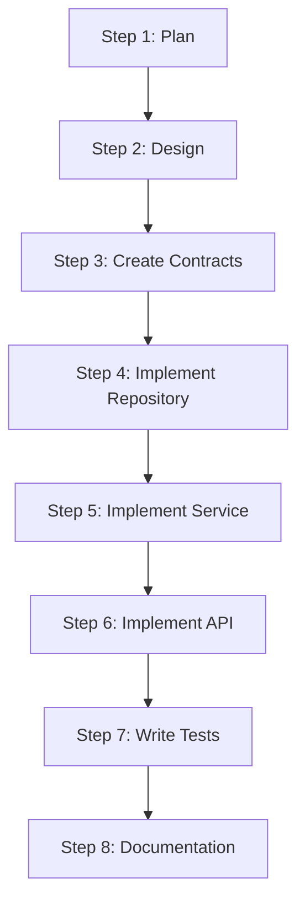

# Agentic Process System Examples

This document provides practical examples of using the Agentic Process System for common development tasks.

## Example 1: Developing a User Story

### Scenario

You need to implement a new feature: "User Authentication" that allows users to log in with email and password.

### Process Creation

1. **Invoke Command**:
   ```
   /process-new
   ```

2. **Select Template**:
   - Choose `develop-user-story` template

3. **Provide Parameters**:
   ```
   userStoryTitle: User Authentication
   userStoryDescription: Implement login functionality allowing users to authenticate with email and password
   acceptanceCriteria: 
   - User can log in with valid email and password
   - Invalid credentials show error message
   - Successful login returns JWT token
   ```

4. **Process Created**:
   - Process instance created in `~/.claude/agentic-processes/active/process-user-authentication-20250115/`
   - Steps ready to execute

### Process Execution

**Step 1: Create High-Level Plan**
- System analyzes requirements
- Creates plan in `ai/plans/user-authentication/plan.md`
- Presents plan for review
- User approves plan

**Step 2: Validate Process-Steps**
- System checks which steps are needed
- Verifies all step files exist
- Reports any missing steps

**Step 3: Create Detailed Step Plans**
- System creates detailed plans for each implementation step
- Each plan includes specific guidance
- User reviews and approves all plans

**Step 4-N: Implementation Steps**
- Execute steps from approved plan:
  - Create request/response DTOs
  - Implement repository layer
  - Implement service layer
  - Implement API controller
  - Write unit tests
  - Write integration tests
  - Update documentation

**Final Step: Continuous Improvement**
- System analyzes process log
- Identifies improvement opportunities
- Implements approved improvements

### Result

- Complete feature implementation
- All tests passing
- Documentation updated
- Process moved to `~/.claude/agentic-processes/completed/`

## Example 2: Fixing Integration Test Failures

### Scenario

An integration test is failing and needs to be fixed.

### Process Creation

1. **Invoke Command**:
   ```
   /process-new
   ```

2. **Select Template**:
   - Choose `integration-test-fix` template

3. **Provide Parameters**:
   ```
   testName: UserAuthenticationTests
   testFailure: Login_WithValidCredentials_ReturnsToken test is failing
   ```

### Process Execution

**Step 1: Capture Test Failure**
- Run the failing test
- Capture error message and stack trace
- Document test environment

**Step 2: Diagnose Failure**
- Analyze error message
- Review test code
- Identify root cause
- Document findings

**Step 3: Implement Fix**
- Create fix based on diagnosis
- Update code
- Verify fix addresses issue

**Step 4: Verify Test Passes**
- Run test again
- Confirm it passes
- Run related tests
- Ensure no regressions

### Result

- Test fixed and passing
- No regressions introduced
- Process completed

## Example 3: Creating a Custom Template

### Scenario

You want to create a template for a specific workflow your team uses frequently.

### Template Creation

1. **Create Template File**:
   - Location: `~/.claude/agentic-processes/templates/processes/{category}/custom-workflow.md`

2. **Template Structure**:
   ```markdown
   <!--
   Template: Custom Workflow
   Purpose: Description of what this template does
   Required Parameters: param1, param2
   Optional Parameters: param3
   When to use: When to use this template
   -->
   
   # Process: {{processName}}
   
   **Template**: custom-workflow
   **Status**: Not Started
   
   ## Description
   {{description}}
   
   ## Steps
   - [ ] Step 1: First step
     - **Step**: `step-name` (references subfolder of the process template directory)
     - **Description**: Step description
     - **Output**: What this step produces
   
   - [ ] Step 2: Second step
     - **Description**: Step description
     - **Output**: What this step produces
   ```

3. **Reference Steps**:
   - Use a simple step name (e.g., `"understand-context"`) as the `stepRef` -- it references a subfolder of the process template directory
   - Create new steps as subfolders if needed

4. **Test Template**:
   - Create a process from the template
   - Verify all steps resolve correctly
   - Test parameter substitution

## Example 4: Creating a Custom Step

### Scenario

You need a step that doesn't exist in the steps library.

### Step Creation

1. **Choose Category**:
   - Determine appropriate category (api, service, data, testing, etc.)

2. **Create Step File**:
   - Location: `{process-template-dir}/step-name/step-name.json` and `{process-template-dir}/step-name/step-name.md`

3. **Step Structure**:
   ```markdown
   <!--
   Step: Step Name
   Purpose: What this step accomplishes
   -->
   
   # Step: Step Name
   
   ## Description
   Detailed description of what needs to be done.
   
   ## Output
   - Files created
   - Documentation written
   - Decisions made
   
   ## Guidance
   **Specific Actions:**
   - Action 1: Detailed instruction
   - Action 2: Detailed instruction
   
   **Files/Folders:**
   - Work in: `path/to/directory`
   - Create: `path/to/new/file`
   
   ## Flow
   ```mermaid
   graph TD
       A[Substep 1] --> B[Substep 2]
       B --> C[Complete]
   ```
   
   ### Substeps
   - [ ] **Substep 1**: Action description
   - [ ] **Substep 2**: Action description
   
   ## Examples
   ### Example 1: Scenario
   Context and actions taken.
   
   ## Common Pitfalls
   ### Pitfall 1: Issue
   Problem and solution.
   ```

4. **Reference in Template**:
   - Use `@step:{category}/step-name` to reference the step

## Example 5: Resuming an Interrupted Process

### Scenario

You started a process yesterday but didn't finish. You want to continue today.

### Resuming Process

1. **Invoke Command**:
   ```
   /process-continue
   ```

2. **Process Discovery**:
   - System lists all active processes:
     ```
     Active Processes:
     1. process-user-authentication-20250115
        Current Step: Step 5 - Implement API Layer
        Progress: 4 of 12 steps completed
        Last Updated: 2025-01-15 16:30
     ```

3. **Select Process**:
   - Choose the process to resume

4. **State Summary**:
   - System shows:
     - What was being worked on
     - Completed steps
     - Next step to work on
     - Information from memory file

5. **Continue Work**:
   - System updates current state
   - Highlights next step
   - Provides guidance
   - Work continues from where you left off

## Example 6: Using Memory Files

### Scenario

You need to share information between steps in a process.

### Memory Usage

**In Step 1** (Create High-Level Plan):
```markdown
## Step 1: Create High-Level Plan
**Information Produced**: 
- Approved plan in `ai/plans/user-auth/plan.md`
- 5 implementation tasks identified

**Decisions Made**:
- Use JWT for authentication
- Store sessions in Redis
- Password hashing with bcrypt

**Files Created**:
- `ai/plans/user-auth/plan.md`
```

**In Step 4** (Implement Service Layer):
- Read from memory: "Use JWT for authentication"
- Use decision from Step 1
- Store implementation details in memory

**In Step 7** (Write Unit Tests):
- Read from memory: "Password hashing with bcrypt"
- Write tests for bcrypt integration
- Store test results in memory

## Example 7: Process with Conditional Steps

### Scenario

A process has steps that may or may not be needed based on decisions made earlier.

### Handling Conditionals

**In Template**:
```markdown
- [ ] Step 5: Implement feature
  - **Description**: Implement the main feature
  - **Note**: This step may require additional steps based on complexity

- [ ] Step 6: Add caching (conditional)
  - **Description**: Add caching if feature is high-traffic
  - **Condition**: Only if Step 5 determines high-traffic requirement
```

**In Process Execution**:
- Step 5 completes and stores decision in memory
- Process Manager checks memory
- If condition met, Step 6 is executed
- If not, Step 6 is skipped

## Example 8: Multi-Step Process with Dependencies

### Scenario

A complex process with multiple dependent steps.

### Process Flow



**Execution**:
- Steps execute sequentially
- Each step can read from previous steps' memory
- Dependencies are enforced by Process Manager
- Cannot skip or reorder steps

## Guidelines from Examples

1. **Be Specific**: Provide detailed parameters for better process creation
2. **Use Memory**: Store important information for later steps
3. **Review Steps**: Always review expanded steps before starting
4. **Follow Guidance**: Step guidance provides detailed instructions
5. **Check State**: Regularly review current state section
6. **Complete Steps**: Mark steps complete only when fully done
7. **Document Decisions**: Store decisions in memory for reference
8. **Use Templates**: Create templates for repeated workflows

## Common Patterns

### Pattern 1: Feature Development
- Plan → Design → Implement → Test → Document

### Pattern 2: Bug Fix
- Reproduce → Diagnose → Fix → Verify

### Pattern 3: Refactoring
- Analyze → Plan → Refactor → Test → Verify

### Pattern 4: Integration
- Design → Implement → Test → Deploy → Monitor

---

For more information, see:
- [Getting Started](getting-started.md)
- [Architecture](architecture.md)

