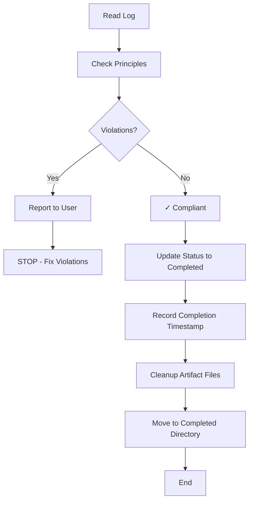

# Step: End Process Validation

## Description

Validate that all operating principles were followed throughout the process. This is a **framework step** — automatically injected as the final step of every process at creation time. Template authors do not need to include it.

## Purpose & Usage

This step ensures that:
- All user interactions were logged before responses
- Approval checkpoints were properly handled
- No external todos were created
- Mandatory actions had output confirmations

**Output**: Compliance report documenting adherence or violations, plus process completion (status update, directory migration).

## Quick Reference

| Aspect | Value |
|--------|-------|
| Position | Final step (auto-injected) |
| Mandatory | Yes - cannot be skipped |
| Output | Compliance report, status update, directory migration |

## Compliance Checklist

| # | Principle | What to Check |
|---|-----------|---------------|
| 1 | LOG FIRST | All user interactions logged before responses |
| 2 | READ JSON | Step JSON files read for guidance |
| 3 | STOP AT CHECKPOINTS | Approval checkpoints waited for user |
| 4 | NO TODOS | todo_write not used during process |
| 5 | VERIFY ACTIONS | Mandatory actions had confirmations |

## Process Completion Actions

After compliance validation passes, the following completion actions are performed:

| Action | Description |
|--------|-------------|
| Status Update | `process.json` status set to "completed" |
| Timestamp | `log.json` metadata.completed set to current time |
| Artifact Cleanup | Delete all files except `process.json`, `memory.json`, `log.json` |
| Directory Migration | Process moved from `~/.claude/agentic-processes/active/` to `~/.claude/agentic-processes/completed/` |

**Note**: If violations are found, the process does NOT proceed to completion steps. Violations must be resolved first.

## Flow

